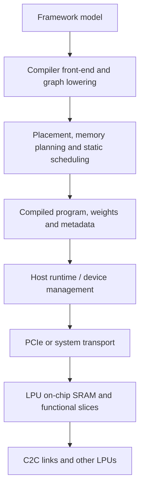

# 推理框架与运行时边界

<Badge type="tip" text="跨架构" /> <Badge type="info" text="机制专题" />

Groq 的公开资料对芯片和静态调度机制描述较多，对当前商业 runtime/compiler API 描述较少。本章只建立可由公开资料支撑的系统分层。

## 1. 系统分层

### Framework/model 层

输入是训练完成的 tensor graph、weights、shape 和 dtype 信息。早期论文/专利举过 TensorFlow model；BERT 论文使用 GroqAPI 混合高层与低层抽象。公开信息不足以断言当前前端只支持某一种 framework 或 IR。

### Compiler 层

负责 graph lowering、numerics、layout、memory、resource allocation、schedule 与 binary。对于固定 shape/model，很多执行决定可以在这里完成。

### Host runtime

合理职责包括设备初始化、compiled image/weights 装载、input/output buffer、执行启动、PCIe/C2C 协调和错误处理。这里的具体 API 与内部实现大多不是公开研究材料。

### Device execution

片上 SRAM 提供显式管理的 weights/activation/instruction storage。ICU 和 functional slices 按已编译 schedule 推进；数据通过 streams 在 MEM/SXM/MXM/VXM 之间传播。

### Scale-out runtime

多芯片 program 还需要配置拓扑、路径、Send/Receive 时间、link deskew、distributed SRAM addresses 及 collectives。ISCA 2022 强调这些网络资源同样由软件调度。

## 2. 编译期与运行期的边界

| 问题 | 更可能在编译期 | 更可能在运行期/host |
| --- | --- | --- |
| operator lowering | 是 | 否 |
| functional-unit placement | 是 | 否 |
| SRAM tensor layout | 是 | 初始化时实现装载 |
| per-cycle device schedule | 是 | 按 schedule 执行 |
| input tokenization | 通常否 | 是 |
| input 内容 | 否 | 是 |
| 固定 shape buffer address plan | 是 | 绑定实际 buffer |
| PCIe error/retry | 否 | runtime/hardware |
| 服务排队 | 否 | 数据中心软件 |

这张表是系统设计推理，不是 Groq 当前 SDK 契约。

## 3. 推理框架应解决的问题

### 模型准备

- constant folding、shape inference、operator canonicalization；
- training-only nodes 移除；
- quantization calibration 或 QAT 结果导入；
- unsupported operator 分解或 host fallback 策略。

### Program specialization

静态 schedule 偏好可预测 shape，但真实 NLP/LLM 有动态 sequence length。框架可能需要：

- 多个 shape-specialized binaries；
- padding/bucketing；
- 最大长度 schedule 加 mask；
- host 选择 program variant。

这些是一般设计选项，公开资料不足以确认 Groq 当前具体选择。

### 生命周期管理

- weights 常驻与复用；
- activation/scratchpad buffer reuse；
- compiled program cache；
- input/output DMA；
- error、timeout 和 telemetry。

## 4. 从 BERT 到自回归 LLM 的新增问题

BERT 论文是固定 sequence length、完整 encoder inference。LLM decode 还要面对：

- 每一步只生成一个或少量 token；
- KV cache 随 sequence 增长；
- attention shape 逐步变化；
- sampling/top-k 等 host 或 device 后处理；
- prefill 与 decode 的计算/带宽特征不同；
- 大模型必须跨多芯片保存 weights；
- 多用户 serving 还会引入 admission、batching 和调度策略。

因此学习 BERT mapping 是理解单次静态 pipeline 的好起点，但不能直接等同完整 LLM serving stack。

## 5. 建议的研究方法

1. 先用论文确认 device-visible mechanism。
2. 用专利补 compiler/ISA 的可能实现。
3. 用通用 ML compiler 知识解释 IR、lowering、allocation 和 scheduling。
4. 对 runtime 未公开部分明确标记“未知”或“推断”。
5. 只在得到 SDK/硬件证据后，把推断升级为实现事实。
