# NVIDIA GPU 软硬件流水与同步：一块 Tile 的端到端交接

<Badge type="tip" text="NVIDIA GPU" /> <Badge type="info" text="架构专论" />

副标题：从 CPU submission、grid admission 和 warp issue，到 TMA、mbarrier、Tensor pipeline、下游任务与 buffer reuse。

结构重构日期：2026-08-17。技术资料最后核对日期：2026-08-12。

这篇文章只有一个主角：**一块 tile**。

它起初位于 producer buffer，随后被某条 CUDA stream 上的 kernel 接收；进入 SM 后，由 producer threads 搬入 shared memory；async engine 或 Tensor pipeline 接手其中一段工作；consumer 使用结果；最后，另一个 kernel、CPU 或 remote GPU 继续消费，storage 才能复用。

沿途会遇到 scoreboard、barrier、mbarrier、fence、atomic signal、semaphore、event 等机制。但这些名词不是章节主线。它们只是不同交接点签发的不同“凭证”。

> **同步的本质，是一个独立推进的 agent 在把数据、完成状态或资源所有权交给另一个 agent 时，证明后者现在可以继续。**

一次完整交接必须回答四个问题：

1. **Progress**：producer 和 required participants 最终能获得调度机会吗？
2. **Completion**：consumer 等到的究竟是哪项工作完成？
3. **Visibility**：consumer 观察 completion 后，能按正确 scope/proxy 读取 payload 吗？
4. **Ownership**：consumer 用完以前，storage 会不会被覆盖、释放或进入下一 phase？

participants、scope、phase/generation 是这四份证明的参数；wait mode 与等待时持有的硬件资源，则决定协议的性能与 forward progress。

---

## 1. 先看完整旅程：一块 tile 会被交接多少次

### 1.1 端到端路线

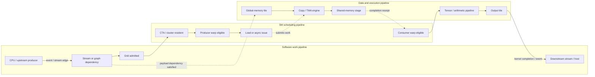

图中实际上有三条相互关联、但不能混为一谈的链：

- **work chain**：task 什么时候允许进入，CTA/warp 什么时候得到执行资源；
- **data chain**：payload 什么时候完成搬运或计算，什么时候对 consumer 可见；
- **ownership chain**：谁当前可以写/读某个 stage，什么时候可以覆盖或释放。

时间上“producer 好像先执行了”不能代替其中任何一条 edge。

### 1.2 八次核心交接

| # | 交接 | 主要凭证 | 它没有自动证明什么 |
| --- | --- | --- | --- |
| 1 | CPU/upstream task → kernel task | stream order、event、graph edge | block 已 resident、instruction 已执行 |
| 2 | device scheduler → CTA/warp | placement、residency、eligible state | tile 数据已 ready |
| 3 | producer instruction → dependent instruction | scoreboard | 跨 thread visibility 或 rendezvous |
| 4 | producer threads → shared-memory consumers | barrier 或 release/acquire signal | arbitrary async transaction 已完成 |
| 5 | producer warp → async/Tensor engine → consumer warp | async group、mbarrier transaction/phase、specialized completion | stage 已经允许下一轮覆盖 |
| 6 | consumer → next-generation producer | empty/permit、phase/generation | output task 或 remote consumer 已完成 |
| 7 | kernel → downstream task/host | event、stream/graph edge、host synchronization | remote API 的独立 ownership 已转移 |
| 8 | local GPU → remote GPU/API | cross-device event、collective completion、quiet/signal、external semaphore | source/destination storage 已无其他 user |

注意：**fence 没有单独出现在“凭证”一列**。Fence 约束 memory effects 的次序，却不产生 participant arrival，也不生成一个可供 consumer 等待的完成事件。它通常是交接协议的一个零件，不是完整协议。

### 1.3 不要混用这些时间点

```text
submitted
  → admitted
  → resident
  → eligible
  → issued
  → locally complete
  → visible to intended consumer
  → retired
  → storage reusable
```

| 时间点 | 精确含义 |
| --- | --- |
| submitted | host/runtime 已接受 command |
| admitted | work 被允许进入 device execution |
| resident | CTA/warp context 已占用 SM resource |
| eligible | warp 的 next instruction 当前允许进入 issue 竞争 |
| issued | scheduler 已把 instruction 发给目标 path |
| locally complete | issuing context 已越过相应 completion gate |
| visible | 指定 scope/proxy 的 consumer 可按协议观察 payload |
| retired | warp/CTA/grid 的 architectural work 已结束 |
| reusable | 最后一位合法 user 已释放 storage/permit |

整篇后文，就是跟着同一块 tile 逐一穿过这些时间点。

---

## 2. 交接一：CPU 或 upstream task → kernel task

tile 尚未进入 SM。第一个问题是：负责处理它的 kernel **什么时候可以开始**？

### 2.1 Kernel launch 只提交 work

```cpp
producer<<<grid, block, 0, stream_a>>>(input);
consumer<<<grid, block, 0, stream_b>>>(input);
```

两个 host API 返回，并不代表 producer 已完成，也不代表 consumer 可以读取 `input`。Host return 通常只表示 launch request 已提交：

```text
host API returns
  → command reaches a device queue
  → grid becomes admissible
  → blocks become resident
  → instructions issue
  → last block retires
```

如果 producer 和 consumer 位于同一 stream，stream order 提供 task dependency。如果位于不同 streams，就必须显式建立 edge。

### 2.2 Event 是 task completion receipt

```cpp
producer<<<grid, block, 0, stream_a>>>(input);
cudaEventRecord(input_ready, stream_a);

cudaStreamWaitEvent(stream_b, input_ready);
consumer<<<grid, block, 0, stream_b>>>(input);
```

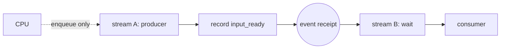

这次交接的四份证明是：

| 证明 | 结论 |
| --- | --- |
| Progress | CUDA scheduler 看得见 A→B dependency，不需要 B 在 device 上盲目 spin |
| Completion | event 表示 stream A 在 record 点之前的 work 已完成到 CUDA contract 要求的阶段 |
| Visibility | 匹配的 stream/event ordering 使 downstream CUDA work 可以消费 upstream result |
| Ownership | 若 B 之后还要使用 buffer，free/reuse 必须继续排在 B 完成之后 |

event 解决的是 **task-to-task handoff**，不会在 producer kernel 内生成 block barrier，也不会说明 consumer 的某个 warp 已经 resident。

### 2.3 Graph edge 是同一种责任的显式化

CUDA Graph 把 kernel、copy、allocation 等 work 组织成 node DAG：

```text
allocation → H2D/producer → tile kernel → consumer → D2H/free
```

它让 scheduler 看见 dependency，因此通常优于 device code 中隐藏的 flag spin。不同 branches 没有 edge，只表示允许 overlap；是否真正并发还取决于 queues、contexts、SM 和 memory resources。

### 2.4 Value edge 需要自己补全 publication contract

Stream-ordered memory write/wait 可以把一个 progress value 当作 doorbell：

```text
producer writes payload
  → producer publishes sequence = k
  → waiting stream observes sequence >= k
  → consumer task continues
```

但 value 改变只是 signal。还要确认：

- address 对双方合法可见；
- payload write 先于 signal；
- wait 的 scope/order 足以覆盖 consumer；
- producer 能获得 forward progress；
- phase/sequence 不会把旧 signal 当成新 signal。

普通 event/graph edge 足够时，优先让 dependency 对 scheduler 可见。

### 2.5 这一步对硬件流水的意义

software dependency 决定 grid 能否进入后续 admission 竞争。它不是 SM 内 stall：consumer grid 尚未进入 SM 时，不存在它的“barrier stall”或“scoreboard stall”。

反过来，过宽的 `cudaDeviceSynchronize()` 会让 host 等待整个 device，可能在 timeline 上制造本可避免的空洞。正确策略是等待最窄 completion：单个 event、单条 stream，最后才考虑整个 device。

---

## 3. 交接二：device scheduler → resident CTA 与 active warp

software DAG 已允许 tile kernel 开始。下一张凭证不是 barrier，而是 **residency**：某个 block/cluster 得到了 SM 上的执行资源。

### 3.1 Placement 是 forward-progress 前提

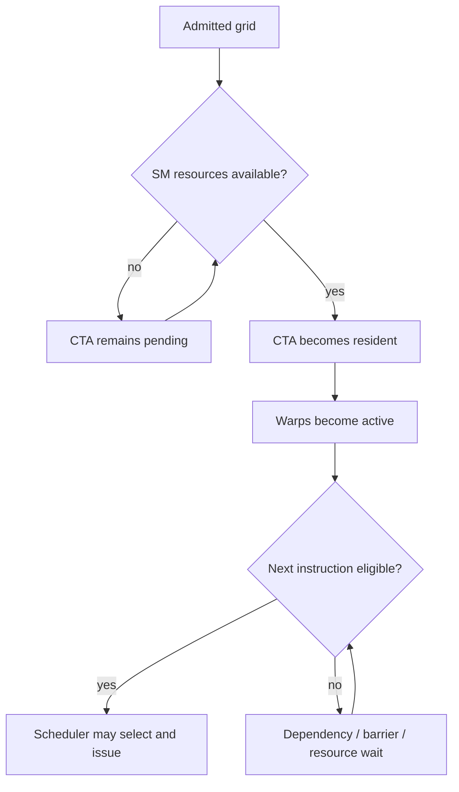

一个 CTA 能否 resident，受多种有限资源共同约束：

- registers per thread/block；
- static + dynamic shared memory；
- resident threads/warps/blocks 上限；
- barrier、cluster 与 generation-specific resources；
- launch bounds、MIG/partition/context configuration。

resident 只说明 context 在场。warp 仍可能因为 operand、barrier、async completion 或 execution-path backpressure 而不 eligible。

### 3.2 普通 blocks 必须允许任意顺序执行

一个 ordinary grid 的 blocks 可以并行、串行或交错 placement。程序不能依赖：

- block 0 一定早于 block 1；
- 所有 blocks 同时 resident；
- consumer blocks 正在 spin 时，producer blocks 必然能被调度；
- 不同 blocks 天然拥有 global rendezvous。

典型 residency deadlock：

```text
all resident slots = consumer blocks polling flag
pending producer blocks = cannot become resident
flag = can never be produced
```

这个 bug 即使 atomic scope、memory order 全部正确，也仍然无法前进，因为失败的是 **Progress proof**。

跨 block phase 的常规解法是 kernel boundary；确实需要同场协作时，使用具有相应 residency contract 的 cluster 或 cooperative grid launch。

### 3.3 Occupancy 不是越高越好

更多 resident warps 可能提供更多 eligible candidates，从而覆盖 latency；但为了提高 occupancy 而减少 registers/shared stages，也可能损害 ILP、reuse 或 async pipeline depth。

真正目标是：

```text
每个 scheduler 周期都有足够的 eligible work
+ execution/memory pipelines 保持有效利用
+ 不为此破坏 locality 与 stage depth
```

高 active-warps、低 eligible-warps 往往说明许多 resident warps 同时卡在相同 gate。此时继续增加 occupancy 未必有用。

### 3.4 Barrier wait 会继续占用 residency resource

warp 到达 `__syncthreads()` 后：

- 它仍是 active warp；
- 它继续占用 registers 和 CTA shared memory；
- barrier phase 完成以前，它不能发射 barrier 后的 instruction；
- 其他 resident CTA 的 ready warps 仍可能运行。

因此 barrier 既是 correctness mechanism，也会改变 scheduler 能看到的 eligible set。Work imbalance 会让早到 warps 长时间占着资源等待最后到达者。

### 3.5 Cluster 与 cooperative grid 改变 residency contract

Hopper-generation thread-block cluster 保证 cluster blocks 被 co-scheduled，可使用 cluster barrier 与 distributed shared memory。Cooperative grid sync 则要求 cooperative launch 满足 whole-grid synchronization 的限制。

它们不是把 block barrier “扩大一下”那么简单：scope 变大时，required participants、同时在场保证、resource cost 和 deadlock premise 都随之改变。

至此，tile 所在 CTA 已 resident。但某条 producer instruction 能不能发射，还要拿到下一张凭证。

---

## 4. 交接三：producer instruction → dependent instruction

这次交接完全发生在一个 warp 的 instruction stream 内。负责签发凭证的是硬件 dependency tracking，通常概括为 **scoreboard**。

### 4.1 Active、eligible、selected、issued

```text
resident warp
  → active: 尚未退出
  → eligible: next instruction 当前允许 issue
  → selected: scheduler 本周期选择它
  → issued: instruction 进入目标 execution path
```

eligible 至少要求：

- instruction 已 fetch/decode；
- source operands 和 producer dependencies 已 resolved；
- warp 没有等待 barrier、membar 或 async completion；
- 目标 dispatch/execution path 当前能接受 work。

多个 warps eligible 而当前 warp 没被选中，profiling 中可能显示 `not selected`。这往往表示 scheduler 仍有 ready work；真正空耗 issue slot 的情况是没有 eligible warp。

### 4.2 Scoreboard 签发 register-readiness receipt

```text
LDG  R8, [R2]       // variable-latency producer
FFMA R10, R8, R4    // dependent consumer
```

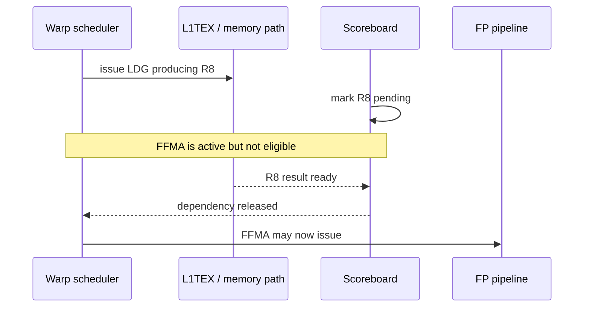

Scoreboard 的 contract 很窄：它保护 instruction producer/consumer dependency。它不证明：

- warp A 和 warp B 已 rendezvous；
- warp B 能看见 warp A 的 shared/global stores；
- TMA transaction 已完成；
- stream task 或 remote operation 已完成。

正因为它足够窄，所以普通同-thread load→use 不需要 programmer 再插 barrier。

### 4.3 Load、store 与 drain 的差异

普通 load 的 data return 最终使 destination register ready，dependent instruction 因 scoreboard release 而重新 eligible。

store 没有 destination register 供后续 instruction直接等待。store/atomic memory effect 可能在 warp 执行到 `EXIT` 后仍需 drain，直到硬件允许释放 execution context。这里的 “instruction issued” 仍不等于 “任意 consumer 已观察 store”。

### 4.4 Dependency latency 与 pipeline throughput 不是一回事

即使所有 operands ready，target path 也可能暂时不接受更多 work：

| 现象 | 主要问题 |
| --- | --- |
| long scoreboard | global/local/texture producer result latency 暴露 |
| short scoreboard | shared/MIO 等 producer dependency |
| math pipe throttle | arithmetic/Tensor path throughput saturated |
| LG/TEX/MIO throttle | request queue 或执行路径 backpressure |
| dispatch stall | dispatcher/resource conflict |
| barrier | required participants 尚未到齐 |
| membar | ordering所需的 outstanding memory work 未满足 |

latency 用 ILP、其他 warps 的 TLP 或 async staging 覆盖；throughput saturation 则需要调整 instruction mix、数据复用或 work 分配。给 throughput bottleneck 增加 barrier 不会产生更多执行带宽。

### 4.5 这次交接为什么还不够

假设 producer warp 通过 load 和计算拿到了 tile fragment，并把它写入 shared memory：

```text
warp A: load global → compute address → store shared
warp B:                                      load shared → consume
```

A 的 scoreboard 只知道 A 自身的 instruction dependency。它无法替 B 签发 shared payload 的 visibility receipt，也不知道 B 是否属于本次 tile 的 participant set。于是 tile 来到下一次交接。

---

## 5. 交接四：producer threads → shared-memory consumers

先从传统、同步的 global→shared tile pipeline 开始。它能把 scoreboard、barrier 和 memory ordering 的边界讲清楚。

### 5.1 同步版本的因果链

```cpp
// 所有 threads 合作搬运一块 tile。
smem[idx] = gmem[src_idx];
__syncthreads();
consume(smem);
```

真实链条不是“load，然后 barrier”这么简单：

```text
LDG result ready in producer register        ← scoreboard
  → producer can issue shared-memory store
  → all required producers reach boundary    ← barrier arrivals
  → their prior shared writes are ordered    ← barrier memory contract
  → consumers cross boundary
  → shared loads can consume tile
```

这里 scoreboard 和 barrier 并非重复等待：前者完成单条 instruction 的 register dependency；后者把多个 threads 的控制进度与 shared communication 汇合起来。

### 5.2 Rendezvous 就是 phase boundary 汇合

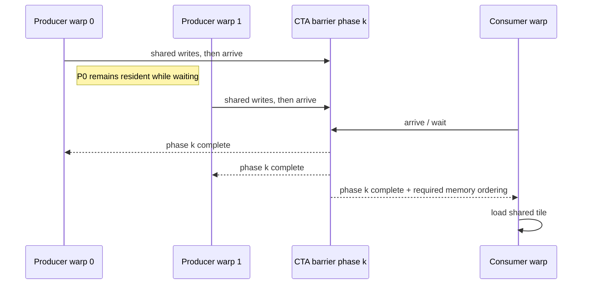

**rendezvous** 指约定 participants 在同一个 phase boundary 汇合。Reusable barrier 必须区分 phase；否则上一轮 completion 可能被下一轮错误消费。

### 5.3 Participant set 必须显式正确

Volta 及以后的 Independent Thread Scheduling 使 sub-warp divergence 和 reconvergence 更灵活，旧代码不能依赖隐式 warp lockstep。

```cpp
unsigned members = __ballot_sync(parent_mask, predicate);
if (predicate) {
    int leader = __ffs(members) - 1;
    int value = __shfl_sync(members, local, leader);
}
```

必须区分：

- current active mask：这条 instruction 的瞬时 active lanes；
- logical participant set：算法规定必须参加 collective 的 lanes；
- memory ordering：这些 lanes 通过 memory 通信时需要的顺序保证。

vote、shuffle、match 的 `sync` 表示 mask 中 lanes 参加匹配 collective，不能一概理解为 arbitrary memory fence。通过 shared memory 通信时，应使用 `__syncwarp(mask)` 或具有明确 memory contract 的 group synchronization。

### 5.4 Barrier、fence 与 signal 不是替代关系

考虑一个 subset producer-consumer protocol：

```cpp
// producer
payload = 42;
ready.store(1, cuda::memory_order_release);

// consumer
ready.wait(0, cuda::memory_order_acquire);
use(payload);
```

这套协议中：

- atomic value 是 consumer 能观察的 signal state；
- release/acquire 建立 publication relationship；
- wait 避免 consumer 越过条件；
- producer 能否运行仍由 residency/scheduling 决定；
- buffer 何时复用仍需另一条 ownership edge。

单独 fence 只有 ordering，没有 signal：

```text
producer: write payload → fence → ???
consumer:                    不知道何时继续
```

单独 barrier 有 participant rendezvous，却未必代表某项独立 async engine transaction 已完成。选择机制时应先问交接责任，而不是问“哪个 API 更强”。

Release/acquire 只有在 consumer 观察到相应 atomic modification、并且双方 scope 能互相覆盖时，才建立需要的 happens-before。Block-scope publication 不能拿去支持另一个 block 的 consumer。`__threadfence_block()`、`__threadfence()`、`__threadfence_system()` 分别扩大 ordering scope，但仍不会自动创建 signal。

`volatile` 主要约束 compiler 对 access 的处理，不提供 atomicity 或 release/acquire；cache operator 影响数据路径和性能，也不能代替 synchronization contract。

### 5.5 Atomic 还可以交接 counter、queue 与 ownership

Atomic RMW 保证同一 state word 的修改不撕裂或丢失；是否发布旁边的 non-atomic payload，仍取决于 memory order 和 scope。典型用途包括：

- counter、reference count；
- CAS state transition / lock；
- queue head/tail、work index；
- monotonic sequence / doorbell；
- atomic wait/notify。

同一 hot location 上的 contending RMW 必须 serialization，但不是“一次 atomic 锁住整个 GPU”。Warp aggregation、per-CTA counters、sharding 和 hierarchical reduction 可以减少热点。

GPU spin lock 还要单独证明 forward progress：waiters 会继续占用 resident execution context；如果 lock owner 或生产 flag 的 CTA 无法得到资源，即使 atomic protocol 的 order/scope 正确也会 deadlock。Scheduler 可见的 task dependency 通常更适合交给 stream/event/graph。

### 5.6 Named barrier 与 subset cooperation

Full-block `__syncthreads()` 最清晰，但 producer/consumer 只涉及部分 warps 时，named/numbered barrier 或 `cuda::barrier` 可以表达：

- fixed subset participant count；
- producer arrive 后继续独立工作；
- consumer 在真正使用 tile 前 wait；
- reusable phase 与可选 reduction。

这种 split arrive/wait 已经开始像流水，但 tile 搬运本身仍经普通 register chain。为了让 copy 和 compute 真正重叠，需要把工作交给 async mechanism。

---

## 6. 交接五：producer warp → async engine → consumer warp

这是整条主线的核心：tile 暂时离开普通 warp register dependency chain，交给异步搬运或计算机制；之后再通过专门 completion receipt 交回 consumer。

### 6.1 从同步 copy 到 async copy

同步版本：

```text
global load → producer register → shared store → CTA barrier → compute
```

流水化版本：

```text
issue copy for tile k+1
  → compute tile k
  → wait until tile k+1 copy completes
  → acquire full stage
  → consume tile k+1
```

Ampere-style `cp.async` 使用 issuing thread 的 async groups：

```text
cp.async...
  → cp.async.commit_group
  → later groups remain in flight
  → cp.async.wait_group N / wait_all
```

一个 thread 的 async-group wait 只证明相应 group 的 completion，不自动让整个 CTA rendezvous，也不自动证明 stage 已经从所有 consumers 手中收回。

### 6.2 TMA 把提交者、搬运者和消费者分开

Hopper TMA 常由一个 elected thread 提交较大 tensor movement。真正写 shared memory 的是 async proxy/engine；多个 consumer warps 稍后读取结果。

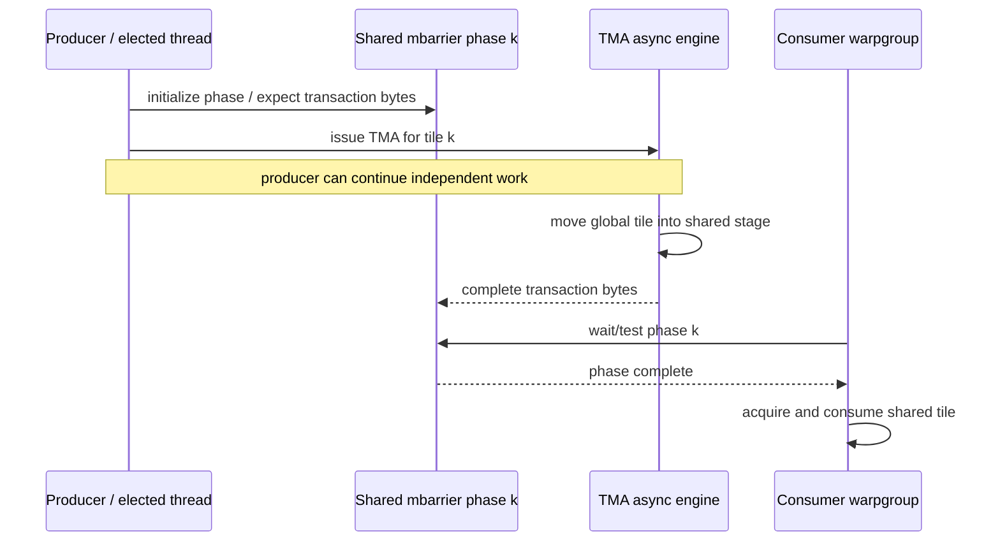

这次交接至少包含四个不同责任：

1. **Election**：谁只提交一次 TMA；
2. **Source handoff**：async proxy 能否合法观察 descriptor/source state；
3. **Transaction completion**：这块 tile 的全部 tracked bytes 是否搬完；
4. **Destination handoff**：generic consumers 等待后能否读取 shared result。

一个 `__syncthreads()` 无法独自替代这四项。

### 6.3 mbarrier 是 phase receipt 加 transaction ledger

shared-memory mbarrier 可抽象成：

```text
phase identity
+ expected / pending software arrivals
+ expected / pending async transaction count
```

| 操作 | 在交接中的作用 |
| --- | --- |
| init | 定义 expected arrivals 与初始 phase |
| expect_tx | 登记本 phase 预期的 async transaction amount |
| arrive / arrive_drop | software participant 到达；drop 还改变后续 expectation |
| complete_tx | async engine 偿还 transaction 欠账 |
| test_wait / try_wait | 按 token/parity 观察 phase completion |
| inval | storage 改作他用前结束 object lifetime |

arrival count 和 transaction count 是两本账：前者记录 software participants，后者记录 async work。TMA 场景中的 transaction amount 常按 bytes 计；把 thread count 当 byte count，或者漏记某笔 transaction，都会破坏 completion proof。

### 6.4 Proxy fence 解决“不同访问方法”之间的交接

PTX 把 generic、async、tensormap、fabric 等访问抽象为不同 memory proxies。普通 thread fence 不一定覆盖同一 location 的跨-proxy handoff。

典型检查顺序：

```text
generic producer modifies source or descriptor
  → required release / proxy handoff
  → async proxy consumes it
  → async engine writes destination
  → tracked completion reaches mbarrier
  → consumer performs required wait/acquire
  → generic consumer reads destination
```

高层 CUDA/CUTLASS abstraction 可能封装其中部分规则；手写 PTX 时必须按具体 instruction family 确认。不能把“我已经做过 threadfence”当作任意 proxy 都已同步。

### 6.5 Async completion 会怎样影响 warp scheduler

consumer warp 在 wait 前后仍处于 SM residency 中：

- wait condition 未满足时，它可能 active 但不 eligible；
- producer warp 或其他 CTA 可继续提供 eligible work；
- stage 太浅时，所有 consumers 可能同时等 copy；
- wait 太早时，原本可重叠的 independent work 被浪费；
- copy engine、L1TEX 或 shared path 饱和时，即使 barrier 设计正确也可能吞吐不足。

所谓 async 优化，不是删除 wait，而是把 wait 移到 **首次真正消费 tile 之前的最晚位置**，并在此前安排独立工作。

### 6.6 Tile 再交给 Tensor pipeline

Hopper WGMMA 的 simplified sequence 是：

```text
shared tile ready
  → wgmma.fence / required input ordering
  → wgmma.mma_async...
  → wgmma.commit_group
  → independent work or later groups
  → wgmma.wait_group N
  → result may be consumed
```

这里有三个独立时间点：

- input 可以交给 Tensor operation；
- operations 被组织并提交为 group；
- result group 已完成到允许消费的阶段。

CTA barrier 只说明 participants 到齐，不能代替 Tensor group completion。反过来，`wait_group` 也不代表其他 warps 已到达共同 phase。

Blackwell `tcgen05`/Tensor Memory 又加入 generation-specific allocation、permit、async operation 与 specialized completion rule。主线仍不变：明确谁提交、谁执行、completion 写到哪里、consumer 等什么、Tensor Memory 何时可以 relinquish；具体 instruction contract 必须按 target PTX 阅读。

---

## 7. 交接六：consumer → next-generation producer，交还 stage ownership

copy complete 只证明 stage 已 **full**。Producer 想覆盖同一个 stage，还需要 consumer 签发 **empty** receipt。

### 7.1 双缓冲是双向交接，不是两个 boolean

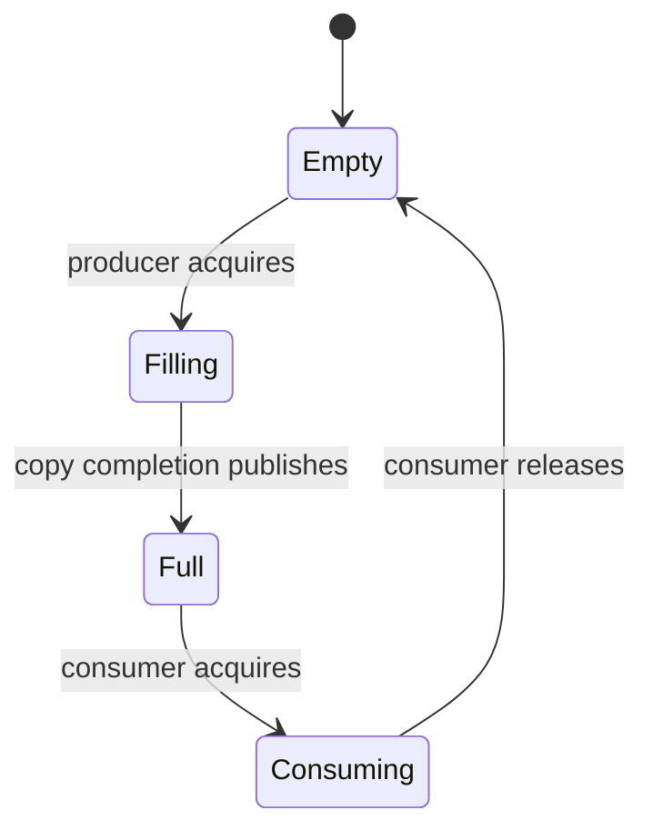

完整 bounded pipeline 有两个方向：

```text
producer --full/completion--> consumer
producer <--empty/release---- consumer
```

若只有 `full` signal：

```text
producer fills S0 → consumer begins reading S0
producer immediately refills S0 for next generation
                    ↑ overwrite race
```

所以 completion、visibility、lifetime 是三条不同 edge：

```text
producer operation completed
  ≠ consumer has observed payload
  ≠ consumer has finished using storage
```

### 7.2 两级 pipeline 的重叠时序

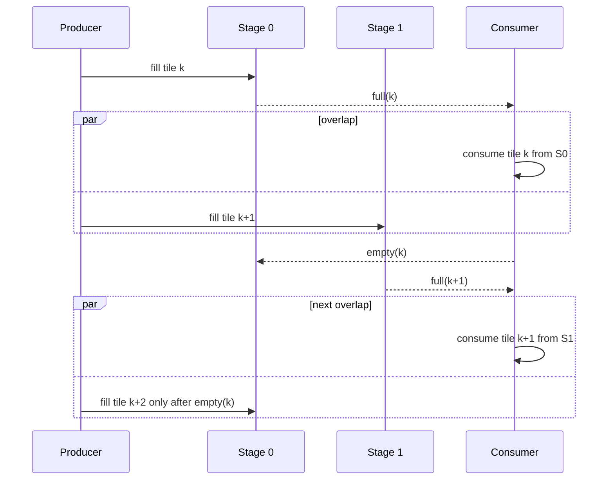

性能瓶颈可以由状态直接读出：

- producer 经常等 empty：consumer 或 Tensor pipeline 较慢；
- consumer 经常等 full：copy/memory path 较慢；
- 两边都 ready 但 issue rate 低：execution path/dispatcher throughput 问题；
- 所有 resident warps 等同一个 phase：stage depth、work balance 或 pipeline partition 不足。

### 7.3 Phase、parity 与 ABA

Reusable object 必须区分 `stage 0, generation k` 和 `stage 0, generation k+2`。只观察一个回到相同值的 boolean，consumer 可能把旧 completion 当成新 completion。

常见 generation encoding：

- barrier token；
- parity bit；
- monotonic sequence number；
- ring index + generation；
- producer/consumer counters。

phase 不只是 bookkeeping。它是证明“这张 receipt 对应哪一代 tile”的身份信息。

### 7.4 Latch、barrier、semaphore、timeline、pipeline 的状态机不同

| Object | 状态转换 | 最适合表达 |
| --- | --- | --- |
| latch | count → 0，打开后不复用 | one-shot completion |
| barrier | N arrivals → phase complete → next phase | collective rendezvous |
| semaphore | permit count；acquire 消耗 permit | bounded resource/ownership |
| timeline | monotonic value ≥ target | progress generations |
| pipeline | empty → filling → full → consuming → empty | stage ownership + overlap |

它们都有 `wait` 不表示语义相同。选择 object 应先画状态机，再选择 API。

### 7.5 Object lifetime 也是 ownership

不仅 payload buffer 有 lifetime：

- mbarrier storage 在 invalidation/合法结束前不能改作他用；
- cluster 其他 blocks 仍访问本 CTA 的 DSM 时，owning block 不能退出；
- TensorMap descriptor 更新和使用需要正确 proxy ordering；
- Tensor Memory permit 必须按 generation-specific lifecycle relinquish；
- external buffer 需要完成 API ownership transfer 才能复用。

到这里，tile 已完成 kernel 内计算，shared stages 也被正确归还。下一步是把 global output 交给 kernel 外部的 consumer。

---

## 8. 交接七：kernel → downstream task、host 与 allocator

### 8.1 Kernel retirement 是 task receipt 的来源

一个 warp 执行到 `EXIT`，可能仍需等待 outstanding stores/atomics drain；所有 blocks 完成后，grid 才满足 downstream CUDA task dependency。

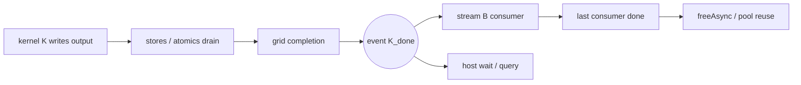

Kernel 内 `__threadfence()` 不能代替 grid completion，也不会让 host 自动知道可以读取 output。Host 应等待 event/stream/device completion；device downstream task 应通过 stream/graph/event edge 排序。

### 8.2 Stream-ordered allocator 把 lifetime 变成 DAG

```text
stream A: mallocAsync(p) → producer uses p → event A
stream B:                                  wait A → consumer uses p → event B
stream C:                                                             wait B → freeAsync(p)
```

这张图必须证明：

1. allocation 在第一次 use 前生效；
2. 每个跨-stream user 都位于 free 之前；
3. free/reuse 位于最后一个 user 之后。

memory pool 可以沿 dependencies 复用 allocation，也可能为了 reuse 插入内部 dependency，导致 overlap 变化。Allocation address 相同不表示 generation 相同；lifetime edge 仍须显式正确。

### 8.3 Unified Memory 不自动建立 CPU↔GPU happens-before

Unified Virtual Addressing/Managed Memory 解决 addressability、migration 和平台相关 coherence，不等于应用同步。

CPU 读取 GPU result 前通常需要：

- event/stream/device synchronization；
- copy completion；或
- 平台明确支持、scope/order 正确的 heterogeneous atomic protocol。

Page migration 不是 notification，CPU page fault 也不是 kernel completion receipt。

### 8.4 PDL：launch receipt 与 data receipt 可以分离

Programmatic Dependent Launch 允许 same-stream secondary kernel 在 primary 完全结束前运行 independent preamble：

```text
primary triggers launch completion
  → secondary may launch independent region
primary data becomes ready under PDL contract
  → secondary passes dependency synchronization
  → dependent region consumes output
```

这里故意把两张 receipt 分开：

- launch-ready：secondary 可以占用执行资源并做不依赖 primary output 的工作；
- data-ready：secondary 可以真正消费 primary payload。

把前者当后者会读到未完成数据；把 PDL overlap 当成必然并发则会破坏 progress premise。

---

## 9. 交接八：local GPU → remote GPU 或 external API

跨 device 后，“完成”会被拆成更多阶段。

### 9.1 Remote handoff timeline

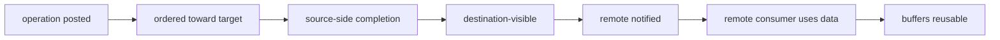

不同 API 可能只保证其中几步。`fence`、`quiet`、event、collective completion 和 signal 不能只因为都与“等待”有关就互换。

### 9.2 Cross-device event

`cudaStreamWaitEvent()` 可以让一块 GPU 的 stream 等待另一块 GPU 上记录的 event，从而建立 scheduler-visible task edge。它适合 task-level handoff；fine-grained peer atomic 则还要求 peer/native-atomic capability、合法 storage、匹配 scope 和 memory order。

统一虚拟地址只说明指针空间，不证明 remote atomic/coherence protocol 成立。

### 9.3 NCCL collective completion

NCCL host call 返回通常只表示 collective 已 enqueue 到 CUDA stream。Output 应通过对应 stream/event completion 判断何时可用。

Collective 还要求 communicator/rank participants 和调用顺序匹配。多 stream group operation 可能建立较宽 dependency。NCCL 负责 collective communication，不替代 kernel 内 barrier。

### 9.4 NVSHMEM 把 order、delivery、notification 分开

| Primitive | 主要保证 | 不能直接推出 |
| --- | --- | --- |
| `nvshmem_fence` | 对目标 PE 的相关 remote updates 排序 | delivery completion、remote notification |
| `nvshmem_quiet` | 先前相关 operations 完成并在 destination visible | collective rendezvous、自动通知 consumer |
| signal + wait/test | point-to-point progress notification | 未正确排序的 payload 自动 publication |
| barrier/team sync | collective synchronization及其规定的 outstanding operations 语义 | kernel 内任意 scope 的同步替代 |

典型 one-sided handoff是：

```text
prepare local payload
  → ordered remote put
  → ensure required delivery/completion
  → publish remote signal
  → remote wait observes generation
  → remote consumer uses payload
  → protocol later returns buffer ownership
```

### 9.5 External semaphore

Vulkan/D3D/NvSciSync 等 external semaphore 把 wait/signal enqueue 到 CUDA stream，用 binary state 或 monotonic timeline value 交接进度：

```text
graphics signals 7
  → CUDA waits 7 and owns resource
  → CUDA updates resource
  → CUDA signals 8
  → graphics waits 8 and resumes
```

Timeline 达标之外，还要遵守 external resource layout/state、handle lifetime 和 ownership-transfer rule。

---

## 10. 把整条 pipeline 重放一遍

假设 kernel K 使用两级 TMA→shared→WGMMA pipeline，并把结果交给 stream B。

### 10.1 Software work DAG

```text
mallocAsync(input/output)
  → upstream producer in stream A
  → event input_ready
  → stream K waits input_ready
  → kernel K
  → event K_done
  ├→ stream B local consumer
  └→ NCCL/NVSHMEM/external handoff
  → all consumers done
  → freeAsync / reuse
```

### 10.2 Kernel 内 tile k 的交接链

```text
CTA becomes resident
  → producer warp becomes eligible
  → producer acquires empty stage S[k mod 2]
  → elected thread prepares mbarrier phase and issues TMA
  → async engine moves tile while warps do independent work
  → mbarrier transaction reaches completion
  → consumer acquires full stage and required visibility
  → WGMMA input ordering and async operations are issued
  → Tensor group completion releases result dependency
  → output store is issued
  → consumer releases shared stage as empty
  → store/drain and grid retirement satisfy K_done
```

### 10.3 时间重叠图

```text
time ──────────────────────────────────────────────────────────────→

TMA      fill S0(k) ──────┐ fill S1(k+1) ────┐ fill S0(k+2) ────┐
                           │                   │                   │
mbar     phase0 complete ──┘ phase1 complete ─┘ phase2 complete ─┘

Tensor                    use S0(k) ────────┐ use S1(k+1) ──────┐
                                            │                    │
owner    E0→Filling→Full→Consuming→Empty ───┘                    │
         E1────────→Filling→Full→Consuming→Empty ────────────────┘
```

这里至少有五种同时存在、但责任不同的 state：

- stream/event task state；
- CTA/warp residency 与 eligibility；
- scoreboard instruction dependencies；
- mbarrier/Tensor async completion；
- stage ownership phase。

### 10.4 Tile handoff ledger

| Gate | Producer → consumer | Receipt | 等待时持有的资源 | 需要额外证明 |
| --- | --- | --- | --- | --- |
| input ready | stream A → K | event/edge | K 通常尚未 admission | allocation lifetime |
| CTA placement | device scheduler → CTA | residency | registers/shared/CTA slot | producer progress |
| global load ready | memory path → instruction | scoreboard | warp context | 无跨-thread publication |
| TMA submission | producer warp → async proxy | issue + required proxy ordering | producer warp/descriptor | elected once、source visibility |
| shared tile ready | TMA → consumers | mbarrier tx/phase | waiting consumer warps resident | correct bytes、phase、acquire |
| Tensor result ready | Tensor path → consumer instruction | commit/wait/specialized completion | warpgroup context | input/output contract |
| stage empty | consumer → producer | ownership release | stage shared memory | generation identity |
| output ready | K → stream B | grid completion/event | downstream尚未运行 | output buffer lifetime |
| remote ready | local → remote | API-specific completion + signal | communication resources | order、delivery、notification |

这张 ledger 才是整篇的“统一模型”。任何新同步 primitive 都可以放进来审查，而不是记住一个孤立定义。

---

## 11. 用同一条交接链诊断 correctness 与 performance

### 11.1 先找到 tile 停在哪次交接

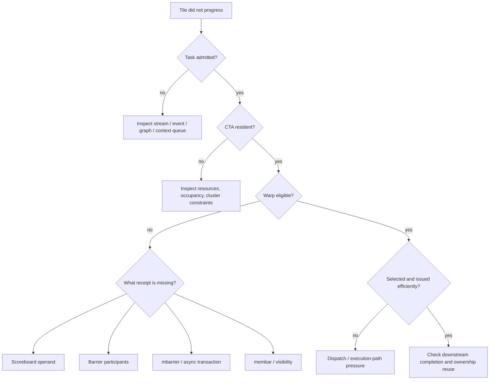

### 11.2 Correctness 症状

| 症状 | 最可能失败的证明 |
| --- | --- |
| kernel 永久 hang | participant/progress：barrier mismatch、residency deadlock、rank mismatch |
| 偶发旧数据 | visibility：缺 release/acquire、scope 太窄、proxy handoff 缺失 |
| 上一 tile 混入下一 tile | ownership/phase：ABA、parity/token、stage reuse 错误 |
| 新 GPU 或优化编译才出错 | 隐式 lockstep、volatile 假同步、data race |
| multi-stream use-after-free | ownership/lifetime DAG 缺失 |
| PDL secondary 读到未完成结果 | 把 launch-ready 当 data-ready |
| remote consumer 永久等 | completion/notification 或 communicator progress 失败 |

### 11.3 Nsight / timeline 现象

| 现象 | Tile 大概率停在哪个 gate |
| --- | --- |
| active warps 高、eligible 低 | 多个 warps 同时缺 dependency/barrier/completion receipt |
| long scoreboard 高 | global/local/texture result 未返回 |
| short scoreboard 高 | shared/MIO dependency、bank conflict 等 |
| barrier stall 高 | participant 到达不平衡或 scope 过宽 |
| membar stall 高 | ordering要求的 outstanding traffic 未满足 |
| math pipe throttle | Tensor/FP throughput，不是缺 barrier |
| not selected 高但 issue slot 满 | scheduler 有其他 eligible work，通常不是首要问题 |
| copy 与 compute 不重叠 | wait 太早、stage 太浅、resource conflict或 async protocol未建立 |
| timeline 出现 device-wide 空洞 | host wait 太宽、legacy stream coupling、隐藏 dependency |
| NCCL 周围多 streams 被串行 | group dependency 或 software DAG 过宽 |

### 11.4 三个常见误诊

1. **把 long scoreboard 当缺少 barrier**：scoreboard 已经在等待 producer result；插 barrier 只会增加 participant wait。
2. **把 barrier 当 memory fence 的同义词**：barrier 同时涉及 participant phase；fence 没有到达计数或 signal。
3. **看到 copy complete 就立即复用 stage**：completion 只完成 producer→consumer 方向，consumer→producer 的 empty ownership 尚未返回。

---

## 12. 建议实验：让每张 receipt 都能被观察

### 实验 A：Scoreboard 与 latency hiding

写三版 global-load kernel：

1. load 后立即 use；
2. load 与 use 之间加入 independent arithmetic；
3. 增加 independent warps。

比较 long scoreboard、active/eligible warps、issue efficiency、occupancy 与 kernel time。目标是观察同一张 register receipt 如何被 ILP/TLP 隐藏。

### 实验 B：Shared tile handoff

实现三版 block producer-consumer：

1. 错误 plain/volatile flag；
2. full-block `__syncthreads()`；
3. subset release/acquire atomic 或 named barrier。

分别写出 progress、completion、visibility、ownership proof，并比较 barrier tail。

### 实验 C：从同步 copy 演进到 async pipeline

按顺序实现：

1. ordinary global→register→shared copy；
2. `cp.async` / `cuda::memcpy_async` group；
3. two-stage `cuda::pipeline`；
4. 支持硬件上的 TMA + mbarrier；
5. 支持时加入 WGMMA/tcgen completion。

每一步都画 full/empty state，标注哪个 wait 被推迟，以及 producer/consumer 各自何时不 eligible。

### 实验 D：Software DAG 与 lifetime

用三条 streams 构造：

```text
malloc/producer → tile kernel → consumer → freeAsync
```

逐个删除 event edge，观察 data race/use-after-free；再比较 event wait 与 `cudaDeviceSynchronize()` 对 timeline overlap 的影响。

### 实验 E：Distributed completion

如果有多 GPU：

1. 用 cross-device event 表达 task handoff；
2. 观察 NCCL call return 与 CUDA stream completion 的差异；
3. 使用 NVSHMEM 时分别标记 fence、quiet、signal/wait；
4. 对每一步标注 ordered、source-complete、destination-visible、notified、reusable。

---

## 13. 支线机制放回它们所属的交接点

这些机制重要，但不应打断 tile 主线。

### 13.1 Green / Execution Context：改变 progress resource，不创建 data edge

Green Context 可以 provision SM/work-queue resources，减轻不同 workloads 的资源干扰。它改变的是 grid admission、placement 与 progress premise；不会自动在两个 contexts 的 payload 间建立 happens-before。

Context-level event/synchronization 可捕获更宽的 work 范围。根据需要选择 event、stream、context 或 device wait，不要把 isolation 当 completion。

### 13.2 Dynamic Parallelism：device-created software DAG

Device thread launch child grid 后，parent/child 仍构成 work DAG。Proper nesting 不表示 child 必然与 parent 并发，也不允许随意把 parent shared/local memory 交给 child。

现代 CDP2/tail launch 应按当前 execution model 组织 child result 的下游消费，而不是套用旧 device-side `cudaDeviceSynchronize()` 心智模型。

### 13.3 Cluster Launch Control：scheduler state 也可以异步交接

Blackwell CLC 让执行中的 block/cluster 尝试取消尚未开始的 work，并取得被取消 index 来 work-steal：

```text
leader issues cancellation request
  → scheduler tries to cancel pending work
  → result written asynchronously
  → mbarrier transaction completes
  → requester waits phase and performs required proxy handoff
  → success: execute stolen index; failure: follow retry/observation rules
```

它同时涉及 leader election、scheduler state、mbarrier transaction、shared result lifetime 与 proxy ordering。CLC 是 scheduling primitive，不是 memory fence，也不保证每次 steal 成功。

### 13.4 Memory synchronization domains：减少 fence interference

Hopper memory synchronization domains 可以隔离无关 traffic，减少宽 scope fence 被其他 transactions 拖累。它优化的是 fence interference，不创建新的 rendezvous，也不免费提供跨-domain ordering。

---

## 14. 代际边界：主线稳定，凭证实现会变化

| 代际主线 | 与 tile 交接相关的变化 |
| --- | --- |
| Pascal 及更早 | 旧代码常依赖隐式 warp lockstep；新代码不应延续该假设 |
| Volta/Turing | Independent Thread Scheduling、现代 scoped memory model 基础 |
| Ampere | hardware-accelerated async copy、mbarrier/pipeline 能力扩展 |
| Hopper | cluster、DSM、TMA、mbarrier tx-count、WGMMA、memory sync domains、PDL |
| Blackwell-generation | Tensor Memory、tcgen05、CLC、更多 specialized/proxy completion rules |

稳定不变的是四份证明；变化的是：谁执行异步工作、completion 写进什么 object、哪些 proxy/scope 有效、object lifetime 如何管理。

PTX 是 virtual ISA，SASS 才是 target-specific machine instruction。Scheduler 数量、dispatch width、scoreboard encoding、cache/coherence implementation 与 firmware policy 没有全部公开，因此本文采用公开 programming/PTX/profiler model，不把它误写成完整 RTL。

---

## 15. 机制索引：它们各自签发什么 receipt

这一节用于查阅，不是阅读主线。

| 机制 | 主要状态/receipt | 直接 observer | 不自动保证 |
| --- | --- | --- | --- |
| scoreboard | operand/result ready | warp scheduler、dependent instruction | 跨 thread visibility |
| hardware backpressure | target path capacity | scheduler/dispatcher | producer completion |
| warp/CTA/cluster barrier | participant phase complete | group participants | arbitrary async work完成 |
| mbarrier | phase + arrivals + transactions | participants、async engine | storage 已可下一代复用 |
| async group | issuing context 的 operation batch | issuing thread/warp/warpgroup | CTA rendezvous |
| fence | memory effects ordering | memory model participants | signal、arrival、completion |
| release/acquire atomic | state transition + publication edge | scope覆盖的 threads | producer forward progress |
| semaphore | permit/ownership/progress count | acquire waiter | 任意 payload 的隐式 ordering |
| CUDA event | stream record 点前 task completion | wait stream、host | kernel 内 thread phase |
| external timeline | cross-API monotonic progress | imported API/device/process | resource layout/ownership细节 |
| NCCL completion | communicator collective work | participating ranks/streams | one-sided general memory fence |
| NVSHMEM quiet/signal | delivery completion / notification | PE/team | 彼此未声明的保证 |

选择原则不是“最强 primitive”，而是：

1. 最窄 scope；
2. 最小 participant set；
3. 最精确 completion condition；
4. 最晚必要 wait；
5. 明确的 generation 与 ownership return；
6. scheduler 可满足的 forward-progress premise。

---

## 16. 官方资料与阅读顺序

### 16.1 先看 work、placement 与 warp issue

1. CUDA Programming Model
   <https://docs.nvidia.com/cuda/cuda-programming-guide/01-introduction/programming-model.html>
2. Advanced Kernel Programming：SIMT、Independent Thread Scheduling、occupancy
   <https://docs.nvidia.com/cuda/cuda-programming-guide/03-advanced/advanced-kernel-programming.html>
3. Nsight Compute Profiling Guide：active/eligible/issued warp 与 stall reason
   <https://docs.nvidia.com/nsight-compute/ProfilingGuide/>
4. CUDA C++ Best Practices Guide
   <https://docs.nvidia.com/cuda/cuda-c-best-practices-guide/>
5. Green / Execution Contexts
   <https://docs.nvidia.com/cuda/cuda-programming-guide/04-special-topics/green-contexts.html>

### 16.2 再看 participant、memory 与 completion

6. CUDA C/C++ Language Extensions：warp、barrier、atomic、fence
   <https://docs.nvidia.com/cuda/cuda-programming-guide/05-appendices/cpp-language-extensions.html>
7. CUDA C++ Memory Model
   <https://docs.nvidia.com/cuda/cuda-programming-guide/05-appendices/cuda-cpp-memory-model.html>
8. Cooperative Groups
   <https://docs.nvidia.com/cuda/cuda-programming-guide/04-special-topics/cooperative-groups.html>
9. libcu++ synchronization primitives
   <https://nvidia.github.io/cccl/libcudacxx/extended_api/synchronization_primitives.html>
10. PTX ISA：memory consistency、barrier、mbarrier、fence、WGMMA、tcgen05
    <https://docs.nvidia.com/cuda/parallel-thread-execution/>

### 16.3 然后看 async tile pipeline

11. CUDA asynchronous barriers
    <https://docs.nvidia.com/cuda/cuda-programming-guide/04-special-topics/async-barriers.html>
12. CUDA pipelines
    <https://docs.nvidia.com/cuda/cuda-programming-guide/04-special-topics/pipelines.html>
13. CUDA asynchronous data copies
    <https://docs.nvidia.com/cuda/cuda-programming-guide/04-special-topics/async-copies.html>
14. Hopper Tuning Guide
    <https://docs.nvidia.com/cuda/archive/13.0.0/hopper-tuning-guide/index.html>
15. Cluster Launch Control
    <https://docs.nvidia.com/cuda/cuda-programming-guide/04-special-topics/cluster-launch-control.html>
16. Programmatic Dependent Launch
    <https://docs.nvidia.com/cuda/cuda-programming-guide/04-special-topics/programmatic-dependent-launch.html>

### 16.4 最后扩展到 task lifetime 与 remote handoff

17. CUDA asynchronous execution：streams/events
    <https://docs.nvidia.com/cuda/cuda-programming-guide/02-basics/asynchronous-execution.html>
18. Stream-Ordered Memory Allocator
    <https://docs.nvidia.com/cuda/cuda-programming-guide/04-special-topics/stream-ordered-memory-allocation.html>
19. Dynamic Parallelism
    <https://docs.nvidia.com/cuda/cuda-programming-guide/04-special-topics/dynamic-parallelism.html>
20. Memory Synchronization Domains
    <https://docs.nvidia.com/cuda/cuda-programming-guide/04-special-topics/memory-sync-domains.html>
21. Unified Memory
    <https://docs.nvidia.com/cuda/cuda-programming-guide/04-special-topics/unified-memory.html>
22. Multi-GPU Systems
    <https://docs.nvidia.com/cuda/cuda-programming-guide/03-advanced/multi-gpu-systems.html>
23. Graphics Interop / External Semaphore
    <https://docs.nvidia.com/cuda/cuda-programming-guide/04-special-topics/graphics-interop.html>
24. NCCL CUDA Stream Semantics
    <https://docs.nvidia.com/deeplearning/nccl/user-guide/docs/usage/streams.html>
25. NVSHMEM Memory Ordering
    <https://docs.nvidia.com/nvshmem/api/gen/api/ordering.html>

---

## 17. 最后的统一心智模型

遇到任何 GPU synchronization primitive，先不要问“它和 barrier 有什么区别”，而要把 tile 放回交接链，逐项问：

```text
谁在生产？谁在消费？
producer 一定能被调度吗？
consumer 等到的 completion 精确对应什么工作？
这张 receipt 是否带 payload visibility，scope/proxy 是否匹配？
等待时 warp/CTA/task 还占着什么资源？
consumer 用完后，怎样把 ownership 交回下一 generation？
```

> **Software DAG 决定 work 何时允许进入；placement 决定谁能同时在场；warp scheduler 根据 scoreboard、barrier 与 resource state 决定 instruction 能否发射；async completion object 把 copy/Tensor work 交给 consumer；memory order 与 proxy rule 使 payload 可见；phase、semaphore 与 lifetime edge 最终把 storage 交回下一块 tile。**

这就是从 CPU submission 到 remote completion 的同一条同步主线。
