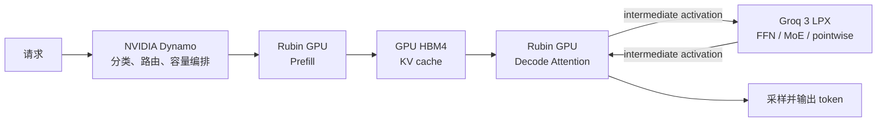

# NVIDIA Rubin GPU + Groq 3 LPX：异构推理与负载分配

<Badge type="tip" text="NVIDIA Rubin GPU" /> <Badge type="tip" text="Groq 3 LPX" /> <Badge type="info" text="系统研究" />

最后核对日期：2026-08-06。

本文讨论 NVIDIA 在 2026 年公布的 **NVIDIA Groq 3 LPU**、单芯片型号 **LP30** 和机架级系统 **Groq 3 LPX**。研究目标是回答两个问题：

1. Rubin GPU 与 Groq 3 LPX 是否会共同执行同一次推理？
2. 如果会，训练、prefill、attention、FFN/MoE、KV cache 和在线请求应如何分配？

## 0. 结论先行

NVIDIA 公布的方案不是“GPU 做 prefill、LPU 做完整 decode”，也不是让运行时随意把 CUDA kernel 搬到 LPU。它是由 NVIDIA Dynamo 编排的 **Attention–FFN Disaggregation（AFD）**：

- **Rubin GPU**：训练、prefill、构建和保存 KV cache、decode attention，以及动态/通用算子；
- **Groq 3 LPX**：decode 中延迟敏感的 FFN、稀疏 MoE expert 和部分 pointwise 运算；
- **GPU 与 LPX 之间**：每个输出 token 的 decode 循环中交换中间 activation；
- **另一条异构路径**：LPX 跑小 draft model，Rubin GPU 跑大 target model 并验证候选 token。

负载分配必须分四层理解：

| 层级 | 决策 | 动态性 |
| --- | --- | --- |
| 模型编译/部署 | attention 留在 GPU，FFN/MoE 放到 LPX；生成两侧兼容产物 | 通常离线、版本化 |
| 请求路由 | 本请求走 GPU-only、GPU+LPX AFD，还是 speculative path | 在线动态 |
| 容量调度 | 同时预留 GPU attention、LPX FFN 和互联容量；决定 GPU/LPX 副本或机架数 | 在线动态 |
| 设备内部 | GPU 调度 block/warp；LPX 编译器排定 SRAM、计算、C2C 路由和时间 | GPU 偏动态，LPX 偏静态 |

所以，“如何分配 load”的正确答案不是固定 `70% GPU + 30% LPU`，而是：

> 先固定模型图的异构切分，再按请求的 SLO、输入/输出长度、batch、模型支持度和实时队列选择执行路径；进入 AFD 后，把 GPU、LPX 和链路当作一个必须同时获得容量的耦合流水线。


## 1. 公开硬件是什么

### 1.1 Groq 3 LP30、tray 和 LPX rack

NVIDIA 公布的 Groq 3 层级如下：

| 层级 | 公开规格 | 解释 |
| --- | --- | --- |
| 单颗 LP30 | 500 MB SRAM、150 TB/s SRAM 带宽、2.5 TB/s scale-up 带宽、96 条 112 Gbps C2C link | SRAM-first、显式数据移动、确定性执行 |
| 单个 LPX tray | 8 颗 LP30、4 GB SRAM、1.2 PB/s SRAM 带宽、9.6 PFLOPS FP8、20 TB/s scale-up；经 fabric expansion logic 最多 256 GB DRAM，经 host CPU 最多 128 GB DRAM | 1U 液冷计算托盘 |
| 一个 LPX rack | 32 个 tray、256 颗 LP30、128 GB SRAM、40 PB/s SRAM 带宽、315 PFLOPS FP8、640 TB/s scale-up、12 TB DDR5 | 机架级低延迟推理系统 |

LP30 仍延续公开 Groq 架构中的功能模块：

- `MEM`：SRAM-first 存储与显式访问；
- `MXM`：矩阵乘加；
- `VXM`：逐元素运算、类型转换与 activation；
- `SXM`：向量交换、旋转、分发和转置；
- 固定的 **320-byte vector** 是计算、访存和跨设备传输的基本单位。

“640 TB/s scale-up”是 **LPX 机架内部 LPU C2C 的聚合带宽**，不能拿来当 GPU↔LPX 的传输带宽。后者的有效带宽、单次 handoff 延迟和具体协议目前没有公开。

### 1.2 Rubin GPU 与 NVL72

作为对照，公开的单颗 Rubin GPU 规格包括 224 个 SM、896 个 Tensor Core、288 GB HBM4、22 TB/s HBM 带宽、50 PFLOPS NVFP4、3.6 TB/s NVLink 6 scale-up 带宽。Vera Rubin NVL72 由 72 颗 Rubin GPU 和 36 颗 Vera CPU 组成，合计 20.7 TB HBM4。

不要把 LPX 的 `315 PFLOPS FP8` 与 NVL72 的 `NVFP4` 峰值直接做倍数比较：数据格式、稀疏性、操作定义、可利用率和目标工作负载都不同。真正相关的是目标 batch/context 下的 TTFT、TPOT、tail latency、tokens/s、功耗和成本。

### 1.3 两种芯片的互补点

| 工作特征 | Rubin GPU 强项 | Groq 3 LPX 强项 |
| --- | --- | --- |
| 大容量模型状态 | 大容量 HBM4 | 片上 SRAM 小，但可跨 256 LPU 分片并由 DDR5 补充 |
| 大 batch / 高并行 | 大量 SM、Tensor Core、动态调度 | 不是主要定位 |
| 小 batch decode | 仍可执行，但利用率与 jitter 受负载影响 | 固定向量、静态排程、SRAM 高带宽、低 jitter |
| 动态 shape / 自定义算子 | CUDA 生态和通用性强 | 依赖支持的图与编译产物 |
| 运行时调度 | block/warp 及软件 runtime 动态适应 | 编译器显式安排计算、数据移动和同步 |
| 训练 | 完整训练与通信生态 | 公开定位是推理，不是同步训练参与者 |

## 2. AFD 到底怎样执行

### 2.1 端到端路径



可以把一个 Transformer layer 的 decode 抽象成：

```text
GPU:  hidden state + KV cache → attention → activation
                                      │
                                      ▼
LPX:                             FFN / MoE
                                      │
                                      ▼
GPU:                         下一 layer / 采样
```

每生成一个 token，这个双引擎循环都会重复。公开资料描述的是“每 token 交换 intermediate activations”；实际产品是否把多个 layer、算子或请求一起 fusion/batch，buffer 如何布局，以及同步粒度多细，尚未公开。

### 2.2 状态放在哪里

在 **AFD 路径** 中，推荐的心智模型是：

| 状态/计算 | 位置 | 原因 |
| --- | --- | --- |
| prompt tokens、prefill | GPU | 大规模并行与大容量 HBM |
| KV cache | GPU HBM | decode attention 每 token 都要访问；避免迁移随 context 增长的状态 |
| decode attention 权重和执行 | GPU | 与 KV cache 共置，保留灵活性 |
| FFN/MoE 权重与 active working set | LPX SRAM/DDR5，跨 LP30 分片 | 让延迟敏感权重路径靠近高带宽 SRAM |
| hidden activation | GPU↔LPX 往返 | 图切分边界上的短生命周期张量 |
| 采样、请求状态和服务编排 | GPU/host/Dynamo | 具体实现未完全公开，不能假定都在 LPU |

NVIDIA 的 LP30 架构文章也说 LPU 自身能把 weights、activations 和 KV state 放入片上 SRAM；这描述 LPU 的一般执行能力。它不改变 AFD 方案中“KV cache 与 attention 留在 GPU”的产品级切分。

目前没有公开证据表明 GPU HBM 与 LPX SRAM/DDR5 构成 cache-coherent unified memory。营销材料中的 “Fusion Memory Architecture” 也不足以推出统一虚拟地址、cache coherence 或任意指针共享。

### 2.3 AFD 与传统 P/D disaggregation 的区别

| 维度 | Prefill/Decode 分离（P/D） | Attention–FFN 分离（AFD） |
| --- | --- | --- |
| 图切分位置 | 请求阶段边界 | decode 的 Transformer layer 内部 |
| 常见硬件 | prefill GPU pool → decode GPU pool | Rubin GPU attention ↔ LPX FFN/MoE |
| 主要迁移状态 | prefill 后迁移 KV cache | 每 token 往返 hidden activation；KV 留在 GPU |
| 传输频率 | 通常每请求一次主要 KV handoff | 每 token、跨 layer/segment 重复 handoff |
| 优化目标 | TTFT 与 TPOT 分池扩缩容 | 让 attention 与 FFN 分别使用合适引擎 |
| 失败恢复 | decode worker 必须获得 KV | GPU 仍拥有 KV，但 AFD session 依赖 LPX 和链路 |

AFD 不是 P/D 的同义词，也不能由公开的 GPU↔GPU NIXL KV transfer 文档推断出 GPU↔LPX activation transport 的实现。

## 3. 为什么这样切分

### 3.1 Prefill 放 GPU

Prefill 一次处理大量输入 token，矩阵乘可以暴露较大并行度；长 prompt 还需要较大的模型状态和 KV 容量。Rubin 的 Tensor Core、HBM4 容量和成熟的并行生态更匹配这类工作。

### 3.2 Decode attention 与 KV 放 GPU

第 `i` 个输出 token 的 attention 需要读取累计 context 的 KV。context 越长，数据移动压力越大，shape 与请求之间的差异也越明显。把 attention 与 KV 共置在 GPU HBM 可以避免在每个 token 上搬动随 context 增长的状态。

### 3.3 Decode FFN/MoE 放 LPX

在交互式、小 batch decode 中，FFN/MoE 常是“读权重、计算一个或少量 token、再读下一层权重”的延迟敏感路径。LPX 的 SRAM-first 设计、显式数据移动和静态 time-space schedule 旨在减少 cache miss、调度竞争和运行时 jitter。

Sparse MoE 尤其值得关注：每个 token 只激活部分 experts，低 batch 时很难靠大 batch 稳定摊薄权重读取和调度开销。官方将 MoE expert execution 明确列为 AFD 的重点目标。不过，router 在哪一侧运行、expert 如何映射到 LP30、热点 expert 是否复制，都没有公开，不能自行补全。

### 3.4 为什么传 activation 而不是 KV

若每层只传一条 hidden vector，传输规模近似与 hidden size 成正比；KV 的规模还与 context length 和 layer 数累积增长。因此保留 KV、只移动图切分边界上的 activation，通常更适合每-token 循环。

这只是算法量级解释。AFD 是否真正获益仍取决于有效链路、同步开销、batch、模型宽度、层数和两侧并行方式。

## 4. 哪些 load 放哪一侧

### 4.1 工作负载决策表

| Load | 首选路径 | 判断依据 |
| --- | --- | --- |
| pretraining、SFT、LoRA training、backward、optimizer | GPU-only | LPU 没有公开的 CUDA autograd、NCCL rank 或同步训练栈 |
| 长上下文 prefill | GPU | 大 HBM、密集并行计算 |
| KV cache 与 decode attention | GPU | 与增长的 context 状态共置 |
| 小 batch、严格 TPOT/P99 的 decode FFN | GPU+LPX AFD 候选 | LPX 低延迟、低 jitter 路径 |
| 大型 sparse MoE 的交互式 decode | GPU+LPX AFD 强候选 | 官方重点目标，FFN/expert 比例高 |
| coding、voice、agent loop、premium interactive | AFD 候选 | 输出长、串行 token 延迟直接影响体验 |
| 长 prompt、短 output | 通常 GPU-only | prefill 占主导，AFD 的 decode 收益难摊薄 handoff |
| 大 batch、后台生成、宽松 TPOT | 通常 GPU-only | GPU batching 能维持高利用率 |
| embeddings、moderation、vision encoder、diffusion、media pipeline | GPU-only | 不是 LPX AFD 的公开目标路径 |
| 动态模型、自定义 CUDA op、尚未支持的 dtype/shape | GPU-only | LPX 需要兼容编译产物 |
| 小 draft model + 大 target model | LPX draft + GPU verify 候选 | 只有 acceptance 足够高才有收益 |
| 没有受支持 LPX runtime/recipe 的部署 | GPU-only | 架构已公布不等于公开 SDK 已可复现 |

“候选”很重要：不能只按 workload 名称硬编码。相同模型在 batch 1 与 batch 64、输出 32 与 2K token、冷启动与热权重下，最优路径可能相反。

### 4.2 不应该怎样分

- 不按请求数量做静态 `50/50`；一条 128-token prompt 与一条 64K-token prompt 不是同样的 load。
- 不在生成过程中因为“另一侧空闲”就随意迁移单个 op；模型切分、buffer ABI 和编译产物必须事先匹配。
- 不只看 GPU utilization；还要看 HBM/KV 压力、attention queue、LPX FFN queue 和 activation link。
- 不看到 LPX 空闲就接纳 AFD 请求；GPU attention 或链路已经饱和时，LPX 只会等待。
- 不把 LPX 内部 `640 TB/s` 当成 GPU↔LPX 网络能力。
- 不让一个同步 training step 横跨 GPU 和 LPX；公开栈没有这种训练 world。

## 5. 性能与传输成本模型

### 5.1 单请求延迟

定义：

- `P`：input sequence length；
- `O`：output sequence length；
- `C_i = P + i`：第 `i` 个输出 token 的 context；
- `B`：decode 时活跃序列数；
- `L`：Transformer layer 数；
- `A_g(C_i, B)`：GPU 上一层 attention 时间；
- `M_g(B)`、`M_l(B)`：GPU/LPU 上一层 FFN/MoE 时间；
- `X_gl`、`X_lg`：单层 activation 往返的两个方向时间；
- `F_g(P, B)`：GPU prefill 时间；
- `Q`：排队、编排和同步开销。

GPU-only 的粗略模型：

```text
T_gpu ≈ Q_gpu + F_g(P, B)
        + Σ_output_token Σ_layer [A_g(C_i, B) + M_g(B)]
```

AFD 的粗略模型：

```text
T_afd ≈ Q_path + F_g(P, B)
        + Σ_output_token Σ_layer
          [A_g(C_i, B) + X_gl + M_l(B) + X_lg]
```

一层 FFN 改放 LPX 的基本收益条件是：

```text
M_g(B) - M_l(B)
  > X_gl + X_lg + 新增排队/同步开销
```

真实系统可以重叠通信与不同请求/层的计算，因此总吞吐不能只把各项机械相加；但单请求依赖链仍必须等待该 token 所需的 attention 和 FFN 完成。应测 critical path 和 pipeline bubble，而不是仅比较峰值 FLOPS。

### 5.2 activation 流量下界示例

若概念上每层向 LPX 发送一次 hidden vector、再返回一次，忽略 header、padding、额外 tensor、压缩和 fusion，则每个 decode step 的流量下界近似为：

```text
D_step_min ≈ 2 × L × B × d × s bytes
```

其中 `d` 是 hidden size，`s` 是每个 activation 元素字节数。

示例：`L=120`、`d=16384`、`B=1`、`s=2`（16-bit activation）：

```text
D_step_min = 2 × 120 × 1 × 16384 × 2
           = 7,864,320 bytes
           ≈ 7.5 MiB / output token
```

若单流达到 400 token/s，下界约为 `3.15 GB/s`（`2.93 GiB/s`）。8-bit activation 约减半。这个数字是用于理解量级的**推导值**，不是 NVIDIA 披露的实际流量；产品可能合并 layer、采用不同 dtype/layout、压缩或更复杂的流水。

这个估算也解释了为什么 GPU↔LPX 链路、拓扑邻近和通信重叠会直接决定 AFD 是否成立。

### 5.3 系统吞吐是三者的最小值

```text
C_afd ≤ min(
    C_gpu_attention,
    C_lpx_ffn,
    BW_activation_effective / bytes_activation_per_token
)
```

因此 AFD admission 应原子检查一个资源 gang：

```text
GPU prefill capacity
+ GPU decode-attention capacity
+ LPX FFN/MoE capacity
+ GPU↔LPX activation-link capacity
```

缺少任何一项都不应接纳新 AFD session，否则它会把排队和 tail latency 转移到另一个阶段。

## 6. 在线请求路由器怎样设计

以下是工程建议，不是 NVIDIA 已披露的 Dynamo AFD 算法。

### 6.1 先做硬过滤

每个请求先检查：

- model ID、revision、dtype、quantization、MoE 配置是否有验证过的 AFD artifact；
- input/output limit、multimodal、tool calling、LoRA/adapters 是否受支持；
- GPU、LPX、链路和软件版本是否健康且兼容；
- 数据隔离、安全域和租户策略是否允许跨两个 rack；
- GPU HBM/KV 容量、LPX working set 和双方队列是否有 headroom。

任何硬条件不满足，回退 GPU-only，而不是在运行中试错。

### 6.2 对可行路径做预测

候选路径可以是：

```text
GPU_FULL
GPU_LPX_AFD
LPX_DRAFT_GPU_VERIFY
```

可定义一个带 SLO 约束的评分：

```text
J(path) =
    w_ttft  × predicted_TTFT / TTFT_SLO
  + w_tpot  × predicted_TPOT / TPOT_SLO
  + w_cost  × predicted_cost
  + w_energy× predicted_energy
  + w_queue × queue_risk
  + w_fail  × failure_risk
```

先剔除预测 P99 TTFT/TPOT 违反 SLO 的路径，再选 `J` 最小者。预测器至少使用：

- input tokens、expected output tokens、当前 context；
- batchability、sampling 参数、latency tier；
- dense/MoE、active experts、模型宽度和层数；
- prefix/KV cache 命中；
- GPU attention 和 LPX FFN 实测 service time；
- 两侧 queue depth、GPU HBM/KV 占用；
- activation link 的有效带宽、延迟和 P99 jitter；
- speculative draft 的 acceptance 预测。

### 6.3 参考伪代码

```python
def choose_path(req, platform, model_profile):
    if req.is_training or req.is_finetuning:
        return GPU_FULL

    gpu = predict_gpu_full(req, platform, model_profile)
    candidates = [gpu]

    if (
        platform.lpx_runtime_validated
        and model_profile.afd_supported(req.revision, req.dtype)
        and gang_capacity_available(
            gpu_prefill=gpu_prefill_demand(req),
            gpu_attention=gpu_attention_demand(req),
            lpx_ffn=lpx_ffn_demand(req),
            activation_link=activation_bytes(req),
        )
    ):
        candidates.append(predict_afd(req, platform, model_profile))

    if (
        platform.lpx_runtime_validated
        and model_profile.speculative_pair_supported
        and predicted_acceptance(req) >= model_profile.min_acceptance
    ):
        candidates.append(predict_lpx_draft_gpu_verify(req))

    feasible = [
        path for path in candidates
        if path.p99_ttft <= req.slo.ttft
        and path.p99_tpot <= req.slo.tpot
    ]

    return min(feasible or [gpu], key=cost_slo_score)
```

需要为切换加入 hysteresis，避免 GPU-only 与 AFD 因短期波动反复抖动。同一 generation 应保持 session affinity：KV 在某个 GPU worker 上时，不应无代价迁移到另一 GPU。

### 6.4 Speculative decoding 的单独条件

LPX draft + GPU verify 只有在下式成立时才值得选择：

```text
T_draft_lpx(k)
+ T_handoff
+ T_verify_gpu(k)
+ T_reject_and_rollback
< T_target_baseline
```

至少要测 draft 长度 `k`、每位置 acceptance、平均每次 verification 接受的 token 数、sampling 对 acceptance 的影响、handoff、rollback 和 verifier batch efficiency。draft/target 差异大、温度高或接受率低时，这条路径可能比 GPU-only 更慢。

## 7. GPU 与 LPX 应配多少

不存在公开的固定 `1 个 NVL72 : N 个 LPX` 比例。NVIDIA GTC 说明可以在一个 GPU 系统旁增加第二、第三、第四个 LPX rack；真正比例由模型和服务目标决定。

对请求类别 `c`，令到达率为 `λ_c`，其平均 GPU attention、LPX FFN 和链路需求分别为 `t_g,c`、`t_l,c`、`b_x,c`：

```text
D_gpu = Σ_c λ_c × E[t_g,c]
D_lpx = Σ_c λ_c × E[t_l,c]
D_link = Σ_c λ_c × E[b_x,c]
```

选 `N_gpu`、`N_lpx` 和 fabric 容量，使三者在目标 P99 下都保留 headroom，而不是追求 100% 利用率。一个实用的控制回路是：

| 观测信号 | 主要动作 |
| --- | --- |
| TTFT、prefill queue 上升 | 增加/迁移 GPU prefill capacity |
| GPU attention time 或 KV/HBM 压力上升 | 增加 GPU decode-attention capacity，改善 KV affinity |
| TPOT、LPX FFN queue 上升而 GPU 空闲 | 增加 LPX capacity 或减少 AFD admission |
| activation transfer P99/bandwidth 上升 | 扩 fabric、改善拓扑邻近，或回退部分请求到 GPU-only |
| GPU-only batch 利用率高且满足 SLO | 保持吞吐型请求在 GPU |
| LPX 空闲但 GPU attention 饱和 | 不增加 AFD；先扩 GPU 或改变流量组合 |

扩缩容应围绕“每种 workload 的实测 service demand”，而不是按设备峰值 FLOPS 配比。

## 8. LPX 内部怎样分 load

进入 LPX 后，不应再用 GPU warp 调度的方式想象 256 颗 LP30。公开设计强调由编译器同时决定：

- model layer/权重分到哪些 LP30；
- active working set 放在哪些 SRAM bank/DDR5 层级；
- MEM、MXM、VXM、SXM 的指令和数据何时相遇；
- 320-byte vector 走哪条 C2C link、何时发送与到达；
- 多芯片同步、deskew、pipeline balance 和空槽；
- 多个请求/序列如何形成稳定的流水。

LP30 的 96 条 C2C link 和 plesiosynchronous 协议帮助抵消芯片时钟漂移，保持可预测的数据到达。这里的“load balance”主要是编译期的 layer、memory、link 和时间空间排程，不是运行时把 ready warp 偷到另一颗芯片。

MoE 的现实难点是 expert 热点和 token 分布会变化。当前公开资料没有给出在线 expert placement/rebalancing 算法，因此不能声称 LPX 能无代价动态搬迁 expert。合理做法是用 trace 建立 expert 热度分布，编译/部署多个映射方案，并测 reprogram 或版本切换成本；具体能力仍要等平台文档。

## 9. 验证方案：先找 crossover，再上线路由

### 9.1 Benchmark 矩阵

至少覆盖：

| 维度 | 建议取值 |
| --- | --- |
| ISL | 128、1K、4K、16K、64K、目标最大 context |
| OSL | 32、128、512、2K |
| 并发 | 1、4、16、64、直到饱和 |
| 模型 | dense 与 sparse MoE；不同 hidden size/layer 数 |
| cache | 冷 prefix、热 prefix、不同命中率 |
| 精度 | 平台共同支持且质量对齐的 dtype/quantization |
| 服务档 | batch、standard interactive、strict/P99 interactive |

每个点比较：

```text
A. Rubin GPU-only
B. Rubin prefill + attention + LPX FFN/MoE AFD
C. LPX draft + Rubin GPU verifier
D. 只有平台明确支持时，再测 AFD target + speculative draft 组合
```

### 9.2 必测指标

- 端到端：TTFT、TPOT/ITL、E2E latency 的 P50/P95/P99；
- 吞吐：tokens/s/user、aggregate tokens/s、goodput/SLO；
- GPU：prefill time、attention time/token、queue、SM/Tensor/HBM 活跃度、KV occupancy；
- LPX：FFN/MoE time/token、queue、SRAM/DDR5 residency、program/weight switching；
- 互联：GPU→LPX 与 LPX→GPU bytes、有效带宽、latency/jitter、同步 bubble；
- MoE：expert 热度、负载不均、跨 LP30 通信；
- speculative：draft TPS、acceptance、accepted tokens/verify、reject/rollback；
- 效率：功耗、energy/token、cost/token，以及满足 SLO 的 goodput/MW。

先用这些结果找出每个模型的 crossover surface：

```text
(ISL, OSL, concurrency, cache hit, SLO) → 最优路径
```

再让在线 router 学习/查表，不要用一个全局阈值覆盖所有模型。

### 9.3 故障与回退

- 每个 AFD 模型保留已验证的 GPU-only artifact；
- LPX/link 健康度下降时，停止接纳新 AFD session，并 drain 已有 session；
- streaming 开始前可以重试到 GPU-only；开始后若没有 KV replication/migration，不能假装无状态切换；
- 对链路和 LPX queue 设置 circuit breaker；
- 保留容量 headroom，避免 AFD 的一个阶段饱和后拖垮整个 gang；
- 记录实际 fallback 原因，反哺 capability matrix 和路由模型。

## 10. 当前公开软件边界

截至 2026-08-06，可以确认两件同时成立的事：

1. **产品能力已正式公布。** NVIDIA 明确描述 Dynamo 编排 GPU prefill/attention 与 LPX FFN/MoE 的 AFD，也描述 LPX draft + GPU verify。
2. **公开开发接口还不完整。** 当前 Dynamo 1.3.0 兼容矩阵列出的后端是 vLLM、SGLang 和 TensorRT-LLM，硬件栏是 CUDA GPU；公开 recipes 中尚未看到 LPX worker、AFD deployment、activation transport ABI 或 LPX compiler artifact 接口。

因此，不能从公开 quickstart 推断今天任何普通 Dynamo 用户都能自己部署 Groq 3 AFD。实际使用很可能需要受支持的 Vera Rubin/LPX 平台发行版、配套编译器、固件和特定模型 artifact。

下面这些细节仍属未知：

- GPU↔LPX 采用 NIXL、RDMA、BlueField、定制协议或其组合；
- 单次 activation handoff 的 latency、有效带宽和并发语义；
- activation buffer layout、ownership、同步与错误恢复 ABI；
- 完整 LP30 ISA/VLIW encoding、频率、TDP、die size；
- 支持的模型、dtype、quantization、shape 和动态算子清单；
- MoE router/expert 的精确放置与在线负载均衡；
- GPU/LPX program version compatibility 与切换成本；
- Dynamo 的 AFD 分类器、阈值、gang scheduler 和故障恢复实现。

NVIDIA 给出的“最高 35× TPS/MW”是面向特定厂商投影场景：约 2T 参数 MoE、400K context、约 400 TPS/user，并以 GB200 NVL72 为比较对象。它不能泛化成“任意模型的 LPX 都比 GPU 快 35×”，必须与本节 benchmark 分开看。

## 11. 对本学习项目的实验建议

如果暂时没有 Vera Rubin + LPX 硬件，仍可以先实现一个可验证的调度模拟器：

1. 给 Transformer block 建 `ATTN_GPU → XFER → FFN_LPX → XFER` DAG；
2. 为 `GPU_ATTN`、`LPX_FFN`、`G2L_LINK`、`L2G_LINK` 建独立 resource；
3. 用可调 `ISL/OSL/B/L/d/dtype` 生成 service demand；
4. 对比 GPU-only 与 AFD makespan、link utilization 和 pipeline bubble；
5. 加入 Poisson/bursty arrivals，比较 fixed 50/50、least-queue 和 SLO-aware gang admission；
6. 模拟 LPX/link 故障，验证 drain、circuit breaker 和 GPU-only fallback；
7. 等公开平台可用后，用实测 profile 替换模拟参数，而不改调度模型接口。

这样学到的是异构系统真正困难的部分：graph partition、state placement、rate matching、queueing、data movement 与 tail latency，而不是云 API 的调用方式。

## 12. 主要来源与证据边界

### NVIDIA 2026 产品与架构资料

- NVIDIA，*Inside NVIDIA Groq 3 LPX: The Low-Latency Inference Accelerator for the NVIDIA Vera Rubin Platform*：<https://developer.nvidia.com/blog/inside-nvidia-groq-3-lpx-the-low-latency-inference-accelerator-for-the-nvidia-vera-rubin-platform>
- NVIDIA，*How the NVIDIA Vera Rubin Platform is Solving Agentic AI’s Scale-Up Problem*：<https://developer.nvidia.com/blog/?p=116892>
- NVIDIA GTC 2026，*Inside the NVIDIA AI Platform and Ecosystem*：<https://www.nvidia.com/en-us/on-demand/session/gtc26-s81911/>
- NVIDIA，Groq 3 LPX 产品页：<https://www.nvidia.com/en-us/data-center/lpx/>
- NVIDIA，*Inside NVIDIA Rubin GPU Architecture*：<https://developer.nvidia.com/blog/inside-nvidia-rubin-gpu-architecture-powering-the-era-of-agentic-ai/>
- NVIDIA，Vera Rubin NVL72 产品页：<https://www.nvidia.com/en-us/data-center/vera-rubin-nvl72/>
- NVIDIA 新闻稿，*NVIDIA Vera Rubin Opens Agentic AI Frontier*：<https://nvidianews.nvidia.com/news/nvidia-vera-rubin-platform>

### 软件与公司关系

- NVIDIA Dynamo 兼容矩阵：<https://docs.nvidia.com/dynamo/dev/reference/compatibility>
- NVIDIA Dynamo recipes：<https://docs.nvidia.com/dynamo/dev/recipes/browse>
- NVIDIA Dynamo planner：<https://docs.nvidia.com/dynamo/dev/knowledge-base/modular-components/planner/planner-guide>
- NVIDIA Dynamo KV-aware routing：<https://docs.nvidia.com/dynamo/dev/kubernetes/kv-aware-routing/overview>
- Groq 与 NVIDIA 的 non-exclusive inference technology licensing agreement：<https://groq.com/newsroom/groq-and-nvidia-enter-non-exclusive-inference-technology-licensing-agreement-to-accelerate-ai-inference-at-global-scale>

产品文章和 GTC session 支撑“系统将如何工作”与公开规格；Dynamo 文档支撑“当前公开 SDK 能看到什么”。本文的成本公式、路由评分、gang admission、流量示例和扩缩容规则是基于这些事实提出的工程模型，不是 NVIDIA 内部实现披露。


## 术语表：缩写与概念索引

### AFD 的准确含义

**AFD = Attention–FFN Disaggregation，注意力—前馈网络解耦。**

它把同一次 LLM decode、同一个 Transformer layer 内原本连续执行的两类计算拆到不同处理器：

```text
Rubin GPU：Attention，读取并更新 GPU 中的 KV cache
      │
      └── intermediate activation ──→

Groq 3 LPX：FFN / MoE expert / 部分 pointwise
      │
      └── intermediate activation ──→ 返回 GPU
```

这个过程会在生成每个输出 token 时重复。AFD 的重点是 **decode 内部按算子类型分工**，不是把一部分完整请求交给 GPU、另一部分完整请求交给 LPU，也不是“GPU prefill、LPU 完整 decode”。

### 硬件与系统术语

| 缩写/术语 | 全称 | 本文中的概念 |
| --- | --- | --- |
| GPU | Graphics Processing Unit | NVIDIA 的通用并行处理器。本文特指 Rubin GPU，负责训练、prefill、KV cache、decode attention 和通用算子。 |
| LPU | Language Processing Unit | Groq 对其推理处理器的产品名称。重点是 SRAM-first、显式数据移动和编译器静态排程；它不是行业统一 ISA 类别。 |
| LP30 | NVIDIA Groq 3 LPU chip | 单颗 Groq 3 LPU 芯片的型号。`LP30` 是 chip，不是整机或机架。 |
| LPX | NVIDIA Groq 3 LPX | 由 32 个 tray、256 颗 LP30 组成的机架级推理系统。本文说“把 FFN 放到 LPX”通常指跨多颗 LP30 的系统执行。 |
| Vera Rubin NVL72 | NVIDIA Vera Rubin NVL72 | 包含 72 颗 Rubin GPU 和 36 颗 Vera CPU 的机架级 GPU 系统。`72` 指 GPU 数量。 |
| Tray | Compute tray | 安装若干加速器、host、DRAM 与互联逻辑的 1U 计算托盘；一个 LPX tray 有 8 颗 LP30。 |
| Rack | Rack-scale system | 机架级系统。LPX rack 与 NVL72 rack 是两套可互联、功能不同的机架。 |
| SRAM | Static Random-Access Memory | 低延迟、高带宽但容量和面积成本高的存储。LP30 每颗公开为 500 MB SRAM。 |
| HBM / HBM4 | High Bandwidth Memory | GPU 的大容量高带宽内存。AFD 中模型大状态、KV cache 与 attention 工作集主要留在 GPU HBM。 |
| DDR5 | Double Data Rate 5 SDRAM | LPX 的大容量内存层级，容量大于 SRAM，但延迟与带宽特性不同，不能当作片上 SRAM。 |
| C2C | Chip-to-Chip | LP30 之间的芯片直连。它服务 LPX 内部 scale-up，不等于 GPU↔LPX 链路。 |
| Scale-up | 域内纵向扩展 | 用高带宽紧耦合互联把多颗芯片组成一个更大的执行域，例如 LPX 内的 256 颗 LP30。 |
| Scale-out | 跨节点/机架横向扩展 | 通过数据中心网络增加更多节点或机架，通常比 scale-up 更松耦合。 |
| SM | Streaming Multiprocessor | NVIDIA GPU 中重复排列的计算与调度单元，负责执行 thread block/warp。 |
| Tensor Core | NVIDIA Tensor Core | GPU 中面向矩阵/张量运算的专用计算单元；具体吞吐取决于数据格式和操作类型。 |
| MEM | Memory module | LPU 中负责 SRAM 访问与数据供给的功能模块，不是泛指所有 memory。 |
| MXM | Matrix Execution Module | LPU 的矩阵乘加模块。 |
| VXM | Vector Execution Module | LPU 的向量/逐元素运算模块，例如 activation、类型转换等。 |
| SXM | Switch Execution Module | LPU 中负责 permutation、rotation、distribution、transpose 等结构化数据移动的模块。 |
| PFLOPS | Peta Floating-Point Operations Per Second | 每秒 `10^15` 次浮点操作的峰值单位。必须同时说明 FP8、NVFP4 等数据格式，不能只看数字比较芯片。 |
| FP8 | 8-bit floating point | 8 位浮点数据格式家族。不同格式、稀疏条件和计数方式会影响峰值口径。 |
| NVFP4 | NVIDIA 4-bit floating point | NVIDIA 的 4 位浮点格式。NVFP4 峰值不能与 LPX FP8 峰值直接做等精度倍数比较。 |

### 模型与推理执行术语

| 缩写/术语 | 全称 | 本文中的概念 |
| --- | --- | --- |
| LLM | Large Language Model | 大语言模型。本文主要讨论 Transformer LLM 的推理。 |
| Transformer layer | Transformer 层 | 通常包含 attention、FFN、normalization、residual 等部分。AFD 在 layer 内部切分 attention 与 FFN。 |
| Token | 词元 | 模型处理和生成的离散单位，不等同于一个汉字或英文单词。 |
| Prompt | 输入提示 | 用户输入以及系统/工具上下文，经 tokenizer 变成 input tokens。 |
| Context | 上下文 | 当前 token 能看到的历史序列，通常包括 prompt 和已经生成的 token。 |
| Prefill | 输入填充/上下文处理阶段 | 一次处理 input tokens，建立每层 KV cache；它主要影响 TTFT。 |
| Decode | 自回归生成阶段 | 基于已有 context 一次生成一个或一组候选 token，并不断扩展 KV cache。 |
| Attention | 注意力 | 用当前 query 访问历史 key/value，从 context 中聚合信息。AFD 中由 Rubin GPU 执行。 |
| KV cache | Key–Value cache | 保存各 Transformer layer 已处理 token 的 key/value，避免每生成一个 token 都重算全部历史。它的容量随 context 增长。 |
| FFN | Feed-Forward Network | Transformer layer 中对每个 token 独立执行的前馈网络/MLP，通常含两个或多个线性投影和非线性函数。 |
| MLP | Multi-Layer Perceptron | 多层感知机。在 Transformer 语境中通常与 FFN 指同类子层。 |
| MoE | Mixture of Experts | 混合专家模型。router 为每个 token 选择少量 expert，而不是运行所有 expert。 |
| Expert | 专家子网络 | MoE 中一个可被选择的 FFN 子网络；expert 热点会造成设备或链路负载不均。 |
| Router | MoE router | 根据 token hidden state 选择 expert 的模型组件。它不同于负责请求分流的服务 router。 |
| Activation | 中间激活/中间张量 | 某层产生、供下一算子消费的数据。AFD 交换的是 hidden activation，不是只指 ReLU/GELU 这类 activation function。 |
| Hidden state | 隐状态 | token 在某一层的向量表示。AFD 图切分边界上传输的核心数据。 |
| Pointwise op | 逐元素算子 | 对 tensor 各元素独立或近似独立执行的运算，例如 activation function、类型转换和部分归一化步骤。 |
| P/D disaggregation | Prefill/Decode disaggregation | 把 prefill worker pool 与 decode worker pool 分开，通常在两个阶段之间迁移 KV cache；它不同于 layer 内切分的 AFD。 |
| Speculative decoding | 推测解码 | 小 draft model 先提出多个候选 token，大 target model 一次验证；接受多个候选时可减少目标模型的串行生成步数。 |
| Draft model | 草稿模型 | 推测解码中快速提出候选 token 的小模型；公开方案中可由 LPX 执行。 |
| Target model / verifier | 目标模型/验证器 | 对 draft tokens 进行验证并决定最终接受结果的大模型；公开方案中由 Rubin GPU 执行。 |
| Batch | 批处理 | 一次共同执行的请求/序列集合。增大 batch 常能提高 GPU 吞吐，但可能增加单请求等待与延迟。 |
| dtype | Data type | tensor 的数值格式，例如 BF16、FP8。它影响内存、带宽、吞吐、精度和平台兼容性。 |
| Quantization | 量化 | 把权重或 activation 映射到更低位宽格式，以减少容量/带宽或提高吞吐；必须验证精度与算子支持。 |
| Kernel | 设备计算内核 | GPU runtime 提交的设备程序单位。AFD 不是把现成 CUDA kernel 原样迁移到 LPU。 |

### 软件、编译与补充缩写

| 缩写/术语 | 全称 | 本文中的概念 |
| --- | --- | --- |
| AI | Artificial Intelligence | 人工智能的总称；本文聚焦其中的大模型推理系统。 |
| API | Application Programming Interface | 源代码调用接口。API 可隐藏底层实现，但不代表 GPU 与 LPX 已具有统一设备执行语义。 |
| SDK | Software Development Kit | 开发工具包，通常包括编译器、runtime、库、头文件和示例。产品能力已宣布不等于公开 SDK 已包含对应功能。 |
| CPU | Central Processing Unit | 主机通用处理器，负责控制、请求处理、数据准备和设备编排等 host 工作。 |
| DRAM | Dynamic Random-Access Memory | 动态随机存储器的总类；DDR5 与 HBM 都基于 DRAM 技术，但封装、接口、带宽和用途不同。 |
| CUDA | Compute Unified Device Architecture | NVIDIA GPU 的编程平台、runtime 和工具生态。LPU 不是 CUDA device，不能直接执行 CUDA binary。 |
| NCCL | NVIDIA Collective Communications Library | NVIDIA GPU 间 collective 通信库，服务 all-reduce、all-gather 等操作；LPX 不能据公开资料直接作为 NCCL rank。 |
| NIXL | NVIDIA Inference Xfer Library | NVIDIA 推理数据传输库，公开 Dynamo 文档主要用于 GPU worker 间 KV transfer；不能据此假定 AFD 的 GPU↔LPX transport 也使用 NIXL。 |
| RDMA | Remote Direct Memory Access | 绕过远端 CPU 数据拷贝的数据传输机制；它只解决数据移动的一部分，不自动解决 tensor layout、同步和错误语义。 |
| ISA | Instruction Set Architecture | 软件可见的指令、寄存器、数据类型和执行语义约定。LP30 的完整 ISA 尚未公开。 |
| VLIW | Very Long Instruction Word | 一条宽指令中编码多个可并行操作的指令组织方法；早期 Groq 资料涉及该概念，但不能自动当成 LP30 完整编码。 |
| DAG | Directed Acyclic Graph | 有向无环图。编译器用它表达算子依赖，调度模拟器用它确定哪些任务能并行。 |
| SFT | Supervised Fine-Tuning | 监督微调，需要反向传播和优化器更新，本文归入 GPU 训练负载。 |
| LoRA | Low-Rank Adaptation | 低秩适配微调方法；训练仍涉及 backward，推理时还要考虑 adapter 加载、版本和路由兼容性。 |
| BF16 | Brain Floating Point 16 | 16 位浮点格式，指数范围接近 FP32，常用于训练和推理。它与 FP8/NVFP4 的精度和性能口径不同。 |
| GELU | Gaussian Error Linear Unit | Transformer FFN 中常见的非线性 activation function，可作为 VXM/pointwise 类运算理解。 |
| GTC | GPU Technology Conference | NVIDIA 的技术大会。本文引用 GTC 2026 session 作为产品架构的一手说明。 |
| GB200 NVL72 | Grace Blackwell NVL72 | NVIDIA 上一代机架级 GPU 系统；Groq 3 产品页的部分厂商性能投影以它为比较基线。 |
| TDP | Thermal Design Power | 热设计功耗口径。它不是任意 workload 的实测整机功耗；LP30 的公开 TDP 目前未知。 |
| E2E | End-to-End | 端到端，从请求进入到结果完成的完整路径，而不是只测芯片 kernel 或单个 stage。 |
| XFER | Transfer | 本项目调度模拟器中建议使用的数据传输 resource 名称，例如 `G2L_LINK`、`L2G_LINK`。 |
| MB/GB/TB | Byte capacity units | 存储容量单位；厂商十进制单位与操作系统常见 MiB/GiB 二进制单位需要区分。 |
| Gbps/TB/s/PB/s | Bandwidth units | 每秒 bit 或 byte 的带宽单位；必须区分单向/双向、单芯片/聚合和峰值/有效带宽。 |
| 1U | One rack unit | 机架高度单位，约 44.45 mm；LPX compute tray 为 1U。 |

### 服务、性能与调度术语

| 缩写/术语 | 全称 | 本文中的概念 |
| --- | --- | --- |
| Dynamo | NVIDIA Dynamo | 负责请求路由、分布式推理编排、KV-aware routing 和容量管理的软件层；产品资料说它编排 AFD，但公开 LPX backend/ABI 尚不完整。 |
| Load / workload | 负载/工作负载 | 既可能指一类任务，也可能指某阶段消耗的计算、存储、链路时间。本文分配的是 service demand，不只是请求数量。 |
| SLO | Service-Level Objective | 服务级目标，例如 P99 TTFT 小于 1 秒、P99 TPOT 小于 20 ms。它是路由约束，不是硬件峰值。 |
| TTFT | Time To First Token | 从请求到第一个输出 token 的时间，包含排队、prefill、调度和首次 decode。 |
| TPOT | Time Per Output Token | 生成阶段平均或分位数意义上的每个输出 token 时间，通常不包含 prefill。 |
| ITL | Inter-Token Latency | 相邻输出 token 的时间间隔。许多场景与 TPOT 接近，但统计口径需要明确。 |
| TPS | Tokens Per Second | 每秒 token 数。必须区分单用户 TPS、单请求 TPS 和系统 aggregate TPS。 |
| TPS/MW | Tokens Per Second per Megawatt | 每兆瓦可产生的 token 吞吐，是系统能效指标；必须注明模型、context、SLO 和比较基线。 |
| ISL | Input Sequence Length | 输入 token 数；主要影响 prefill 和初始 KV cache 大小。 |
| OSL | Output Sequence Length | 输出 token 数；决定 decode 循环重复多少次。 |
| P50/P95/P99 | Percentile latency | 延迟分位数。P99 表示 99% 样本不超过该值，用于观察少数慢请求。 |
| Tail latency | 尾延迟 | P95/P99/P99.9 等高分位延迟，反映排队、争用、抖动和慢路径。 |
| Jitter | 抖动 | 相同类型请求或 token 的执行时间波动。低平均值不代表低 jitter。 |
| Queue depth | 队列深度 | 等待某资源的工作量。应按预计 service time 加权，不能只数请求条数。 |
| Headroom | 容量余量 | 为突发、估算误差和故障保留的未使用资源；延迟服务通常不能长期跑到 100% 利用率。 |
| Gang admission | 成组准入 | 只有 GPU、LPX 和 activation link 都有容量时，才把请求接纳到 AFD 路径。 |
| Session affinity | 会话亲和性 | 同一 generation 尽量固定到拥有其 KV cache 的 GPU worker，也称 sticky routing。 |
| Hysteresis | 滞回 | 使用不同的进入/退出阈值，避免路由模式因短期指标波动而频繁切换。 |
| Handoff | 数据交接 | activation 从 GPU 传给 LPX 或从 LPX 返回 GPU 的传输与同步过程。 |
| Effective bandwidth | 有效带宽 | 应用实际获得的 payload 带宽，通常低于链路峰值；AFD 成本模型应使用有效值。 |
| Latency | 延迟 | 完成一次请求、stage 或 token 所需的时间。它与单位时间能处理多少工作的 throughput 不同。 |
| Throughput | 吞吐 | 单位时间完成的请求、token 或计算量；提高 aggregate throughput 可能以更高单请求 latency 为代价。 |
| Goodput | 有效吞吐 | 在满足正确性和 SLO 的前提下完成的吞吐；违反延迟目标的 token 不应全部算作有效产出。 |
| Critical path | 关键路径 | 决定完成时间的最长依赖链。AFD 单 token 必须依次经过所需的 GPU attention、传输和 LPX FFN。 |
| Pipeline bubble | 流水气泡 | 某个 pipeline stage 因依赖、失配或通信等待而空闲的时间槽。 |
| Rate matching | 速率匹配 | 让 GPU attention、LPX FFN 和链路处理速率接近，避免一个阶段持续积压。 |
| Crossover | 交叉点 | GPU-only 与 AFD 的性能/成本优劣发生反转的 workload 边界，通常由 ISL、OSL、batch 和 SLO 共同决定。 |
| Artifact | 编译/部署产物 | 针对模型、版本、shape、dtype 和硬件生成的 program、weights layout 与元数据集合。 |
| ABI | Application Binary Interface | 两侧二进制接口约定，包括 buffer layout、ownership、同步、版本和错误语义。公开 AFD ABI 目前不完整。 |
| Fallback | 回退路径 | AFD 不可用或预计违反 SLO 时，改走已经验证的 GPU-only 路径。 |
| Drain | 排空 | 停止接收新 session，同时让已有 session 完成或安全迁移。 |
| Circuit breaker | 熔断器 | 当 LPX、链路或某阶段持续异常时，临时阻止新 AFD 请求，避免级联故障。 |
