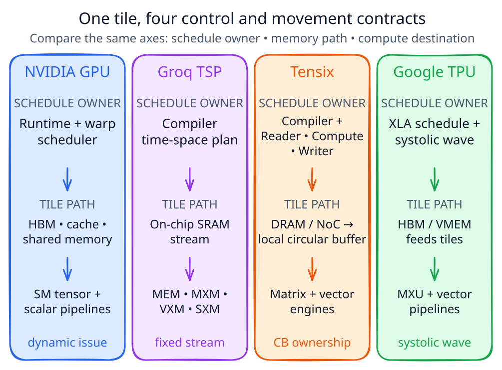

# AI Compute Full-Stack Co-design

archNotes studies how model computation becomes hardware execution through a Compiler, Runtime, and Kernel stack. It also studies the reverse direction: how constraints in compute, memory, interconnects, and serving systems should change software, numerics, or model structure.

NVIDIA GPU, Groq LPU/TSP, Tenstorrent Tensix, and Google TPU are architecture case studies rather than the boundary of the curriculum.

## Six Learning Tracks

For a short starting route, take the [12-hour AI Compiler primer + C++ review](./mlir/bootcamp.md): one MatMul connects models, IR, kernels, and hardware, with CPU-only C++ repairs and a miniature pass.

Already write C++ but need to recover forgotten rules? Use the [C++ review cheat sheets](./cpp/index.md): seven topics, 84 reminders, short examples, pitfalls, and self-checks.

| Track | Entry | Primary question |
| --- | --- | --- |
| Model Computation and Workload | [Model Computation Primitives and Workload Description](./notes/model-computation-primitives.md) | What computation, data, state, and Communication does the model create? |
| Model-to-Hardware Mapping | [Model-to-Hardware Mapping](./notes/model-to-hardware-mapping.md) | How does an Operation become real device execution? |
| Hardware Architecture | [AI Accelerator Architecture Comparison](./notes/ai-accelerator-architecture-comparison.md) | Where are resources located, and how is responsibility divided? |
| Software Optimization | [Cross-Architecture Software Optimization](./notes/software-optimization-methodology.md) | How can Data Movement, waiting, and waste be reduced? |
| Model–Hardware Co-design | [Model–Hardware Co-design](./notes/model-hardware-codesign.md) | When should a cross-layer contract change? |
| Performance Modeling and Validation | [Performance Modeling and Validation](./notes/performance-modeling.md) | How can a claim be predicted, measured, and falsified? |

## How to Read the Repository

- Start with the [Curriculum Blueprint](./curriculum.md) to understand ownership and boundaries.
- Use the [Glossary](./glossary.md) for canonical English terminology.
- Follow the six tracks with one shared Transformer block rather than learning six disconnected vocabularies.
- Treat vendor monographs as case studies that instantiate the shared framework.
- Write a prediction before running a lab or benchmark.

The Chinese locale contains the complete vendor monographs and teaching labs. Every route has a committed English counterpart: completed translations contain the full article, while pending translations contain an explicit status page and a link to the Chinese source. The site build never generates or translates content.
