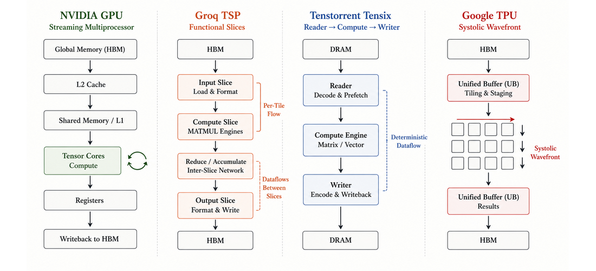

# AI 计算全栈协同设计

archNotes 研究模型计算怎样经过 compiler、runtime 和 kernel 落到硬件，也研究 memory、compute、interconnect 和系统约束怎样反向塑造模型、数值与软件优化。NVIDIA GPU、Groq LPU/TSP、Tenstorrent Tensix 和 Google TPU 是四组架构案例，而不是内容边界。

内容以[六条主线课程蓝图](./curriculum.md)为骨架，以[主题矩阵](./topics.md)进行交叉索引；侧边栏继续按文档用途组织，避免把厂商、抽象层级和文章类型混在一起。

## Start with the shared coordinate system

The useful comparison is not a peak-throughput ranking. Ask the same questions of every system:

- Where does computation happen?
- Which memory level feeds it?
- Who schedules the next operation?
- How does a tile move between stages and chips?
- What proves that the result is complete and visible?

## Choose a reading mode

- **按六条主线：** 从[课程蓝图](./curriculum.md)进入模型计算、全栈映射、硬件架构、软件优化、协同设计和性能验证。
- **按学习顺序：** 从[学习路线](./notes/learning-roadmap.md)开始，逐步进入架构、机制、软件栈和系统扩展。
- **按架构对象：** 在“架构专论”中分别阅读 NVIDIA GPU、Groq TSP、Tenstorrent Tensix 和 Google TPU。
- **按技术问题：** 使用[主题矩阵](./topics.md)，横向查找计算组织、调度、数据移动、软件栈或系统扩展。
- **按概念查阅：** 使用[术语表](./glossary.md)，统一跨文章反复出现的层级与执行模型。
- **按证据验证：** 进入“实验验证”，用可运行模型观察调度、背压与 systolic wavefront。

## Six-track backbone

| 主线 | 入口 | 首要问题 |
| --- | --- | --- |
| 模型计算与 Workload | [计算原语与 Workload](./notes/model-computation-primitives.md) | 模型产生了什么计算、数据、状态和通信？ |
| 模型到硬件映射 | [完整映射链](./notes/model-to-hardware-mapping.md) | Operation 怎样变成真实设备执行？ |
| 硬件架构 | [四类加速器统一对照](./notes/ai-accelerator-architecture-comparison.md) | 资源在哪里，责任怎样分配？ |
| 软件优化 | [跨架构优化方法](./notes/software-optimization-methodology.md) | 如何减少搬运、等待与浪费？ |
| 模型—硬件协同设计 | [协同设计框架](./notes/model-hardware-codesign.md) | 何时需要改变跨层契约？ |
| 性能建模与验证 | [性能模型与实验契约](./notes/performance-modeling.md) | 如何预测、测量并反证结论？ |

## Four execution models

- **NVIDIA GPU:** dynamic warp scheduling feeds tensor and scalar pipelines through registers, shared memory, caches, and HBM.
- **Groq TSP:** the compiler plans when and where tensor streams cross specialized functional slices.
- **Tenstorrent Tensix:** reader, compute, and writer kernels exchange tiles through circular buffers and a programmable mesh.
- **Google TPU:** XLA schedules tiled work for MXU systolic wavefronts, VMEM/HBM movement, and ICI collectives.

Continue with the [learning roadmap](./notes/learning-roadmap.md), inspect the [topic matrix](./topics.md), or open the full architecture comparison from the sidebar.
