# Google TPU：Systolic Array、XLA 编译器与 Pod 级系统

最后核对日期：2026-08-10。

本文把 Google TPU 纳入 AI accelerator architecture 学习项目。研究范围聚焦：

- TPU 从第一代 inference ASIC 到当前 Cloud TPU 的架构演化；
- TensorCore、MXU systolic array、vector/scalar unit 与 SparseCore；
- HBM、VMEM、SMEM、host memory 和显式数据移动；
- StableHLO、XLA、GSPMD、PJRT、Pallas/Mosaic；
- ICI、3D torus、TPU Pod 与 multi-slice；
- TPU 与 GPU、Groq、Tenstorrent 的机制差异。

项目不以创建 Cloud TPU VM 或调用云 API 为主线。云使用方式只在需要理解 host/device、topology 和可复现实验时出现。

若要把 TPU 与 GPU、Groq、Tenstorrent 放进同一坐标系，请读 [AI Accelerator 架构总览](ai-accelerator-architecture-comparison.md)。

## 0. 结论先行

Google TPU 的核心思想可以概括为：

> 用 domain-specific TensorCore 执行机器学习图；让 MXU 中的二维 systolic array 持续进行矩阵乘加，由 vector/scalar unit 处理非矩阵部分；通过 XLA 在图级完成 fusion、layout、buffer、sharding 与 collective planning，再用 ICI 将大量 TPU chip 组成 Pod 级训练/推理系统。

TPU 不是“只有一个巨大矩阵乘法器”，也不是“没有 CUDA Core 的 GPU”。它同时包含：

- matrix-multiply unit；
- vector unit；
- scalar unit；
- HBM 与片上 memory；
- host/device runtime；
- inter-chip interconnect；
- compiler-generated program；
- 部分代际中的 SparseCore；
- 用于大规模系统的 topology、collective 和 fault handling。

与其他架构的第一层区别：

| 架构 | 主计算组织 | 主要延迟隐藏/调度方法 |
| --- | --- | --- |
| NVIDIA GPU | SM + warp + CUDA/Tensor pipelines | hardware dynamic warp scheduling、occupancy、cache/shared-memory pipeline |
| Groq LPU/TSP | MEM/SXM/MXM/VXM functional slices | compiler time-space schedule 与跨 slice streaming |
| Tenstorrent Tensix | 重复 Tensix core mesh | reader/compute/writer、CB、NoC producer-consumer |
| Google TPU | TensorCore + MXU systolic array + vector/scalar unit | XLA graph compilation、MXU wavefront、HBM/VMEM staging、ICI collective |

## 1. 代际边界与当前研究范围

TPU 已经经历多代。不同代际的用途、MXU 数量、memory、interconnect 和 system topology 都不同，不能把第一代论文参数直接套到 Ironwood。

### 1.1 TPU v1：理解架构动机

2017 年 ISCA 论文公开的第一代 TPU 是 datacenter inference accelerator。其代表性机制包括：

- 65,536 个 8-bit MAC 组成的 matrix-multiply unit；
- 28 MiB software-managed on-chip memory；
- deterministic execution；
- 以 domain-specific hardware 避免 CPU/GPU 上为广泛 workload 准备的部分 reactive mechanism。

TPU v1 适合研究：

- 为什么 systolic array 能减少矩阵乘中的反复 memory access；
- 为什么 domain-specific accelerator 可以把 die/power 集中到 MAC 与 SRAM；
- tail latency、determinism 与平均 throughput 的差别。

它不是当前 Cloud TPU 的规格基线。

### 1.2 TPU v2/v3：从 inference chip 到 training supercomputer

TPU v2/v3 加入面向训练的浮点能力、HBM 和高速 inter-chip network，并通过 TPU Pod 扩展。它们建立了后来 TPU system 的稳定基本形态：

```text
TensorCore
├── MXU systolic array
├── vector unit
├── scalar unit
└── memory / collective path

chip → ICI topology → Pod
```

### 1.3 TPU v4：系统架构与 optical reconfiguration

TPU v4 论文的重要性不仅是 chip 性能，还包括：

- 4,096-chip supercomputer；
- 3D torus interconnect；
- optical circuit switch 用于重新配置 topology；
- SparseCore 加速 embedding workload；
- reliability、availability 和 large-scale scheduling。

因此 v4 是研究“AI accelerator 为什么必须把 network 和 datacenter 当成架构一部分”的关键案例。

### 1.4 v5e/v5p 与 v6e Trillium

这些代际分别覆盖 cost-efficient training/serving 与大规模 training。当前文档中 v6e 的核心公开信息包括：

- 每 chip 一个 TensorCore；
- 每 TensorCore 两个 MXU、一个 vector unit、一个 scalar unit；
- MXU 为 `256 × 256` systolic array；
- 32 GB HBM；
- 1,638 GB/s HBM bandwidth；
- 800 GB/s bidirectional ICI bandwidth；
- 最高 256-chip Pod footprint。

这些是 Google Cloud 产品规格，需要与 model、dtype、batch、topology 和 software version 一起使用。

### 1.5 TPU7x Ironwood：当前主线

截至核对日期，Google Cloud 将 TPU7x 描述为最新可用 TPU，也是第七代 Ironwood family 的首个版本。它同时面向 large-scale training 与 inference。

官方公开的每 chip 规格：

| 项目 | TPU7x Ironwood |
| --- | --- |
| TensorCores | 2 |
| SparseCores | 4 |
| Peak BF16 | 2,307 TFLOPS |
| Peak FP8 | 4,614 TFLOPS |
| HBM | 192 GiB |
| HBM bandwidth | 7,380 GB/s |
| Bidirectional ICI | 1,200 GB/s |
| Maximum Pod footprint | 9,216 chips |

这些数字是厂商峰值/产品口径，不代表任意模型的 sustained performance，也不能与 Groq、Tenstorrent、NVIDIA 的不同格式峰值直接相除。

Ironwood 还采用 dual-chiplet architecture：

- 一个 chip 由两个 compute chiplet 组成；
- 每个 chiplet 有一个 TensorCore、两个 SparseCore 和 96 GB HBM；
- chiplet 之间通过 die-to-die interface 连接；
- JAX 将每个 chiplet 暴露成独立 device；
- topology 增加 chiplet dimension；
- 跨 chiplet 数据仍需考虑 collective 与 placement。

当前 TPU7x 文档列出 JAX 与 PyTorch framework support，并明确标注 TensorFlow 不支持。这是 TPU7x 的当前产品边界，不应泛化成“整个 TPU family 不支持 TensorFlow”。

### 1.6 TPU 8i/8t：已公布但不作为当前机制基线

Google Cloud 产品页已经列出：

- TPU 8i：面向 post-training 与 inference，标记为 coming soon；
- TPU 8t：面向 large-scale pre-training 与 embedding-heavy workload，标记为 coming soon。

由于完整架构文档、可用配置和可复现实验边界尚不如 TPU7x 完整，本项目只登记产品方向，不把公告中的相对性能数字用于架构结论。当前主线仍以 TPU7x、v6e 和同行评审的 v1/v4 论文为证据基础。

## 2. 从 chip 到 TensorCore

Google Cloud 当前公开的通用层级是：

```text
TPU host / TPU VM
        │ PCIe / host-device path
        ▼
TPU chip
├── one or more TensorCores
│   ├── one or more MXUs
│   ├── vector unit
│   └── scalar unit
├── HBM
├── SparseCore(s), generation-dependent
└── ICI ports
```

需要注意两个重名术语：

- Google `TensorCore`：TPU chip 内包含 MXU、vector/scalar unit 的较大计算组织；
- NVIDIA `Tensor Core`：GPU SM 内执行矩阵乘加的 execution pipeline。

它们不能因为拼写相近而视为同一层级。

### 2.1 MXU

MXU 是 TPU TensorCore 的主要矩阵计算单元。当前 Cloud 文档说明：

- v6e 与 TPU7x 使用 `256 × 256` systolic array；
- v6e 之前的 Cloud TPU 通常使用 `128 × 128` array；
- vector/scalar unit 负责不能直接映射到矩阵阵列的部分。

MXU 高峰值只有在矩阵维度、padding、memory supply 和 fusion 合理时才有意义。

### 2.2 Vector unit

vector unit 处理：

- elementwise operation；
- activation；
- reduction 的部分阶段；
- normalization 等非纯矩阵工作；
- address/layout 相关的向量计算。

如果模型大量时间花在 vector operation、HBM traffic 或 layout conversion，MXU 峰值不会转化成端到端利用率。

### 2.3 Scalar unit

scalar unit 执行 control 与 scalar work。TPU 仍然需要 loop、branch、address、runtime parameter 和 program sequencing；domain-specific 并不等于没有控制处理。

### 2.4 SparseCore

SparseCore 出现在部分现代 TPU 代际，用于 embedding 与 sparse workload。它不能被简单理解为“稀疏版 MXU”。研究时应分别看：

- embedding table capacity 与 access pattern；
- gather/scatter；
- optimizer/update；
- SparseCore 与 TensorCore 的数据交换；
- multi-chip sharding；
- dense model 是否实际使用它。

## 3. Systolic array 怎样计算矩阵乘

考虑：

```text
C = A × B
A: M × K
B: K × N
C: M × N
```

二维 systolic array 中，每个 processing element 负责一个或一组 output accumulation。简化的 dataflow 是：

```text
A values → → →
             PE(i,j): accumulator += A(i,k) × B(k,j)
B values ↓
         ↓
         ↓
```

通过对 A 与 B 做时间 skew：

- A 的一行沿水平方向传播；
- B 的一列沿垂直方向传播；
- 每个 PE 在合适周期接收匹配的 `A(i,k)` 和 `B(k,j)`；
- partial sum 保留在 array 内部或沿指定 dataflow 传播；
- 一个输入会被相邻 PE 重用，而不是每次 MAC 都重新访问 HBM。

### 3.1 Wavefront

数据不是同一周期填满整个 array，而是形成 wavefront：

```text
cycle 0: PE(0,0)
cycle 1: PE(0,1), PE(1,0)
cycle 2: PE(0,2), PE(1,1), PE(2,0)
...
```

因此一次 tile computation 包含：

- array fill；
- steady-state MAC；
- array drain。

当 M/N/K 太小或 tile 不规则时，fill/drain 和 inactive PE 比例上升。

### 3.2 为什么 shape 很重要

对于 `256 × 256` MXU：

- M/N 小于 array dimension 时，部分 PE 空闲；
- dimension 不适合 hardware tiling 时，XLA 可能 padding；
- K 太短时，fill/drain 相对占比增大；
- batch/feature dimension 不友好会增加 memory 与 compute waste。

官方 performance guide 因此建议检查 tensor dimension、padding、MXU utilization，而不是只看 nominal FLOPS。

### 3.3 Systolic 不等于整个 TPU 都静态锁步

Systolic 描述 MXU 内数据传播规律。完整 TPU program 还包括：

- HBM/VMEM movement；
- vector/scalar operation；
- control flow；
- multiple TensorCore/SparseCore；
- collective；
- host infeed/outfeed；
- runtime dispatch。

不能从 MXU wavefront 推断整个 Pod 每一条指令都有 Groq 式公开 time-space schedule。

## 4. Memory hierarchy

### 4.1 HBM

HBM 保存：

- weights；
- activation；
- optimizer state；
- KV cache；
- embedding/shard；
- executable 所需的大型 buffer。

HBM 容量和 bandwidth 很高，但 memory-bound vector op、低 arithmetic intensity 和不合理 layout 仍会成为瓶颈。

### 4.2 VMEM

VMEM 是更靠近 TensorCore 的片上 vector memory/scratchpad。当前 Ironwood 文档强调：

- VMEM 比 HBM 小；
- 对 MXU/compute 提供更高带宽；
- custom Pallas kernel 的 block size 受 VMEM 容量限制；
- buffer 大小和 data movement 是性能调优问题。

Pallas 的 TPU programming model 通常把 HBM block 先搬入 VMEM，再由 kernel 在 register/compute path 上操作。

### 4.3 SMEM

Pallas/Mosaic 文档还区分 scalar memory space（SMEM）。scalar value、semaphore 和 control-related state 与 vector data 的放置规则不同。

这里的 `SMEM` 不能直接等同 CUDA shared memory；二者缩写相似，但架构位置和 programming semantics 不同。

### 4.4 Host memory

TPU VM/host 与 TPU device 通过 host-device path 连接。host memory 可用于 input、checkpoint、offload 和 runtime state，但频繁 host-device transfer 会破坏 accelerator utilization。

基本原则仍是：

```text
一次把大块数据送入 device
→ 在 TPU 上执行尽量长的 compiled computation
→ 只在必要边界与 host 交互
```

## 5. TPU 的调度责任放在哪里

TPU 没有向用户暴露 CUDA-style warp scheduler，也没有 Groq 论文中那种完整 slice-specific time-space ISA。

公开可见的责任分配是：

```text
Framework graph/program
→ StableHLO/HLO
→ XLA graph optimization
→ fusion/layout/buffer planning
→ GSPMD sharding + collectives
→ TPU backend executable
→ PJRT/libtpu runtime
→ TensorCore/MXU/vector/scalar/ICI
```

### 5.1 编译期

XLA 负责或参与：

- operation fusion；
- algebraic simplification；
- layout assignment；
- buffer planning；
- matrix tiling；
- padding；
- sharding propagation；
- collective insertion；
- computation/communication scheduling；
- executable generation。

### 5.2 运行时

PJRT/device runtime 负责：

- device discovery；
- buffer/memory space；
- compile/load executable；
- async dispatch；
- host-device transfer；
- event/future；
- multi-host/device coordination。

### 5.3 硬件内

硬件执行 compiler-generated program，并在 MXU 内形成 systolic dataflow。低层 ISA、全部 microarchitecture scheduler 和当前 commercial TPU backend 没有完整公开，所以不能把 HLO 直接当作 TPU ISA。

## 6. 软件栈

[](../assets/diagrams/google-tpu-architecture-01.svg)

### 6.1 StableHLO

StableHLO 是 framework 与 ML compiler 之间的 high-level operation portability layer。它表达 tensor op、shape、dtype、collective 和 control semantics，但不是 TPU machine instruction。

### 6.2 XLA

XLA 接收 HLO/StableHLO graph，为目标 backend 做 graph、memory、fusion、layout 与 code generation。XLA 也能面向 CPU/GPU，因此：

> XLA 不等于 TPU；TPU backend 是 XLA 的一个目标。

### 6.3 GSPMD

GSPMD 根据 tensor sharding annotation 把 single-device graph 改写为 multi-device SPMD program，并插入 collective/resharding operation。

它把多种 parallelism 放入统一 tensor partition framework：

- data parallel；
- tensor/model parallel；
- optimizer-state sharding；
- spatial partition；
- 部分 pipeline/graph partition pattern。

用户仍需选择 mesh axis 与 sharding intent。自动化不等于无需理解 topology 和 collective cost。

### 6.4 PJRT

PJRT 是 framework 与 device implementation 之间的 uniform device API。它抽象 client、device、buffer、memory space、executable、future 和 communication。

PJRT 也不等于 TPU runtime 的所有实现细节；TPU-specific implementation 可以对 framework opaque。

### 6.5 Pallas/Mosaic

Pallas 为 JAX 提供 custom accelerator kernel abstraction：

- 用 grid/BlockSpec 划分 block；
- 显式考虑 HBM、VMEM、SMEM；
- 在 TPU 上 lowering 到 Mosaic；
- 可以表达 DMA、semaphore、pipeline 和 local block computation。

这给 TPU 提供了比纯 high-level XLA graph 更低层的研究入口，但 Pallas 仍是实验性 API，也不是裸 TPU ISA。

## 7. 单芯片优化问题

### 7.1 MXU utilization

检查：

- M/N/K 是否足够大；
- tile 是否匹配 128/256 array dimension；
- batch/feature dimension 是否产生 padding；
- K 是否足以摊薄 fill/drain；
- small op 是否被 fusion；
- vector/scalar bottleneck 是否掩盖 MXU。

### 7.2 Fusion

Fusion 可以减少：

- HBM intermediate write/read；
- kernel/program boundary；
- temporary buffer；
- layout materialization。

但 fusion 也受 register/VMEM capacity、operation compatibility 和 compiler heuristic 限制。

### 7.3 Memory

检查：

- HBM bytes per FLOP；
- VMEM block 是否过大；
- double buffering；
- host input 是否跟上；
- rematerialization 与 offload；
- embedding/KV/optimizer state 是否合理 sharding。

### 7.4 Shape 与 compilation

JAX/XLA 常围绕 shape/dtype specialization 编译 executable。频繁 shape 变化可能产生：

- recompilation；
- compilation cache miss；
- 不同 padding；
- executable proliferation；
- warmup latency。

StableHLO 支持 dynamic dimension 语义不等于所有 TPU kernel 对任意 dynamic shape 都零成本。

### 7.5 Custom kernel

只有在 high-level op/fusion 不足时才下探 Pallas。需要测量：

- HBM↔VMEM bytes；
- block shape；
- VMEM capacity；
- DMA/compute overlap；
- semaphore wait；
- vector/MXU balance；
- numerical accuracy。

## 8. 从 chip 到 Pod

### 8.1 ICI

ICI 是 TPU chip 间的高带宽 interconnect。collective 与 point-to-point communication 会通过 ICI 运行。

与 host/datacenter network 区分：

| 层级 | 作用 |
| --- | --- |
| On-chip | MXU、VMEM、HBM controller、SparseCore 间数据路径 |
| ICI | 同一 slice/Pod 内 TPU chip 间 scale-up |
| Host network/DCN | host coordination、multi-slice/cluster traffic |
| Storage network | checkpoint、dataset 与 artifact |

### 8.2 3D mesh/torus

TPU7x chip 与三个维度上的邻居连接，大 slice 使用 `4 × 4 × 4` cube 扩展，并支持 3D torus topology。

logical mesh 应与 physical topology 对齐。错误 sharding 可能导致：

- 长路径 traffic；
- hotspot；
- collective serialization；
- reshard；
- ICI bandwidth 不平衡。

### 8.3 Pod

Pod 不是“很多独立 accelerator 放在同一机房”。它是由 topology、ICI、host、runtime、compiler 与 collective library 共同构成的 domain-specific supercomputer。

研究 TPU 时必须同时看：

- per-chip compute；
- HBM capacity/bandwidth；
- ICI；
- topology；
- GSPMD sharding；
- collective overlap；
- compiler time；
- resilience 与 checkpoint。

### 8.4 Multi-slice

超出一个 tightly coupled slice 后，traffic 可能进入 DCN。ICI 与 DCN 的 bandwidth/latency 不同，因此不能假设扩到更多 slice 仍然保持相同 collective cost。

## 9. TPU 与 GPU、Groq、Tensix 的关键差异

### 9.1 与 GPU

- TPU 不以 CUDA thread/warp 为主要抽象；
- MXU systolic array 是主矩阵引擎；
- XLA graph compilation 与 shape/layout 更重要；
- TPU Pod/ICI 是产品体系的一部分；
- GPU 对 dynamic/custom/HPC workload 与生态更通用；
- TPU 通过 Pallas 提供 custom kernel，但低层模型不同于 CUDA。

### 9.2 与 Groq

- 二者都强调 compiler 与 predictable execution；
- Groq 以 functional slices 和 cross-slice streaming 为核心；
- TPU 以 TensorCore 内 MXU/vector/scalar 与 HBM 为核心；
- TPU 的 systolic 主要描述 MXU 内 wavefront；
- Groq time-space schedule 涵盖公开论文中的更广 chip-wide function/data placement；
- TPU 大规模 parallelism 通过 GSPMD/ICI/Pod，Groq 多芯片通过 compiler-scheduled C2C/LPX system。

### 9.3 与 Tenstorrent

- 二者都可以研究 explicit scratchpad 与 block/tile dataflow；
- Tensix 暴露 RISC-V kernel、NoC、CB 和 core placement；
- TPU high-level 路径更多由 XLA 自动处理；
- Pallas 才把 TPU 的 block、VMEM、DMA 和 semaphore 更直接暴露出来；
- Tenstorrent scale-out 强调 Ethernet mesh；TPU scale-up 强调 ICI/Pod；
- Tenstorrent low-level stack 更开放，TPU compiler/runtime/hardware 的完整低层接口更受控。

## 10. TPU 与 GPU 如何配合

当前公开资料没有定义 NVIDIA GPU 与 TPU 在同一个 Transformer layer 内共享 CUDA stream、HBM address space、KV ABI 或 collective communicator 的标准路径。

可信协作模式主要是：

| 模式 | GPU | TPU | 边界 |
| --- | --- | --- | --- |
| Request-level routing | CUDA-supported model/latency path | TPU-supported compiled model | 完整请求 |
| Workflow split | 某一训练/评估阶段 | 大规模训练或 serving | checkpoint/artifact |
| Async evaluation | 主训练继续 | 独立 eval/inference | storage/queue |
| Multi-model platform | GPU pool | TPU slice/Pod | scheduler/gateway |
| Framework portability | XLA:GPU/PJRT path | XLA:TPU/PJRT path | StableHLO/program，不保证相同性能 |

不要从“XLA 同时支持 GPU/TPU”推断出：

- 一个 executable 可以不重新编译直接跨设备运行；
- TPU 可以加入 NCCL communicator；
- GPU tensor pointer 可以直接被 TPU MXU 访问；
- GPU prefill 的原生 KV cache 可以零转换交给 TPU decode；
- 同一 layer 会自动在 CUDA Tensor Core 与 TPU MXU 间切分。

本项目将 GPU+TPU 首先定位为**资源池、workflow 与模型级异构**。

## 11. 建议的实践路线

### 无 TPU hardware

1. 运行本项目 `labs/systolic_array/`；
2. 手算一个 `4 × 4` array 的 wavefront；
3. 比较 full tile 与 partial tile utilization；
4. 写一个 StableHLO `dot_general + add + maximum` 小图；
5. 阅读 XLA HLO dump，识别 fusion、layout 与 collective；
6. 阅读 GSPMD sharding example；
7. 用 Pallas 文档设计 HBM→VMEM→compute→HBM block pipeline。

### 有 Cloud TPU

1. 从单 device JAX matmul 开始；
2. 记录 compile time 与 steady-state step time；
3. sweep M/N/K、batch、dtype；
4. 检查 padding 与 MXU utilization；
5. 比较 fused/unfused graph；
6. 创建小 mesh，观察 sharding/collective；
7. 最后尝试 Pallas custom kernel；
8. 再扩到 multi-host/slice，避免一开始只看到 Pod 总吞吐。

## 12. 公开边界与证据规则

- TPU v1/v4 论文用于解释历史机制，不能代替 TPU7x 的当前实现；
- Google Cloud product specs 属于厂商口径；
- XLA/StableHLO/PJRT 大量开源，不代表 TPU backend、libtpu、ISA、RTL 全部公开；
- HLO 不是 machine ISA；
- Pallas/Mosaic 是低层 kernel 入口，但仍不是裸硬件 binary interface；
- `TensorCore`、MXU、chip、chiplet、device、slice、Pod 必须分层；
- 不同 TPU generation 的 MXU dimension、TensorCore count 和 topology 不能混用；
- TPU 8i/8t 目前只记录 announced direction，不以相对性能投影做结论；
- 所有 benchmark 固定 model、quality、dtype、batch、shape、software、topology、host 和 power boundary。

## 13. 主要来源

### 当前 Google Cloud 架构与产品

- TPU system architecture：<https://docs.cloud.google.com/tpu/docs/system-architecture-tpu-vm>
- TPU7x Ironwood：<https://docs.cloud.google.com/tpu/docs/tpu7x>
- TPU v6e Trillium：<https://docs.cloud.google.com/tpu/docs/v6e>
- TPU v4：<https://docs.cloud.google.com/tpu/docs/v4>
- Cloud TPU performance guide：<https://docs.cloud.google.com/tpu/docs/performance-guide>
- Cloud TPU product/generation page：<https://cloud.google.com/tpu>

### Compiler、runtime 与 kernel

- StableHLO specification：<https://openxla.org/stablehlo/spec>
- PJRT device API：<https://openxla.org/xla/pjrt>
- XLA architecture example/SPMD partitioner：<https://openxla.org/xla/gpu_architecture>
- GSPMD overview：<https://www.research.google/blog/general-and-scalable-parallelization-for-neural-networks/>
- Pallas quickstart：<https://docs.jax.dev/en/latest/pallas/quickstart.html>
- Pallas TPU pipelining：<https://docs.jax.dev/en/latest/pallas/tpu/pipelining.html>
- Pallas design/Mosaic lowering：<https://docs.jax.dev/en/latest/pallas/design/design.html>

### 同行评审与历史架构

- TPU v1 ISCA 2017：<https://research.google/pubs/in-datacenter-performance-analysis-of-a-tensor-processing-unit/>
- TPU v4 supercomputer：<https://arxiv.org/abs/2304.01433>
- GSPMD：<https://arxiv.org/abs/2105.04663>

## 术语表

| 术语 | 概念 |
| --- | --- |
| TPU | Tensor Processing Unit，Google 为机器学习设计的 domain-specific accelerator/system family。 |
| TensorCore（Google） | TPU chip 内包含 MXU、vector unit 和 scalar unit 的计算组织；不同于 NVIDIA Tensor Core。 |
| Tensor Core（NVIDIA） | GPU SM 中执行矩阵乘加的 execution pipeline。 |
| MXU | Matrix Multiplication Unit，TPU TensorCore 内的矩阵乘单元。 |
| Systolic array | 数据按规则 wavefront 在 PE 阵列中传播并复用的计算结构。 |
| PE | Processing Element，systolic array 中执行局部 MAC/accumulation 的单元。 |
| MAC | Multiply-Accumulate，乘加操作。 |
| Wavefront | 数据和有效计算以对角线式时间波在 PE array 中推进。 |
| Fill/Drain | systolic array 从空到 steady state、再排空结果的周期开销。 |
| Vector unit | 执行 elementwise、activation、reduction 等向量工作的单元。 |
| Scalar unit | 执行 scalar/control work 的单元。 |
| SparseCore | 部分 TPU 代际用于 embedding/sparse workload 的专用处理单元。 |
| HBM | High Bandwidth Memory，TPU chip 的大容量高带宽外部 memory。 |
| VMEM | TPU/Pallas 语境中的片上 vector memory/scratchpad。 |
| SMEM | TPU/Pallas 语境中的 scalar memory；不等同 CUDA shared memory。 |
| StableHLO | framework 与 ML compiler 之间的稳定 high-level op portability layer。 |
| HLO | High Level Operations，XLA 使用的高层计算图/IR。 |
| XLA | Accelerated Linear Algebra，面向 ML graph 的 compiler；TPU 是其 backend 之一。 |
| GSPMD | General and Scalable Parallelization for ML Computation Graphs，XLA 的 SPMD graph partitioning system。 |
| SPMD | Single Program, Multiple Data，多 device 执行同一 partitioned program。 |
| PJRT | framework 与 accelerator implementation 间的 uniform device/runtime API。 |
| libtpu | Cloud TPU software/runtime distribution 中的 TPU-specific component；完整内部实现并非全部公开。 |
| Pallas | JAX 的 experimental custom accelerator kernel abstraction。 |
| Mosaic | Pallas 在 TPU 上的低层编译/lowering path。 |
| ICI | Inter-Chip Interconnect，TPU chip 间 scale-up network。 |
| DCN | Data Center Network，host/multi-slice 层级网络。 |
| TPU slice | 从 Pod 中分配给 workload 的一组 topology-connected TPU resources。 |
| TPU Pod | 由大量 TPU chip、ICI、host、runtime 与 system infrastructure 组成的 supercomputer。 |
| 3D torus | 每个 node 在三个维度连接邻居并首尾闭合的 topology。 |
| Chiplet | 一个 package/chip 中相对独立的 compute die。Ironwood 将两个 chiplet 暴露为两个 framework device。 |
| Padding | 为匹配 hardware tile/MXU dimension 而添加无效 element。 |
| Fusion | compiler 将多个 operation 合并，减少 intermediate memory traffic 与 boundary。 |
| Sharding | 把 tensor 分割并映射到多个 TPU device。 |
| Collective | all-reduce、all-gather、reduce-scatter、all-to-all 等多 device communication。 |
