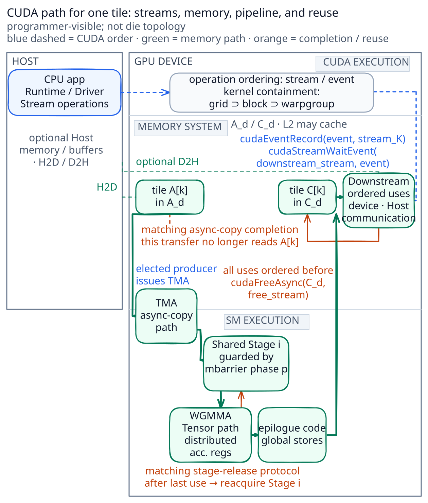
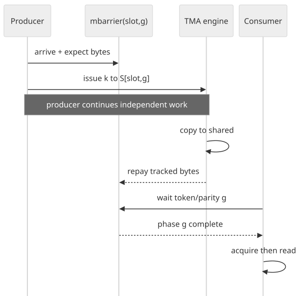
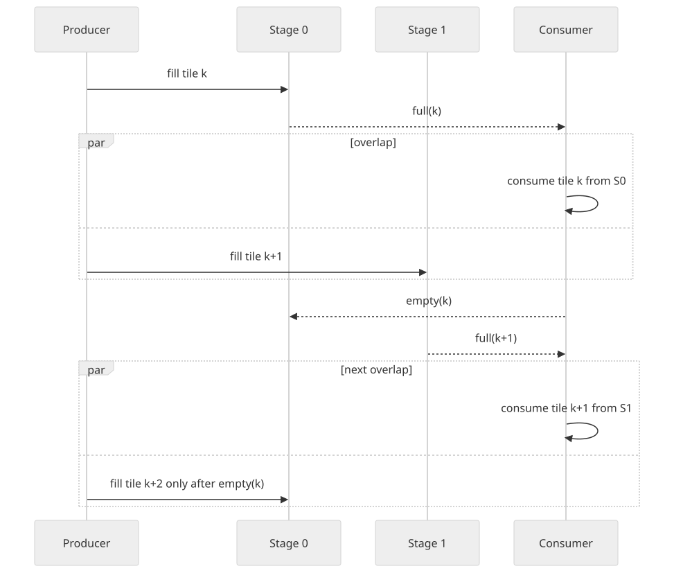

# NVIDIA GPU 同步与流水：从 CUDA Stream 到 TMA Pipeline

结构重构与技术资料核对日期：2026-08-20。

CUDA 同步并不是一个单独的 primitive，也不是一句“等 GPU 做完”。同一段程序会先后经过几套彼此衔接、但不能互相替代的 CUDA contract：Host 向 stream 提交 operations，device 调度 grid 与 thread blocks，threads 通过 CUDA memory model 交换数据，async copy 通过 barrier 或 async group 报告完成，`cuda::pipeline` 管理可复用 stages，最后 stream/event ordering 约束 output allocation 的释放。

本文只沿一段 CUDA 程序向下展开：

```text
Host enqueue
  → Stream / Event ordering
  → Grid / Block / Warp execution
  → Global memory → Shared-memory stage
  → Async copy / Barrier / Pipeline
  → Tensor operation → Registers → Global output
  → Downstream operation → cudaFreeAsync
```

`tile k` 只是示例算法处理的第 `k` 块数据，不是 CUDA runtime object。类似地，后文出现的 `input_ready`、`K_done` 等名称只是示例中的 `cudaEvent_t` 变量名，不代表 CUDA 定义了同名状态。

---

## 1. 先看一段完整 CUDA 程序

### 1.1 从一条 stream 开始

先忽略多 stream 和 Tensor Core，只看一条 stream 中的端到端顺序：

```cpp
cudaMallocAsync(&A_d, bytes_A, stream);
cudaMallocAsync(&C_d, bytes_C, stream);

cudaMemcpyAsync(A_d, A_h, bytes_A, cudaMemcpyHostToDevice, stream);
kernel_K<<<grid, block, smem_bytes, stream>>>(A_d, C_d);
downstream<<<grid2, block2, 0, stream>>>(C_d);
cudaMemcpyAsync(C_h, C_d, bytes_C, cudaMemcpyDeviceToHost, stream);

cudaFreeAsync(A_d, stream);
cudaFreeAsync(C_d, stream);
```

这段代码先建立四个最重要的事实：

1. Kernel launch 和 `cudaMemcpyAsync()` 通常相对 Host 异步；API 返回不表示 operation 已完成，甚至不表示它已经开始。
2. 同一 CUDA stream 是 in-order 的，后加入的 operation 不会越过前面的 operation。
3. Host 读取 `C_h` 前仍要等待相应 stream 或 event；enqueue D2H 不等于 Host 立即可读。
4. `cudaFreeAsync()` 必须在 stream order 中排在 allocation 的所有 uses 之后。

涉及 Host memory 的传输要真正异步并与其他 work overlap，通常还要求相应 Host buffer 是 pinned/page-locked。CUDA stream、event、显式同步与 pinned memory 的基础 contract 见 [CUDA Asynchronous Execution](https://docs.nvidia.com/cuda/cuda-programming-guide/02-basics/asynchronous-execution.html)。

### 1.2 进入 kernel：一块 tile 经过哪些 CUDA 实体

Host code 通过 CUDA Runtime/Driver 提交 kernel；kernel 是一个 grid，grid 由 thread blocks 组成。一个 block 的 threads 在同一 SM 上执行，并能通过该 block 的 shared memory 协作。本文在 `kernel_K` 内追踪一块 `tile k`：

```text
device global-memory input A[k]
  → block 内 producer 提交 global→shared copy
  → shared_buffer[stage_index]
  → ordinary compute 或 WGMMA
  → participating threads 的 accumulator registers
  → epilogue 写回 device global-memory output C[k]
```

下图把 Host/Device、device memory system 与 SM execution 分开。它是 programmer-visible entity map，不是芯片 die topology，也不是精确时间轴。

点击图可打开原始 SVG，并在移动端缩放查看。

[](../assets/diagrams/nvidia-gpu-synchronization-physical-path.svg)

图把 TMA path 放在 memory system 与 SM execution 的交界，只表示 elected producer 使用 TensorMap/参数提交 operation、async agent 在 global memory 与 on-SM shared memory 之间搬运数据；它不声称 TMA engine、L2 slice 或 memory partition 的精确位置。Host/Device、grid/block 和 GPU memory hierarchy 的公开边界见 [CUDA Programming Model](https://docs.nvidia.com/cuda/cuda-programming-guide/01-introduction/programming-model.html)，TMA 的公开路径见 [CUDA Advanced Kernel Programming](https://docs.nvidia.com/cuda/cuda-programming-guide/03-advanced/advanced-kernel-programming.html)。

Canonical 路径从 device allocation `A_d` 开始。Host buffer、H2D、D2H、通信库和外部 API 都是可以接在它前后的 operations。L2 可能缓存 global-memory accesses，但 cache residency 不是程序必须经过或等待的 lifecycle stage。

### 1.3 后文使用的五层 CUDA contract

| CUDA 层次 | 需要回答的问题 | 典型对象或 primitive |
| --- | --- | --- |
| Stream ordering | 哪个 CUDA operation 必须排在哪个 operation 后面？ | stream、event、graph edge |
| Execution model | 哪些 threads/blocks 参与，调度顺序有什么保证？ | grid、block、warp、cluster |
| Memory model | 哪些 accesses 建立 happens-before，覆盖什么 scope？ | barrier、atomic、fence |
| Async pipeline | 哪笔 copy、哪个 barrier phase 或 pipeline stage 已完成？ | `cp.async`、TMA、`cuda::barrier`、`cuda::pipeline` |
| Object lifetime | buffer、barrier 与 allocation 什么时候仍合法？ | shared object、event edge、`cudaFreeAsync` |

这些层次没有一张共享的“完成”总时钟。例如，Host 已完成 enqueue 时 block 可能尚未执行；TMA 已提交时 shared data 仍未 ready；`consumer_wait()` 返回时，它所覆盖的 pipeline operations 已完成，但只有 consumer 使用结束并调用 `consumer_release()` 后该 stage 才能由 producer 再次 acquire。若一个 consumer 还要读取其他 threads 搬入的 shared regions，仍需匹配 participant 模式的 block/group synchronization。

---

## 2. Stream、Event 与 Kernel Launch

### 2.1 Host return 与 operation completion

Kernel launch 是相对 Host 异步的：

```cpp
kernel_K<<<grid, block, smem_bytes, stream>>>(A_d, C_d);
// Host 已返回；这里不能据此断言 kernel 已开始或完成。
```

“Host 线程已经走到下一行”和“stream 已经执行到 kernel 之后”是两个 observer 下的不同事实。需要结果时，应等待最窄的必要边界，而不是默认使用 device-wide synchronization。

### 2.2 同一 stream 的顺序

同一 stream 中，operations 按 enqueue order 执行：

```text
stream S:
  H2D(A) → kernel_K(A,C) → downstream(C) → D2H(C) → free(C)
```

这条顺序已经足以表达相邻 operations 的 dependency。它不承诺 H2D、kernel 或 D2H 与其他 streams 中的 work 一定并发；实际 overlap 还依赖硬件能力、可用资源、copy engines、memory pressure 与其他 work。

### 2.3 不同 streams 用 event 建立 dependency

没有显式关系的不同 streams 可以独立推进。若 `kernel_K` 必须等待另一个 stream 产生 `A_d`，应让 dependency 对 CUDA runtime 可见：

```cpp
cudaEvent_t input_ready;
cudaEventCreate(&input_ready);

produce_A<<<grid, block, 0, stream_a>>>(input, A_d);
cudaEventRecord(input_ready, stream_a);

cudaStreamWaitEvent(stream_k, input_ready);
kernel_K<<<grid, block, smem_bytes, stream_k>>>(A_d, C_d);
```

这里 `input_ready` 只是程序员给 event handle 起的变量名。CUDA 的实际 contract 是：`cudaStreamWaitEvent()` 之后加入 `stream_k` 的 operations 延迟到该 event 完成以后执行。它没有说明 `kernel_K` 的某个 block 已 resident，也没有自动延长 `A_d` 到任意未来 use 的 lifetime。

同理，可以在 kernel 后记录一个示例 event：

```cpp
cudaEvent_t K_done;
cudaEventCreate(&K_done);

kernel_K<<<grid, block, smem_bytes, stream_k>>>(A_d, C_d);
cudaEventRecord(K_done, stream_k);
```

`K_done` 仍只是变量名。它代表 event record point 的完成进度，不是每个 `tile k` 的独立状态，也不表示所有 downstream users 已结束。

### 2.4 Event、stream 与 device 级同步

| Operation | 观察/等待范围 | 常见用途 |
| --- | --- | --- |
| `cudaEventQuery/Synchronize` | 某个 event record point | 精确观察一段 stream progress |
| `cudaStreamQuery/Synchronize` | 某条 stream 先前的 operations | Host 等待一条 stream |
| `cudaStreamWaitEvent` | 将 event dependency 加到另一条 stream | device-side cross-stream ordering |
| `cudaDeviceSynchronize` | 所有 Host threads 的所有 streams 中此前 work | 边界调试或确实需要全局等待 |

CUDA Graph 把 kernel、copy、allocation 等 operations 表达为可重复执行的 DAG。Graph edge 与 stream/event edge 都属于 task ordering；它们不替代 kernel 内 thread synchronization。

---

## 3. Kernel Execution 与 CUDA Memory Model

### 3.1 Grid、Block、Warp 与 Thread

Kernel launch 创建一个 grid；grid 的 blocks 被调度到可用 SM。CUDA 要求一般的 thread blocks 可以按任意顺序、并行或串行执行。程序不能依赖 block 0 必然早于 block 1，也不能假设一个 grid 的所有 blocks 同时 resident。

典型的跨 block progress deadlock 是：

```text
SM 上可同时驻留的 block 资源 = 等 flag 的 consumer blocks
尚未 resident 的 blocks   = 唯一能写 flag 的 producer blocks
结果                       = producer 无法得到执行资源
```

即使 flag 使用了正确的 atomic scope 和 memory order，这个协议仍可能没有 progress。跨 block phase 优先使用 kernel boundary；确实需要同场协作时，应使用具有相应 launch/placement contract 的 cooperative launch 或 thread block cluster，并验证容量前提。

### 3.2 Memory space、scope 与 lifetime

CUDA Programming Guide 给出的常用 memory spaces 可整理为：

| Memory space | 可访问范围 | 典型 lifetime / 管理方式 |
| --- | --- | --- |
| Global memory | Device 上的 kernel threads | allocation 持续到 free 或 application/device reset |
| Shared memory | 同一 thread block；cluster 特性另论 | 每个 block 有自己的 instance，仅在该 block 执行期间供其 threads 使用 |
| Local memory | 单个 thread | kernel execution |
| Registers | 单个 thread | kernel execution |

Shared memory 位于 SM，并与 L1 使用 unified data-cache resources；它适合 block 内交换数据，但不会自动避免 data race。官方 memory-space 表与说明见 [Writing SIMT Kernels](https://docs.nvidia.com/cuda/cuda-programming-guide/02-basics/writing-cuda-kernels.html)。

### 3.3 普通 global→shared copy：先理解 `__syncthreads()`

先看最普通的 cooperative copy：

```cpp
smem[threadIdx.x] = A_d[src_index];
__syncthreads();
consume(smem[threadIdx.x]);
```

实际发生的是：

```text
global load result 到达 issuing thread 的 register
  → thread 执行 shared store
  → block 中 required threads 到达 __syncthreads()
  → barrier 的 memory contract 使此前 shared writes 对参与 threads 可见
  → threads 越过 barrier 后读取 shared memory
```

`__syncthreads()` 同时处理 whole-block rendezvous 和相应 memory visibility。它不是“等待任意 GPU operation”的通用 API，也不能等待另一个 grid 或任意 TMA transaction。

### 3.4 Barrier、fence、atomic 与 scoreboard 不可互换

| Mechanism | CUDA contract 中的主要作用 | 单独不提供什么 |
| --- | --- | --- |
| `__syncthreads()` / group sync | participant rendezvous + 对应 memory visibility | arbitrary async transaction completion |
| `cuda::barrier` | 分离 arrive/wait、phase coordination；可绑定部分 async work | allocation lifetime、任意其他 async work |
| Fence | 规定 calling thread 的 memory effects ordering | arrival、notification、等待者 progress |
| Release/acquire atomic | 在 matching value 与覆盖双方的 scope 下建立 publication | producer 一定能被调度、buffer 自动防覆盖 |
| Scoreboard | 硬件跟踪 issuing warp 的 operand/result readiness | 跨 thread visibility、barrier participation |

CUDA 采用 weakly ordered memory model。若 potentially concurrent conflicting accesses 至少有一个非 atomic，且没有 happens-before，程序存在 data race。CUDA C++ 通过 `thread_scope_block/device/system` 等 scope 扩展标准 C++ memory model；scope 必须覆盖实际 producer 与 consumer。[CUDA C++ Memory Model](https://docs.nvidia.com/cuda/cuda-programming-guide/05-appendices/cuda-cpp-memory-model.html)

### 3.5 用 release/acquire 发布一笔 shared payload

下面是一个最小的 block-scope 示例。`sequence` 必须在协议开始前初始化并对 participants 可见：

```cpp
__shared__ int payload;
__shared__ int sequence_storage;

cuda::atomic_ref<int, cuda::thread_scope_block> sequence(sequence_storage);

if (threadIdx.x == 0) {
    sequence.store(-1, cuda::memory_order_relaxed);
}
__syncthreads();

if (threadIdx.x == producer_lane) {
    payload = make_payload();
    sequence.store(tile_index, cuda::memory_order_release);
}

if (threadIdx.x == consumer_lane) {
    while (sequence.load(cuda::memory_order_acquire) < tile_index) {
        // optional backoff or independent work
    }
    use(payload);
}
```

Release/acquire 只有在 consumer 观察到 matching modification，且双方 scope 相互覆盖时，才建立所需 happens-before。Block-scope atomic 不能支持另一个 block 的 consumer。

这段代码还没有解决 buffer reuse：producer 如果在 consumer 使用结束前覆盖 `payload`，仍然会破坏数据。可以再设计 acknowledge/sequence protocol，但对于多 stage global→shared pipeline，优先使用 CUDA 已提供的 `cuda::pipeline`。

### 3.6 Residency、eligible warp 与 issue 属于执行性能层

进入 SM 后，仍可从 profiler/hardware 角度区分 active/resident warp、next instruction eligible、scheduler selected、instruction issued 和 target-path backpressure。这些状态有助于解释性能，但不是程序可持有的通用 synchronization object。

例如：

```text
LDG  R8, [R2]
FFMA R10, R8, R4
```

在 R8 ready 前，dependent FFMA 不 eligible；scoreboard 会阻止它过早 issue。但 scoreboard 不会让另一个 warp rendezvous，也不发布 shared/global store。即使 operand 已 ready，target execution path 也可能暂时没有 capacity。因此 latency dependency、occupancy 和 execution throughput 应在 correctness 已成立后再诊断。

---

## 4. Async Copy 与 Barrier Completion

### 4.1 从同步 copy 过渡到 async operation

普通 copy 让 issuing threads 执行 global load、持有 register result、再执行 shared store。现代 GPU 可以把部分 global↔shared 搬运交给异步机制，从而在 copy 进行时安排独立计算。

关键变化是：

```text
提交 async copy
  ≠ copy 已完成
  ≠ shared destination 已可被 consumer 读取
```

issuing thread 不能只依赖自己的普通 register scoreboard；它必须使用该 async instruction family 定义的 completion mechanism。

### 4.2 `cp.async`：issuing thread 的 async groups

Ampere 风格的 non-bulk `cp.async` 按 issuing thread 的 async group 记账：

```text
cp.async ...
  → cp.async.commit_group
  → independent work
  → cp.async.wait_group N / cp.async.wait_all
```

`wait_group` 等待该 issuing thread 相应的 `cp.async` groups；它不自动让 CTA 中所有其他 consumers rendezvous，也不是其他 memory operations 的通用 fence。若多个 threads 共同消费 shared tile，还要建立匹配的 group/block synchronization。精确 contract 以 [PTX ISA](https://docs.nvidia.com/cuda/parallel-thread-execution/) 中当前 instruction variant 为准。

### 4.3 TMA、`mbarrier` 与 transaction count

Hopper（compute capability 9.0+）的 Tensor Memory Accelerator 允许 elected thread 使用 TensorMap/参数提交 tensor copy，由 async agent 执行搬运。Shared-memory `cuda::barrier` / PTX `mbarrier` 可以同时跟踪 software arrivals 与 transaction-based asynchronous operations。

点击图可打开原始 SVG，并在移动端缩放查看。

[](../assets/diagrams/nvidia-gpu-synchronization-06.svg)

假设 `Stage i` 已可供 producer 填充，下面以一笔 16 KiB global→shared copy 为例：

| Step | Actor 与 CUDA 动作 | Arrival count | Outstanding transaction bytes | Phase p |
| --- | --- | ---: | ---: | --- |
| Initialize | 一个 thread 初始化 shared barrier，expected arrival count = 1；block 同步初始化结果 | 1 | 0 | active |
| Arrive/expect | elected producer 为 phase p 完成唯一 arrival，并登记 expected 16 KiB | 0 | 16 KiB | active |
| Submit | elected thread 提交 TMA copy | 0 | 16 KiB | active |
| Complete | async operation 完成并更新 transaction count | 0 | 0 | complete |
| Wait | consumers 使用 `mbarrier_try_wait_parity(..., phase_parity)` 观察 phase flip | 0 | 0 | consumers 可继续 |

Arrival count 与 transaction count 是两本不同的账：software arrivals 全部到齐不表示 bytes 已搬完；transaction count 归零也不能替代 required participants。上表固定采用“单个 elected producer arrive，其他 consumers 只观察 parity”的模式，避免把 parity tracking 与每位 participant 都持有 arrival token 的另一种 barrier 用法混在一起。

显式 `mbarrier.complete_tx` 只是按其指令 contract 更新 transaction count，不代表程序可以用它伪造一次真实 TMA completion，也不额外为 issuing thread 的任意先前 operations 建立传递 ordering。正常 TMA load 由 async operation 完成时对关联 barrier 产生 completion side effect。高层用法见 [CUDA Asynchronous Data Copies](https://docs.nvidia.com/cuda/cuda-programming-guide/04-special-topics/async-copies.html) 与 [Asynchronous Barriers](https://docs.nvidia.com/cuda/cuda-programming-guide/04-special-topics/async-barriers.html)。

Source allocation 必须至少保持到 matching asynchronous copy 不再读取它；如果还有其他 kernels、copies 或 communication operations 使用同一 allocation，还要分别把这些 uses 排在 free/reuse 之前。

### 4.4 Barrier phase、token 与 object lifetime

`cuda::barrier` 是 multi-phase coordination object：

- `arrive()` 减少当前 phase 的 expected arrival count，并返回与该 phase 关联的 arrival token；
- `wait(token)` 在 token 所属 phase 完成前阻塞；
- phase 完成后 barrier 自动进入下一 phase；
- token 只能按 API 允许的当前或紧邻 phase 规则使用；旧 token 不能被当成未来 operation 的通知；
- shared barrier 必须先初始化并同步初始化结果，其 storage 在仍有合法 operations 时不能改作他用。

上面的 token 规则适用于相应 participants 调用 `arrive()` 的用法；单 producer arrive 的 TMA 例子则由其他 consumers 按 parity 等待 phase flip。两种协议都应直接说 `barrier phase p`，不要把一个可复用 boolean 当作无限次通用完成标志。

### 4.5 进阶：Thread scope 与 memory proxy 是两个维度

Thread scope 回答哪些 participants 被 synchronization relation 覆盖；proxy 回答同一 address 通过哪种访问方法交接。Generic thread、async engine 与 TensorMap descriptor 可能属于不同 proxy。

手写 PTX 或运行时修改 TensorMap 时，应分别核对：

```text
source/payload preparation
  → required generic→async proxy ordering
  → async operation reads source

TensorMap descriptor update
  → required generic→tensormap proxy ordering
  → tensor copy uses descriptor

async destination write
  → matching barrier completion
  → consumer wait/acquire
  → generic consumer reads shared destination
```

高层 CUDA 或库 abstraction 可能封装其中部分规则；不能假设一次普通 thread fence 自动覆盖所有 proxies 和 instruction families。

---

## 5. `cuda::pipeline` 与 Multi-stage Buffering

### 5.1 CUDA 已经定义了 Pipeline、Stage、Head 与 Tail

CUDA Programming Guide 把 pipeline 定义为多 stage、FIFO 的 producer-consumer coordination object。Producer 向 head 提交 async operations，consumer 从 tail 等待并消费最老 stage。

官方 `cuda::pipeline` 循环是：

```text
producer_acquire()
  → submit cuda::memcpy_async(..., pipeline)
  → producer_commit()
  → consumer_wait()
  → consume shared buffer for this stage
  → consumer_release()
```

各操作含义如下：

| API | 含义 |
| --- | --- |
| `producer_acquire()` | acquire pipeline head；所有 stages 都在使用时会等待 consumer release |
| `producer_commit()` | 将 acquire 后提交的 async operations commit 到当前 stage，并推进 head |
| `consumer_wait()` | 等待 tail，也就是最老 committed stage 的 async operations 完成 |
| `consumer_release()` | consumer 使用结束后释放 tail，使该 stage 可再次被 producer acquire |

这些是 CUDA API 本身的 stage lifecycle，不需要再引入一组 `full/empty` 或 permit 术语。精确 API、unified/partitioned pipeline 和 warp-entanglement 规则见 [CUDA Pipelines](https://docs.nvidia.com/cuda/cuda-programming-guide/04-special-topics/pipelines.html)。

本节用 `cuda::pipeline` 说明 `cuda::memcpy_async(..., pipeline)` 的官方 stage acquire/commit/wait/release API。手写 TMA mainloop 通常用每个 shared stage 的 transaction barrier 加复用协议实现多级流水；除非所选 CUDA 或 library abstraction 明确绑定二者，`consumer_wait()` 不会等待上一节独立提交的 TMA operation。

### 5.2 Stage、shared buffer index 与 barrier phase 不要混叫

| 名称 | 它实际标识什么 | 例子 |
| --- | --- | --- |
| Tile index | 算法处理的第几块数据 | `k` |
| Pipeline Stage | `cuda::pipeline` FIFO 中的一项 resource | head/tail 对应的 stage |
| Shared buffer index | 程序用哪个 shared-memory region 承载该 stage | `i = k % 2` |
| Barrier phase | 某个 barrier object 的第几轮 coordination | token/parity 对应 phase `p` |
| Sequence | 自定义 queue/atomic protocol 的单调序号 | `sequence == k` |

它们可能在一个两级实现中数值相关，但不是同一个对象。最容易出错的是把旧 barrier phase 的 token、旧 sequence value 或同一 shared address 误认为当前 tile 的 completion。

### 5.3 两级 pipeline 如何 overlap

以下取偶数 tile index `k = 2n`。Shared buffer 0 当前承载 tile `k`，buffer 1 承载 tile `k+1`；buffer 0 被 consumer release 后，下一轮才承载 tile `k+2`。

点击图可打开原始 SVG，并在移动端缩放查看。

[](../assets/diagrams/nvidia-gpu-synchronization-08.svg)

可把节拍写成：

```text
Stage 0: acquire → copy k   → commit → wait → consume k   → release
Stage 1:         acquire → copy k+1 → commit → wait → consume k+1 → release
Stage 0:                                                         acquire → copy k+2 ...
```

Overlap 来自 producer 正在填充一个 stage 时 consumer 使用另一个 stage。增加 stage count 只增加潜在 in-flight depth；它也会消耗更多 shared memory，可能降低 occupancy，因此并非越多越好。

### 5.4 `consumer_wait()` 与 `consumer_release()` 关闭不同阶段

`consumer_wait()` 返回意味着当前 tail stage 所跟踪的 async operations 已按 pipeline contract 完成。这个保证只覆盖该 pipeline object 和对应 participant 模式；若 consumer 会读取其他 threads 搬入的 shared regions，还需匹配的 block/group synchronization。它也不表示 consumer 已经使用结束。

`consumer_release()` 必须放在最后一次合法 shared-memory use 之后。若 consumer 发起了异步 Tensor operation，不能因为 WGMMA instruction 已 issue 就立即 release；必须遵守该 Tensor instruction family 的 completion contract，确认 shared operands 不再被访问。

这也是两类性能等待的直接含义：

- consumer 常卡在 `consumer_wait()`：copy path 较慢、wait 太早或 pipeline 太浅；
- producer 常卡在 `producer_acquire()`：consumer path 较慢、release 太晚或 stages 全部在用；
- 两边都不等但 issue/throughput 低：检查 scheduler、dispatch、memory 或 Tensor execution path；
- 增加 stages 后反而变慢：检查 shared-memory/register pressure 与 resulting occupancy。

### 5.5 Participant partition 与 warp entanglement

Pipeline 可以让同一 group 的 threads 同时扮演 producer/consumer，也可以划分 producer 和 consumer roles。初始化时的 participant set、producer count 和每个 collective call 的参与方式必须与 API contract 一致。

对于 warp-shared pipeline，divergent commits 会使实际 pipeline sequence 与单个 thread 感知的 sequence 不同，可能造成 over-wait 或多余 barrier updates。调用 collective pipeline/barrier operation 前，应按官方规则保持需要的 warp convergence。

---

## 6. WGMMA 是 Shared-memory Pipeline 的 Consumer

### 6.1 Shared stage ready 只是 Tensor operation 的输入起点

TMA 把 operand tile 放入 shared memory，并通过 barrier/pipeline completion 允许 consumers 继续。Tensor operation 随后还有自己的 ordering、participation、commit 与 completion contract。

简化的 Hopper WGMMA 路径是：

```text
shared-memory operand ready
  → required async-proxy ordering
  → all warpgroup threads execute wgmma.fence.sync.aligned
  → wgmma.mma_async issues
  → wgmma.commit_group.sync.aligned
  → independent work
  → wgmma.wait_group.sync.aligned 0
  → accumulator registers are readable
  → epilogue stores global output C[k]
```

具体 operand placement、matrix shape、register fragments、fence 和 target ISA 要求取决于选用的 `wgmma` variant；应以 [PTX ISA](https://docs.nvidia.com/cuda/parallel-thread-execution/) 的对应条目为准。本文采用 `wait_group 0` 作为保守示例，即等待此前 committed groups 全部完成；优化版可以使用非零 `N`，但必须确保要访问的目标 group 已包含在实际等待范围中。WGMMA 是 `sm_90a` 特性；本文的 shared stage 只代表被 staging 的 operand(s)，不是一次 MMA 的全部输入。

### 6.2 Copy completion 与 Tensor completion 是两段独立等待

需要持续区分：

```text
TMA / memcpy_async completed
  → shared operands may be consumed

WGMMA group completed
  → accumulator fragments may be read by epilogue
```

Barrier arrivals 已满足不能替代 WGMMA group completion；`wgmma.wait_group` 也不表示 block 中其他 warps 已到共同 barrier phase。

若当前 shared stage 仍被 in-flight WGMMA 读取，通过当前实现采用的 pipeline/barrier 协议过早释放 stage，并允许 producer 覆盖该 buffer，会造成错误。保守而清晰的做法是在 matching Tensor completion 之后 release；更激进的 early release 必须由所用 instruction 的明确 source-use contract 支持，而不能依赖估计 latency。

### 6.3 Epilogue store 仍不是 kernel completion

Epilogue 发出 global store 后，kernel 还可能有其他 tiles、blocks 或 instructions 未完成。只有 CUDA task/stream contract 到达 kernel 之后，后续 stream operation 或 event 才能依赖整个 kernel 的结果。

---

## 7. Kernel Completion、Event 与 Allocation Lifetime

### 7.1 从 device output 到 downstream operation

点击图可打开原始 SVG，并在移动端缩放查看。

[](../assets/diagrams/nvidia-gpu-synchronization-09-lifetime.svg)

```text
kernel_K writes C_d
  → same-stream downstream kernel
  ├→ event → another stream consumes C_d
  ├→ D2H operation → Host waits before reading C_h
  └→ communication / external API operation
       → all uses ordered before free
```

不要依赖未公开的内部 store-drain 时点；程序员应使用 CUDA task boundary、stream order 与 API-defined synchronization contract。

### 7.2 Stream-ordered allocator 把 lifetime 写进 operation DAG

跨 stream 使用 allocation 时，必须把 allocation、所有 uses 与 free 连接起来：

```text
stream A: mallocAsync(p) → K writes p → event A
stream B:                            wait A → consume p → event B
stream C:                                                  wait B → freeAsync(p)
```

对应代码形状：

```cpp
cudaMallocAsync(&p, bytes, stream_a);
kernel_K<<<..., stream_a>>>(p);
cudaEventRecord(produced, stream_a);

cudaStreamWaitEvent(stream_b, produced);
consume<<<..., stream_b>>>(p);
cudaEventRecord(consumed, stream_b);

cudaStreamWaitEvent(stream_c, consumed);
cudaFreeAsync(p, stream_c);
```

用户必须保证 allocation 在首次 use 前可用、每个 cross-stream use 都排在 free 前、free 之后不再访问。相同 address 被 allocator 再次返回，不表示其中仍是上一轮 object。官方 contract 与跨 stream 示例见 [Stream-Ordered Memory Allocator](https://docs.nvidia.com/cuda/cuda-programming-guide/04-special-topics/stream-ordered-memory-allocation.html)。

### 7.3 Host、Managed Memory 与 external consumer

- D2H enqueue 后，Host 必须等待对应 operation 完成再读取 destination。
- UVA 统一地址表示，不自动建立 CPU↔GPU happens-before。
- Managed Memory 另有 migration、coherence 与 platform access 规则；它不把 page migration 变成应用通知。
- NCCL、NVSHMEM、external semaphore 等 API 都有自己的 enqueue、ordering、completion、visibility 和 resource-lifetime contract；不能把 source-side completion 自动解释为 remote consumer 已使用结束。

这些扩展路径都应先接回 CUDA stream/task boundary，再按各自 API 文档补充更远端的 completion 与 lifetime。

---

## 8. 按 CUDA 层次诊断

### 8.1 先定位在哪一层等待

| 观察位置 | 常见现象 | 首先检查 |
| --- | --- | --- |
| Host enqueue | API 已返回但 timeline 无结果 | 是否只是异步提交、是否意外 host wait |
| Stream / Event | dependent operation 未开始 | same-stream order、event edge、default-stream semantics、cycle |
| Grid / Block | blocks 无法全部推进 | registers/shared-memory limits、occupancy、跨 block progress assumption |
| Warp / Instruction | active warp 不 issue | operand dependency、barrier、scoreboard、target-path backpressure |
| CUDA memory model | 旧值、偶发 race | participant set、thread scope、memory order、happens-before |
| Async copy / Barrier | consumer 长时间等待 | matching async group、barrier phase、arrival count、transaction count、proxy |
| `cuda::pipeline` | wait 或 acquire 长时间阻塞 | copy/consumer imbalance、stage count、release 位置 |
| Tensor operation | accumulator 过早读取或吞吐低 | WGMMA fence/commit/wait group、warpgroup participation |
| Allocation lifetime | use-after-free、Host 早读 | 所有 uses 是否排在 free/Host access 之前 |

Cross-stream 旧 output、shared-memory 旧值、TMA 读错 tile、stage 串数据和 use-after-free，都应先按对应行修复 ordering、scope、completion 或 lifetime。Correctness contract 尚未成立时，不应通过更多 stages、更高 occupancy 或更宽 barrier 掩盖问题。

### 8.2 结果正确后再定位性能

| 层次 | Observable | 下一步 |
| --- | --- | --- |
| Host / Stream | timeline gaps | 缩小 host synchronization、检查 dependency graph |
| Block residency | launch/resource limits | registers、shared memory、cluster size、occupancy |
| Warp readiness | Warp State / Scheduler Statistics | load-use latency、barrier、membar、async completion |
| Instruction issue | eligible/issued、dispatch conflict | target execution path、instruction mix |
| Memory/Tensor throughput | Speed of Light / pipeline metrics | bandwidth、Tensor/ALU saturation与复用 |
| Pipeline overlap | timeline + acquire/wait time | wait 位置、stage depth、producer/consumer balance |

Nsight Compute 的 stall reasons 是采样归因线索，不是根因证明。应结合 source correlation、Scheduler Statistics、Warp State Statistics、throughput 与 timeline 交叉验证。官方定义见 [Nsight Compute Profiling Guide](https://docs.nvidia.com/nsight-compute/ProfilingGuide/)。

### 8.3 三个高频误诊

1. **把 long scoreboard 当成缺 barrier**：scoreboard 已在等待 issuing warp 的 producer result；额外 barrier 只会增加 participant wait。
2. **把 async copy completion 当成 stage 已可覆盖**：copy completion 允许 consumer 读取；只有 consumer 使用结束并 release 后 producer 才能重用该 stage。
3. **把高 stall percentage 当成根因**：如果 scheduler 仍持续 issue，某些 warps 等待可能只是有效 latency hiding 的组成部分。

### 8.4 阅读任意 synchronization primitive 的六个字段

面对一个 CUDA API 或 PTX instruction，按它自己的 contract 填写：

```text
Operation：到底提交或等待了什么？
Participants：哪些 threads、warps、blocks、streams 或 async agents 参加？
Scope / Proxy：关系覆盖谁，通过哪种 memory access method？
Ordering：哪些 memory effects 建立 happens-before？
Completion：event、group、barrier phase 或 transaction 何时完成？
Lifetime：相关 source、destination、stage 和 object 必须保持多久？
```

这六个字段是阅读官方文档的索引，不是另一套 CUDA 状态机。

---

## 附录 A：高级功能放回 CUDA 原生层次

### A.1 Stream / Task Ordering

- CUDA Graph 把 kernel、copy、allocation 等 operations 组织成 DAG；没有 edge 只表示允许 overlap，实际并发仍取决于资源。
- Stream memory write/wait 可以把 progress value 当 doorbell，但仍要保证地址有效、payload→signal ordering、observer scope 与 sequence identity。
- Programmatic Dependent Launch（CC 9.0+）允许 primary blocks 提前开放 secondary launch opportunity；secondary 读取 primary output 前仍执行 `cudaGridDependencySynchronize()`。Overlap 不是数据 ready 的保证。详见 [Programmatic Dependent Launch](https://docs.nvidia.com/cuda/cuda-programming-guide/04-special-topics/programmatic-dependent-launch.html)。

### A.2 Execution Model

- Cluster/cooperative launch 改变 placement 和 participant contract；resource cost、同时在场保证与 deadlock premise 都要重新验证。
- Volta 及以后不能把瞬时 active mask 当作算法 participant set。`_sync` collective 的 mask 与 shared-memory ordering 仍是不同 contract。
- Dynamic Parallelism 创建 device-side task DAG，但 parent shared/local memory 不能随意交给 child。
- Green Context 改变 execution resources；Cluster Launch Control 交接 scheduler state；两者都不创建 memory dependency。

### A.3 Memory Model 与 Object Lifetime

- Memory synchronization domains 减少无关 traffic 对 fence 的干扰，不创建 rendezvous。
- Shared `mbarrier` 在 invalidation 前不能改作他用；cluster peer 仍访问 distributed shared memory 时，owning block 也不能提前结束相关 lifetime。
- TensorMap 更新需要 matching proxy ordering；external resource 还要遵守 layout、handle 与 ownership-transfer contract。
- Blackwell Tensor Memory / `tcgen05` 等新对象应按自身 operation completion 与 lifetime 规则理解，不能套用 WGMMA 假设。

### A.4 Remote、Communication 与 Unified Memory

Remote handoff 常见阶段是：

```text
enqueue / posted
  → source-side completion
  → destination visibility
  → notification
  → remote consumption
  → resource reusable
```

Cross-device event 只表达 task dependency；NCCL output readiness 跟随相关 stream progress；NVSHMEM 的 fence、quiet、signal/wait 分别覆盖不同阶段；external semaphore 还受 resource layout 与 handle lifetime 约束。参考 [NCCL Stream Semantics](https://docs.nvidia.com/deeplearning/nccl/user-guide/docs/usage/streams.html) 与 [NVSHMEM Memory Ordering](https://docs.nvidia.com/nvshmem/api/latest/using.html)。

UVA 只统一地址表示；Unified/Managed Memory 另有 migration、coherence 与 platform access 规则。两者都不自动建立 CPU↔GPU happens-before。详见 [Unified Memory](https://docs.nvidia.com/cuda/cuda-programming-guide/04-special-topics/unified-memory.html)。

---

## 附录 B：把 CUDA Contract 变成实验

每个实验都应写清假设、唯一变量、观察指标与 falsifying outcome。

### 实验 B1：Scoreboard 与 latency hiding

- 假设：增加独立 arithmetic 或独立 warps 能隐藏 load→use latency；
- 变量：立即 use、插入 ILP、增加 TLP 三版 kernel；
- 观察：long scoreboard、eligible warps、issued warps、kernel time；
- 反证：stall 下降但 throughput 不变时，检查 memory/target-path saturation。

### 实验 B2：Shared-memory publication

- 假设：matching participants 与 memory ordering 才能稳定发布 shared payload；
- 变量：错误 plain/volatile flag、whole-block barrier、scoped release/acquire sequence；
- 观察：timeout、hash mismatch、barrier tail、Compute Sanitizer；
- 反证：只在某一种 launch shape 正常不能证明协议正确。

### 实验 B3：Async pipeline depth

- 假设：推迟 `consumer_wait()` 并使用合适 stage count 能扩大 copy/compute overlap；
- 变量：同步 copy、`cp.async`、two-stage `cuda::pipeline`、TMA + transaction barrier；
- 观察：timeline overlap、consumer wait、producer acquire wait、throughput；
- 反证：更多 stages 增加 shared/register pressure，反而降低 occupancy 或吞吐。

### 实验 B4：Stream-ordered lifetime

- 假设：最窄 event edge 比 device-wide wait 保留更多 overlap；
- 变量：event wait、stream synchronize、`cudaDeviceSynchronize()`、故意删除 free 前的 edge；
- 观察：timeline gap、race/use-after-free、allocation reuse；
- 反证：相同 address 再出现不能证明旧 object lifetime 正确。

---

## 附录 C：官方 Primitive 快速索引

| Primitive / object | Direct participants / observer | 主要 contract | 不自动保证 |
| --- | --- | --- | --- |
| CUDA stream | runtime 与 stream operations | in-order operation sequence | 与其他 streams 一定 overlap |
| CUDA event | recording stream、waiting stream/Host | record point completion dependency | kernel 内 thread phase |
| `__syncthreads()` | whole thread block | rendezvous + block memory visibility | arbitrary async transaction |
| `cuda::barrier` | configured scope/participants | multi-phase arrive/wait coordination | allocation lifetime |
| Transaction barrier | participants + async operation | arrival count + transaction completion | unrelated operations completion |
| `cp.async` group | issuing thread | committed async-copy group completion | CTA-wide rendezvous |
| `cuda::pipeline` | configured producers/consumers | stage acquire/commit/wait/release | unrelated Tensor group completion |
| Fence | calling thread 与 scope-covered observers | memory-effect ordering | arrival、notification、progress |
| Release/acquire atomic | scope-covered threads | matching atomic publication | buffer reuse protocol |
| `wgmma` group | participating warpgroup | async MMA group ordering/completion | block-wide barrier |
| `cudaFreeAsync` | allocator + stream DAG | stream-ordered allocation end | 未连接的 cross-stream use 安全 |

选择原则：使用最窄且确实覆盖 participants 的 scope、匹配 operation family 的 completion mechanism、尽量晚的必要 wait、足够但不过深的 pipeline stages，以及能保证 object lifetime 的 operation ordering。

---

## 附录 D：官方资料阅读顺序

1. [CUDA Programming Model](https://docs.nvidia.com/cuda/cuda-programming-guide/01-introduction/programming-model.html)
2. [CUDA Asynchronous Execution](https://docs.nvidia.com/cuda/cuda-programming-guide/02-basics/asynchronous-execution.html)
3. [Writing SIMT Kernels](https://docs.nvidia.com/cuda/cuda-programming-guide/02-basics/writing-cuda-kernels.html)
4. [CUDA C++ Memory Model](https://docs.nvidia.com/cuda/cuda-programming-guide/05-appendices/cuda-cpp-memory-model.html)
5. [Advanced Kernel Programming](https://docs.nvidia.com/cuda/cuda-programming-guide/03-advanced/advanced-kernel-programming.html)
6. [CUDA Asynchronous Data Copies](https://docs.nvidia.com/cuda/cuda-programming-guide/04-special-topics/async-copies.html)
7. [CUDA Asynchronous Barriers](https://docs.nvidia.com/cuda/cuda-programming-guide/04-special-topics/async-barriers.html)
8. [CUDA Pipelines](https://docs.nvidia.com/cuda/cuda-programming-guide/04-special-topics/pipelines.html)
9. [PTX ISA](https://docs.nvidia.com/cuda/parallel-thread-execution/)
10. [Stream-Ordered Memory Allocator](https://docs.nvidia.com/cuda/cuda-programming-guide/04-special-topics/stream-ordered-memory-allocation.html)
11. [Nsight Compute Profiling Guide](https://docs.nvidia.com/nsight-compute/ProfilingGuide/)

---

## 最后的统一判断

遇到一段新的 CUDA synchronization code，不必先给它归入某个自定义类别。沿官方层次逐项确认：

```text
哪几个 CUDA operations，由 stream/event/graph 如何排序？
哪些 threads、blocks、warps 或 async agents 参加？
访问的是 global、shared、register 还是 external memory？
thread scope、memory order 与 proxy 是否覆盖实际 producer/consumer？
等待的是 async group、barrier phase、pipeline stage 还是 Tensor group completion？
source、destination、stage、barrier 与 allocation 的 lifetime 到哪里结束？
```

Stream event 不能替代 block barrier，block barrier 不能替代 TMA transaction completion，`consumer_wait()` 不能替代 consumer 使用结束后的 `consumer_release()`，kernel 后的 event 也不能让仍被 downstream 使用的 allocation 提前 free。只要始终说清当前使用的是哪一层 CUDA contract，从 Host enqueue、shared-memory pipeline 到 output reuse，就不必再依赖一套额外术语。
