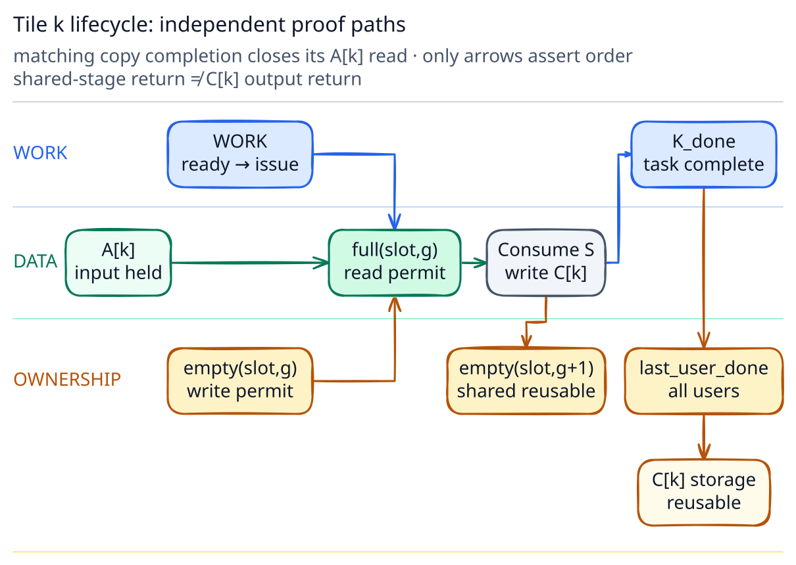

# NVIDIA GPU 软硬件流水与同步：一块 Tile 的端到端交接

结构重构与技术资料核对日期：2026-08-20。

这篇文章不按 API 名称组织，而只追踪一个逻辑工作单元：`tile k`。

它先以 global-memory input `A[k]` 的形式存在；kernel K 把相关 payload 搬入 shared stage `S[slot,g]`；consumer 或 Tensor pipeline 使用这一代 shared payload；结果写成 global-memory output `C[k]`；最后一个 downstream user 结束后，相关 storage 才能复用。

这里有意区分四个对象：

- `tile k`：算法中的逻辑工作单元，不是一段固定地址；
- work state：谁被允许执行下一步；
- payload state：`A[k]`、`S[slot,g]`、`C[k]` 中当前是哪一代数据；
- storage ownership：谁现在可以读取、写入、覆盖或释放具体 storage。

如果把这四个对象混成“tile 已经完成”，就会出现 GPU 同步中最常见的错误推断：kernel 已提交不等于 CTA 已运行，copy 已完成不等于任意 consumer 已可见，consumer 已开始读取更不等于 stage 已经可以覆盖。

> **全文只使用一个一级模型：横向是一块 logical tile 的 lifecycle；纵向用 Work、Data、Ownership 三条 proof lane 检查每个 gate。**

---

## 1. 一块 Tile、三种 Storage、三条 Proof Lane

### 1.1 先固定术语

本文中的 **proof、gate、receipt** 是分析术语，不是 CUDA API 名称。

| 术语 | 本文中的含义 |
| --- | --- |
| Proof | consumer 继续以前必须成立的证明义务 |
| Gate | 下一动作当前不能越过的条件；可能只是瞬时硬件状态 |
| Receipt | 程序或 runtime 可观察、可用来解除某项 proof 的状态，例如 event、barrier phase 或 sequence |

`eligible`、execution-path capacity 和 hardware backpressure 属于 gate/condition，不是程序持有的 receipt。后文还会遇到两种特殊关系：**ordering** 规定 task 或 memory effects 的观察顺序，但不一定产生通知；**permit** 表示可 acquire 并最终归还的 storage 使用权，例如 `empty(slot,g)`。

一张 receipt 只有在以下字段全部匹配时才有意义：

```text
producer + consumer + operation + payload + scope/proxy + generation
```

这里 `scope` 只表示关系覆盖哪些 participants；`proxy` 表示同一 address 由普通 thread、async engine 等哪种访问方法交接。它们会在真正需要时分别展开。

### 1.2 三条固定 proof lane

- **Work proof**：负责下一步的 agent 是否被允许运行，且 forward-progress premise 是否成立？
- **Data proof**：指定 generation 的 operation 是否完成，payload 是否对指定 consumer 可见？
- **Ownership proof**：谁现在可以访问或覆盖对应 storage，何时归还？

Completion 与 Visibility 是 Data proof 内的两个子 gate：operation complete 仍可能缺少目标 scope/proxy 的 visibility。Work proof 中则必须区分 scheduler-visible dependency 与无条件公平性保证；一个 event edge 可以避免 consumer 作为 resident spinner 等待 producer，但不能承诺任何环境下的无限期 fairness。

### 1.3 Canonical tile lifecycle

点击图可打开原始 SVG，并在移动端缩放查看。

[](../assets/diagrams/nvidia-gpu-synchronization-lifecycle.svg)

为把主图限制在九个主节点，图中没有单独画 input-storage reuse：`A[k]` 必须至少保持到 matching copy completion；只有 `source_done(A[k])` 且其他 input users 都结束后，upstream 才能复用它。

本例固定使用以下语义 receipt：

- `input_ready`：`A[k]` 已按 task dependency 交给 K；
- `source_done(A[k])`：matching copy 已完成、不再读取 `A[k]`；它只关闭这次 copy 的 source use，input storage 仍要等其他 users 结束后才能归还 upstream；
- `empty(slot,g)`：producer 获得在物理 `slot` 中构造 generation `g` 的权限；
- `full(slot,g)`：consumer 获得读取 `S[slot,g]` 的权限；
- `empty(slot,g+1)`：最后一个 shared-stage consumer 已结束，物理 slot 可进入下一代；
- `K_done`：K 的 task-level work 已完成到可以开放 downstream dependency 的阶段；
- `last_user_done`：`C[k]` 的最后一位合法 user 已结束，output storage 可复用。

`full` 和 `empty` 是本文的语义名称，不暗示每种实现都存在同名 boolean 或 API object。

在本文的 two-stage 例子中，`slot = k mod 2`，`g = floor(k / 2)`。同一物理 slot 下次承载的是 logical tile `k+2`，但 storage generation 只从 `g` 前进到 `g+1`。

### 1.4 贯穿全文的同一个案例

后文不会再为每种 primitive 发明一套新角色，而只逐步展开下面这段语义伪代码：

```text
host / runtime:
  upstream produces A[k]
  record input_ready
  K waits input_ready and produces C[k]
  record K_done
  downstream consumes C[k]
  record last_user_done, then reuse output storage

kernel K, for logical tile k:
  slot = k mod 2; generation g = floor(k / 2)
  producer waits empty(slot,g)
  elected thread submits A[k] → S[slot,g] async copy
  consumer waits full(slot,g)
  matching copy completion yields source_done(A[k]); upstream may reuse A after its last input user
  Tensor operation consumes S[slot,g]
  matching Tensor completion makes result readable and closes S[slot,g] input use
  consumer returns empty(slot,g+1)
  epilogue stores the Tensor result to C[k]
```

这段代码故意先使用语义 receipt，而不绑定某个 API。第 2 章解释 `input_ready` 与 instruction issue；第 3、4 章分别用同步 copy 与 TMA 实现 `full`；第 5 章解释 `empty`；第 6 章关闭 `K_done → last_user_done` 的 output lifetime。

### 1.5 先看骨架 ledger

| Checkpoint | 新成立的事实 | 仍然没有证明 |
| --- | --- | --- |
| `input_ready` | K 可以进入 software work DAG | CTA 已 resident、instruction 已执行 |
| `source_done(A[k])` | matching copy 不再读取 `A[k]` | 其他 input users 已结束 |
| resident / eligible / issued | producer instruction 有机会进入 execution path | shared payload 已 ready |
| `full(slot,g)` | generation `g` 已完成并可由约定 consumer 读取 | consumer 已用完 stage |
| `empty(slot,g+1)` | shared slot 可构造下一 generation | global output 已交给 downstream |
| `K_done` | downstream task 可以沿 dependency edge 继续 | `C[k]` storage 已归还 |
| `last_user_done` | 最后一位合法 user 已结束 | ——output storage 现在才可复用 |

这些 checkpoint 构成偏序关系，不是一个对象的单一状态机。例如，`S[slot,g]` 可以在 kernel 仍运行时进入下一代；某个 consumer 观察到 payload 时，producer grid 也可能尚未 retired。

后面每章都只做同一件事：指出 tile 当前在哪里、下一项合法动作是什么、缺哪条 proof、哪个机制打开 gate、它明确没有证明什么，以及缺失时能观察到什么。

> **Checkpoint — Orientation**
> - 当前位置：`A[k]` 已存在，shared/output storage 仍属于各自当前 owner。
> - 已取得：对象、generation 与三条 proof lane 的统一坐标。
> - 仍缺：K 接手 `A[k]` 的 Work proof。
> - 缺失表现：后续任何“已完成”都无法回答完成的是哪个对象、哪一代和哪个 observer。

---

## 2. Work Proof：从 `input_ready` 到 Instruction Issue

Upstream producer 已写出 `A[k]`。第一项问题不是 shared memory 或 barrier，而是 K、CTA 和 producer warp 是否真的有机会接手这块逻辑 tile。

### 2.1 Host return、task dependency 与 `input_ready`

下面两个 launch 的 host API 返回，只表示请求已提交，不表示 producer 已完成：

```cpp
produce_A<<<grid, block, 0, stream_a>>>(input, A);
consume_A<<<grid, block, 0, stream_b>>>(A, output);
```

若它们在不同 streams，必须建立明确 dependency：

```cpp
produce_A<<<grid, block, 0, stream_a>>>(input, A);
cudaEventRecord(input_ready, stream_a);

cudaStreamWaitEvent(stream_k, input_ready);
kernel_K<<<grid, block, smem_bytes, stream_k>>>(A, C);
```

这里 `input_ready` 表示 record point 以前的 task work 已完成到 CUDA event contract 要求的阶段。`cudaStreamWaitEvent()` 使后续 stream work 等待该 event；它不会说明 K 的某个 CTA 已经 resident，也不会归还 `A[k]` 的 source storage。只要 K/TMA 或其他 input user 仍可能读取 `A[k]`，upstream 就不能覆盖它。CUDA 对 stream 与 event 的基础 contract 见 [Asynchronous Execution](https://docs.nvidia.com/cuda/cuda-programming-guide/02-basics/asynchronous-execution.html)。

同一 stream 的默认顺序、CUDA Graph edge 和 event edge 都能表达 scheduler-visible task dependency。优先让 dependency 对 runtime 可见，而不是让一个已经 resident 的 consumer 在 device 上盲目 spin。

### 2.2 从 task admission 到 warp issue

进入 device work path 后，还要区分不同层级：

```text
task dependency satisfied
  → grid may be admitted
  → CTA obtains placement and becomes resident
  → warp is active
  → next instruction becomes eligible
  → scheduler selects it
  → instruction issues to a target path
```

这些词描述不同 observer 的状态：

- admission/placement 是本文用于分析 device work 进入执行资源的术语，不是统一 CUDA API state；
- resident 表示 CTA/warp context 已占用 registers、shared memory 等资源；
- eligible 表示 warp 的下一条 instruction 当前没有 dependency、barrier 或 execution-resource gate；
- issued 表示 scheduler 已把 instruction 发给目标 path。

### 2.3 Residency 是 liveness premise，不是 data receipt

普通 grid 的 blocks 可以以任意顺序 placement。程序不能依赖 block 0 必然早于 block 1，也不能假设所有 blocks 同时 resident。

典型 residency deadlock：

```text
all resident slots = consumer blocks polling a flag
pending producer blocks = cannot become resident
flag = can never be produced
```

即使 atomic scope 和 memory order 全部正确，这个协议仍无法推进，因为失败的是 liveness premise。跨 block phase 通常应使用 kernel/task boundary；确实需要同场协作时，必须使用具有相应 placement contract 的 cluster 或 cooperative launch，并验证容量前提。

### 2.4 Scoreboard 只解决 instruction dependency

```text
LDG  R8, [R2]       // variable-latency producer
FFMA R10, R8, R4    // dependent consumer
```

在 R8 ready 以前，dependent FFMA 不 eligible。Scoreboard 是硬件内部的 readiness state，不是 programmer 可以持有的通用 receipt。它保护同一 instruction stream 中的 producer/consumer dependency，但不证明：

- 另一个 warp 已 rendezvous；
- shared/global store 对另一个 thread 可见；
- TMA transaction 已完成；
- stage ownership 已归还。

即使 operand ready，target path 也可能因 throughput 或 dispatch pressure 暂时不能接受 work。Latency dependency 与 execution throughput 必须分开诊断。

### 2.5 Work checkpoint

到这里，K 已进入可执行的 work path，CTA 可能 resident，producer warp 的 instruction 也可能 issue。我们只取得了 Work proof：机器有机会开始生产下一份 payload。

这仍没有证明 `S[slot,g]` 中存在可读数据。Producer 必须先持有 `empty(slot,g)`，再为 consumer 建立独立的 Data proof。

> **Checkpoint — Work**
> - 当前位置：K 的 producer instruction 即将进入或已经进入 execution path。
> - 已取得：task dependency、placement/readiness 所需的 Work gate。
> - 仍缺：`S[slot,g]` 的 completion 与 visibility。
> - 缺失表现：task 不出现、CTA 不 resident、warp 不 eligible 或 issue slot 空转。

---

## 3. Data Proof I：普通 Copy 如何发布 `S[slot,g]`

先从同步的 global→register→shared 路径开始。它能把 scoreboard、participant、ordering 与 notification 的边界讲清楚。

### 3.1 一条完整的 publication chain

```cpp
// producer threads cooperate on one logical tile
smem[idx] = A[src_idx];
__syncthreads();
consume(smem);
```

真正的因果链是：

```text
global load result ready in producer register       ← scoreboard
  → producer can issue shared store
  → all required participants reach the boundary   ← arrivals
  → prior shared writes receive matching ordering  ← memory contract
  → consumers cross the boundary
  → shared loads may read S[slot,g]
```

Scoreboard 与 barrier 并非重复等待。前者处理 issuing warp 的 register dependency；后者把多个 participants 的进度与 shared-memory publication 汇合起来。

### 3.2 Barrier、fence 与 signal 各缺什么

| Mechanism | 主要作用 | 单独缺少什么 |
| --- | --- | --- |
| Barrier | participant phase + 对应 memory contract | arbitrary async transaction completion |
| Fence | memory effects ordering | arrival、notification、ownership return |
| Atomic signal | consumer 可观察的 state | 若 order/scope 不匹配，payload 不会自动 publication |
| Scoreboard | issuing warp 的 operand readiness | 跨 thread visibility 与 rendezvous |

选择机制时先问 handoff 责任，而不是问“哪个 API 更强”。一个完整 publication protocol 通常需要把 payload write、ordering、notification、matching observer 和 generation 接起来。

### 3.3 Participant、scope 与 generation 必须显式

下面是一个 block 内、按 generation 发布 payload 的概念性协议；`sequence` 必须在所有 participants 开始以前初始化：

```cpp
// shared state
__shared__ int payload;
__shared__ int sequence_storage;
cuda::atomic_ref<int, cuda::thread_scope_block> sequence(sequence_storage);

if (threadIdx.x == 0) {
    sequence.store(-1, cuda::memory_order_relaxed); // first generation is 0
}
__syncthreads();  // initialization becomes visible before the protocol starts

if (threadIdx.x == producer_lane) {  // exactly one producer in this minimal example
    payload = make_payload();
    sequence.store(generation, cuda::memory_order_release);
}

if (threadIdx.x == consumer_lane) {  // one consumer in the same block scope
    while (sequence.load(cuda::memory_order_acquire) < generation) {
        // optional backoff or cooperative work
    }
    use(payload);
}
```

Release/acquire 只有在 consumer 观察到匹配 modification，且双方 scope 相互覆盖时，才建立所需 publication。Block-scope atomic 不能支持另一个 block 的 consumer。只用 reusable boolean 还要证明 producer 不会跨过 observer；允许多笔 in-flight work 或 observer 可能错过转换时，应使用 monotonic sequence、token 或 `slot + generation`。

这个最小例子还假设同一 `payload` 最多只有一个 in-flight generation：producer 必须等 consumer 的 empty/ack 后，才能覆盖 scalar payload。`sequence >= generation` 只证明 consumer 没落后于该通知，不能阻止 producer 已经写入更晚一代。多笔 in-flight work 必须使用 per-slot storage，并为每个 slot 建立 full/empty backpressure。

`volatile` 主要影响 compiler 对 access 的处理，不提供 atomicity 或 release/acquire。更完整的 CUDA memory-model 例子见 [CUDA C++ Memory Model](https://docs.nvidia.com/cuda/cuda-programming-guide/05-appendices/cuda-cpp-memory-model.html)。

### 3.4 从同步 publication 过渡到 async engine

同步版本已经说明 Data proof 的形状：producer store 必须发生，required participants 必须满足协议，consumer 跨过匹配 ordering boundary 后才能读取 `S[slot,g]`。本文把这种语义状态记为 `full(slot,g)`。

但普通 copy 仍让数据经过 producer register chain。为了覆盖搬运 latency，下一章把 copy 交给独立 async engine。Producer 因而不能再靠自身 scoreboard 判断 copy 完成，必须引入独立 completion receipt。

> **Checkpoint — Synchronous Data**
> - 当前位置：producer 已把 `A[k]` 发布为 `S[slot,g]`。
> - 已取得：matching participant + ordering 后的 `full(slot,g)`。
> - 仍缺：async overlap，以及 consumer 使用结束后的 ownership return。
> - 缺失表现：旧数据、participant hang，或 producer/consumer 被迫串行。

---

## 4. Data Proof II：从 `empty(slot,g)` 到 Async `full(slot,g)`

Producer 先消费 `empty(slot,g)`，取得构造 `S[slot,g]` 的权限；随后把搬运交给 `cp.async`、TMA 或相应 async agent。Instruction issue 只说明请求已提交，不说明 bytes 已到达，也不说明 consumer 已可读取。

### 4.1 `cp.async`：issuing thread 的 completion 不是 CTA handoff

Ampere 风格的非-bulk `cp.async` 按 issuing thread 的 async group 记账：

```text
cp.async...
  → cp.async.commit_group
  → independent work
  → cp.async.wait_group N / wait_all
```

`wait_group` 只等待该 issuing thread 的相关 `cp.async` group，并不自动让 CTA 中其他 consumers rendezvous，也不为其他 memory operations 提供通用 ordering/visibility。多个 threads 共同读取 shared tile 时，还需要匹配的 group/CTA handoff。具体 contract 见 [PTX ISA `cp.async`](https://docs.nvidia.com/cuda/parallel-thread-execution/)。

### 4.2 TMA 把提交者、搬运者和消费者分开

Hopper（compute capability 9.0+）的 Tensor Memory Accelerator（TMA）让 elected producer thread 描述一次 tensor copy，再由 async engine 执行搬运。`mbarrier` 是放在 shared memory 中的 barrier object，可以同时追踪 software participant arrivals 与 async transaction completion。

点击图可打开原始 SVG，并在移动端缩放查看。

[](../assets/diagrams/nvidia-gpu-synchronization-06.svg)

假设 pipeline 初始化时已经签发 `empty(slot,g)`。下面以一笔 16 KiB global→shared handoff 为例；16 KiB 不是最小传输量，相关 TMA 指令要求 size/alignment 满足其具体 contract（常见 bulk 路径以 16-byte multiple 为基本约束）。

| Step | Actor 与动作 | Arrival debt | Transaction debt | Gate 状态 |
| --- | --- | ---: | ---: | --- |
| Setup | CTA 在 shared memory 初始化 mbarrier，并同步初始化状态 | 1 | 0 | phase 未完成 |
| Acquire | producer 消费 `empty(slot,g)`，选出一个 issuing thread | 1 | 0 | stage 可写 |
| Submit | issuing thread 登记 expected 16 KiB，并提交 TMA | 0 | 16 KiB | copy in flight |
| Complete | async engine 搬完 bytes，产生 complete-tx side effect，同时得到 matching copy 的 `source_done(A[k])` | 0 | 0 | phase complete |
| Acquire data | consumers 对 matching token/parity 执行 acquire wait | 0 | 0 | `full(slot,g)` |

这里的 Submit 同时表达两件事：唯一 software producer 完成本 phase arrival，并把 16 KiB expected transaction amount 记到同一个 mbarrier。具体 CUDA C++/PTX 操作名称因 abstraction 与指令 family 而异，但两本账的语义不能合并。

Arrival count 与 transaction bytes 是两本独立的账：arrival 结清不表示 data 已搬完；transaction 结清也不能替代 required software participant。

显式 `mbarrier.complete_tx` 只模拟偿还 transaction count，本身不代表真实 TMA 已完成，也不额外提供 memory-ordering semantics。正常 TMA 路径由 async operation 完成时产生 complete-tx side effect。相关高层协议见 [CUDA Asynchronous Data Copies](https://docs.nvidia.com/cuda/cuda-programming-guide/04-special-topics/async-copies.html) 与 [Asynchronous Barriers](https://docs.nvidia.com/cuda/cuda-programming-guide/04-special-topics/async-barriers.html)。

### 4.3 进阶：Proxy 是另一个正交维度

Thread scope 回答哪些 participants 被关系覆盖；proxy 回答同一 address 通过哪种访问方法交接。Generic thread、async engine 与 TensorMap descriptor（描述 tensor layout/addressing 的对象）可能属于不同 proxy。

三类 handoff 应拆开检查：

```text
payload/source update:
  generic producer prepares source
  → required generic→async proxy handoff
  → async agent consumes payload

TensorMap descriptor update:
  generic producer modifies descriptor state
  → required generic→tensormap proxy handoff
  → tensormap proxy supplies the async operation

destination publication:
  async agent writes shared destination
  → mbarrier phase completion
  → consumer wait/acquire
  → generic consumer reads destination
```

高层 CUDA/CUTLASS abstraction 可能封装其中部分规则；手写 PTX 或运行时修改 TensorMap 时，应按具体 instruction family 验证，而不是用一次普通 thread fence 覆盖所有 proxy。

### 4.4 进阶：Tensor pipeline 又新增一段 Data proof

Shared tile ready 只开放 Tensor operation 的 input。以 Hopper Warpgroup Matrix Multiply-Accumulate（WGMMA）的简化路径为例；具体 PTX `wgmma` target contract 需要 `sm_90a`：

```text
shared input ready
  → required input ordering / warpgroup participation
  → async Tensor operations issue
  → group commit
  → independent work
  → result completion wait
  → accumulator becomes readable
  → epilogue issues output store to C[k]
```

CTA participants 已到齐不能替代 Tensor group completion；反过来，Tensor wait 也不表示其他 warps 已到共同 phase。Output store 已 issue 仍不是 `K_done`；第 6 章才把 `C[k]` 的 kernel task completion 交给 downstream。

### 4.5 Async 性能问题先看 wait 位置

Async 优化不是删除 wait，而是把 wait 移到首次真正消费 tile 以前的最晚位置，并在此前安排独立 work。

- consumer 经常等 full：copy/memory path 较慢、wait 太早或 stage 太浅；
- producer 经常等 empty：consumer/Tensor path 较慢或 ownership return 太晚；
- 两边都 ready 但 issue rate 低：检查 dispatch/execution throughput；
- 所有 resident warps 等同一 phase：检查 partition、stage depth 和 participant balance。

此时 `S[slot,g]` 已完成并对约定 consumer 可见。Data lane 已推进，但 `full(slot,g)` 只授权 consumer 使用，不授权 producer 覆盖相同 stage。

> **Checkpoint — Async Data**
> - 当前位置：TMA/mbarrier 已签发 `full(slot,g)`，Tensor result 可进入 output epilogue。
> - 已取得：指定 generation 的 completion + visibility，以及 matching copy 的 `source_done(A[k])`；input storage 是否可归还仍取决于其他 users。
> - 仍缺：shared stage 的 empty return，以及 `C[k]` 的 task/lifetime closure。
> - 缺失表现：wait-full、旧 payload、proxy mismatch，或 accumulator/output 过早消费。

---

## 5. Ownership Proof：从 `full(slot,g)` 到 `empty(slot,g+1)`

只要 ordinary load、Tensor operation 或其他合法 consumer 仍可能访问 `S[slot,g]`，producer 就不能把下一代 payload 写进同一物理 slot。

### 5.1 Full 与 empty 是两个相反方向的 handoff

[ 才把复用权归还 producer。")](../assets/diagrams/nvidia-gpu-synchronization-07.svg)

```text
producer --full(slot,g)------> consumer
producer <-empty(slot,g+1)--- consumer
```

必须持续区分：

```text
producer operation completed
  ≠ consumer has observed payload
  ≠ consumer has finished using storage
```

前两项建立 Data proof，最后一项才归还 Ownership proof。

### 5.2 Generation 防止旧 receipt 被重新消费

同一物理 slot 会承载多代 payload。`slot 0, generation g` 与它下一次承载的 `slot 0, generation g+1` 不是同一个 storage incarnation；在 two-stage 例子中，它们分别保存 logical tile `k` 与 `k+2`。

常见 generation encoding 包括 barrier token、parity、monotonic sequence、ring index + generation，以及 producer/consumer counters。Boolean 并非天然错误：严格一进一出、producer 无法跨过 observer 时可以安全；但存在多笔 in-flight work、observer 可能错过转换或 object 被复用时，单个相同值不足以证明 receipt 属于哪一代。

### 5.3 双缓冲的 overlap 来自 ownership edge

为让图中两个物理 stage 与公式一一对应，以下取 `k = 2g`：Stage 0 当前承载 tile `k`，Stage 1 承载 tile `k+1`；同一 Stage 0 的下一代才承载 tile `k+2`。

[](../assets/diagrams/nvidia-gpu-synchronization-08.svg)

两级 pipeline 的正确节拍是：

```text
S0: fill tile k @g   → full(0,g) → consume k   → empty(0,g+1) → fill tile k+2 @g+1
S1: fill tile k+1 @g → full(1,g) → consume k+1 → empty(1,g+1) → fill tile k+3 @g+1
```

Producer 等 empty 表示 downstream ownership 尚未归还；consumer 等 full 表示 upstream Data proof 尚未完成。这个状态比“copy 很慢”或“Tensor 很慢”的笼统判断更接近可验证原因。

到这里，shared stage 的 ownership loop 已闭合；但 `C[k]` 是另一块 storage。Stage 可复用不等于 output 可复用，也不等于 downstream 已看到结果。

> **Checkpoint — Shared Ownership**
> - 当前位置：consumer 已归还 `empty(slot,g+1)`，同一 shared slot 可承载 tile `k+2`。
> - 已取得：shared stage 的 generation-scoped ownership return。
> - 仍缺：`C[k]` 的 kernel task completion 与最后一位外部 user。
> - 缺失表现：overwrite、跨 generation 串数据，或 producer 长时间 wait-empty。

---

## 6. Kernel 边界：从 `C[k]`、`K_done` 到 `last_user_done`

Tensor consumer 已产生结果并向 `C[k]` 发出 output store；shared slot 也可能已经归还 producer。现在需要把观察范围从 CTA 内扩大到 stream、host、allocator，以及可选的 remote consumer。

### 6.1 `K_done` 只开放 downstream dependency

CUDA task contract 规定何时 downstream stream/event/host 可以依赖 kernel side effects；不要把未公开的内部 drain 时点当成 programmer contract。

[](../assets/diagrams/nvidia-gpu-synchronization-09-lifetime.svg)

```text
K writes C[k]
  → K_done
  ├→ stream B consumes C[k]
  ├→ host observes K_done, then waits D2H or a supported mapped/managed access protocol
  └→ communication/API handoff
       → all legal users complete
       → last_user_done
       → output storage reusable
```

### 6.2 Stream-ordered allocator 把 lifetime 变成 DAG

```text
stream A: mallocAsync(p) → K writes p → event A
stream B:                            wait A → consume p → event B
stream C:                                                  wait B → freeAsync(p)
```

必须证明 allocation 在第一次 use 前生效、每个跨-stream user 都位于 free 之前、free/reuse 位于最后一个 user 之后。地址相同不表示 generation 相同。官方示例见 [Stream-Ordered Memory Allocator](https://docs.nvidia.com/cuda/cuda-programming-guide/04-special-topics/stream-ordered-memory-allocation.html)。

本地端到端主线至此结束：`K_done` 开放 task dependency，`last_user_done` 才关闭 `C[k]` lifetime。

> **Checkpoint — Output Lifetime**
> - 当前位置：K 已产生 `C[k]`，downstream users 沿 task DAG 消费它。
> - 已取得：`K_done` 只关闭 K 的 task boundary。
> - 仍缺：所有 downstream users 的 `last_user_done`。
> - 缺失表现：host 早读、跨 stream use-after-free，或 allocator 过早 reuse。

---

## 7. 完整回放：用三条 Proof 定位 Tile 停在哪个 Gate

现在所有对象和 receipt 都已在具体 handoff 中定义。诊断时不再创建一套新模型，而直接回到 lifecycle map。

### 7.1 先定位 gate，再判断 proof class

[](../assets/diagrams/nvidia-gpu-synchronization-diagnosis.svg)

完整回放：

```text
A[k]
→ input_ready
→ admitted / resident / eligible / issued
→ empty(slot,g)
→ S[slot,g] filling
→ full(slot,g)
→ consumer / Tensor completion
→ empty(slot,g+1)
→ C[k]
→ K_done
→ downstream consumption
→ last_user_done
→ reusable
```

### 7.2 Correctness 路径

| 症状 | 优先检查 | 需要的反证/确认 |
| --- | --- | --- |
| task 永久不开始 | Work progress premise | dependency cycle、queue、residency/participant cycle |
| 偶发旧数据 | Data visibility | matching operation、scope/proxy、release/acquire、generation |
| 上一 tile 混入下一 tile | Ownership/generation | full/empty identity、sequence/parity、last legal user |
| multi-stream use-after-free | Output lifetime | 每个 user 是否位于 `freeAsync` 前 |
| remote consumer 永久等待 | delivery/notification | posted、ordered、visible、notified 分别是否成立 |

Correctness 未证明时，应先修协议，不能用 occupancy、更多 stages 或更宽 barrier 掩盖。

### 7.3 Performance 路径

结果正确后，再沿执行层级定位：

| Gate | Observable | 下一步检查 |
| --- | --- | --- |
| task 尚未开始 | timeline 上没有 kernel activity | software DAG、queue、host wait 是否过宽 |
| CTA 未 resident | launch/resource 限制 | registers、shared memory、cluster/occupancy |
| warp active 但不 eligible | warp-state/stall samples | operand、barrier、membar、async completion |
| warp eligible 但 issue 不足 | scheduler statistics | not-selected、dispatch conflict、target path |
| issue 正常但吞吐不足 | Speed of Light (SOL) / pipeline throughput | memory、Tensor、ALU saturation与复用 |
| copy/compute 不重叠 | timeline + full/empty waits | wait 位置、stage depth、producer/consumer imbalance |

Nsight Compute 的 stall reasons 是采样归因线索，不是根因证明。先确认 scheduler 是否确实存在 skipped issue slots，再结合 source correlation、Scheduler Statistics、Warp State Statistics、throughput 与 timeline 交叉验证。官方说明见 [Nsight Compute Profiling Guide](https://docs.nvidia.com/nsight-compute/ProfilingGuide/)。

### 7.4 三个高频误诊

1. **把 long scoreboard 当缺 barrier**：scoreboard 已在等待 producer result；额外 barrier 只增加 participant wait。
2. **把 copy complete 当 stage reusable**：completion 只完成 producer→consumer 方向，consumer→producer 的 empty ownership 尚未返回。
3. **把高 stall percentage 当根因**：若 scheduler 仍持续 issue，某类 warp 等待可能只是有效 latency hiding 的组成部分。

### 7.5 最终 ledger

| Gate | Producer → consumer | Evidence | Waiter 当前持有的资源 | 还需证明 |
| --- | --- | --- | --- | --- |
| `input_ready` | stream A → K | event/edge | K 通常尚未 resident | allocation lifetime |
| `source_done(A[k])` | copy/input users → upstream owner | matching operation completion | input storage/transfer resources | 其他 input users |
| CTA placement | device work distributor → CTA | resident state | 成功后占 registers/shared/CTA slot | warp readiness |
| register ready | memory/execution path → instruction | scoreboard state | warp context | 无跨-thread publication |
| async submission | producer → async proxy | issue + proxy contract | descriptor/stage permit | transaction completion |
| `full(slot,g)` | async agent → consumers | mbarrier phase/tx | consumer warps可能 resident | correct phase、visibility |
| Tensor result ready | Tensor path → consumer instruction | group completion | warpgroup context | output handoff |
| `empty(slot,g+1)` | consumer → producer | ownership permit | shared slot | generation identity |
| `K_done` | K → downstream | event/stream/graph edge | downstream尚未运行 | output lifetime |
| `last_user_done` | final consumer → allocator/owner | API-specific completion | storage/communication resources | ——ownership closed |

面对任何新的 synchronization primitive，都把它放回这张表：它解除哪个 gate、谁能观察、覆盖哪一代 payload、提供 ordering 还是 completion/visibility/ownership，以及它明确没有证明什么。

---

## 附录 A：高级路径放回所属 gate

### A.1 CUDA Graph 与 value edge

CUDA Graph 把 kernel、copy、allocation 等 work 组织成 scheduler-visible DAG。没有 edge 的 branches 只表示允许 overlap，是否真正并发还取决于 queue、context、SM 与 memory resources。

Stream-ordered memory write/wait 可以把 progress value 当 doorbell，但 value 改变只是 condition。还要证明地址合法、payload write 先于 signal、scope/order 覆盖 consumer、producer 有 progress premise，以及 sequence 不会把旧 notification 当成新 generation。

### A.2 Cluster 与 cooperative grid

Cluster/cooperative launch 改变 placement 与 participant contract，不只是把 block barrier“扩大”。Scope 变大时，同时在场保证、required participants、resource cost 与 deadlock premise都会变化；memory effects 仍要遵守对应 synchronization contract。

### A.3 Independent Thread Scheduling 与 logical participant set

Volta 及以后不能把某一时刻的 current active mask 当作算法规定的 logical participant set。`vote`、`shuffle`、`match` 的 `_sync` mask 描述哪些 lanes 参加 matching collective；通过 shared memory 交接 payload 时，还需要匹配的 `__syncwarp(mask)` 或 group synchronization memory contract。瞬时 active lanes、协议 participants 与 memory ordering 是三个不同问题。

### A.4 Programmatic Dependent Launch

PDL 有意拆开 launch-ready 与 data-ready。Compute capability 9.0+ 上，primary 与 secondary 位于同一 CUDA stream；primary 的所有 blocks 都执行 `cudaTriggerProgrammaticLaunchCompletion()`后，runtime 才可提前开放 secondary launch。Secondary 使用相应 extensible launch attribute，并在读取 primary output 前执行 `cudaGridDependencySynchronize()`。Overlap 是机会，不是 correctness 可以依赖的并发保证。详见 [Programmatic Dependent Launch](https://docs.nvidia.com/cuda/cuda-programming-guide/04-special-topics/programmatic-dependent-launch.html)。

### A.5 Remote API 对照

Remote handoff 只是把 `K_done` 与 `last_user_done` 之间的 Data/Ownership lane 延长：

```text
posted → ordered → source-complete → destination-visible
       → notified → consumed → released/reusable
```

不同 API 覆盖的 stage 不同；source-side completion 不自动证明 destination visibility，notification 也不自动证明 remote consumer 已用完 storage。

- Cross-device event：表达 task-level dependency，不自动覆盖 fine-grained remote atomic protocol；
- NCCL：host call 通常只 enqueue collective，output readiness 跟随对应 CUDA stream completion；
- NVSHMEM：fence、quiet、signal/wait 分别处理 ordering、completion/delivery、notification；
- external semaphore：timeline 达标以外，还要遵守 resource layout、handle lifetime 与 API ownership transfer。

参考 [NCCL stream semantics](https://docs.nvidia.com/deeplearning/nccl/user-guide/docs/usage/streams.html) 与 [NVSHMEM memory ordering](https://docs.nvidia.com/nvshmem/api/latest/using.html)。

### A.6 UVA 与 Managed Memory

Unified Virtual Addressing 解决统一地址空间；Managed Memory 另有 migration、coherence 与平台 access 规则。两者都不自动建立应用需要的 CPU↔GPU happens-before，也不把 page migration 变成 notification。CPU 消费 GPU output 前仍要遵守相应 synchronization contract。详见 [Unified Memory](https://docs.nvidia.com/cuda/cuda-programming-guide/04-special-topics/unified-memory.html)。

### A.7 其他 object lifetime

- mbarrier storage 在合法结束/invalidation 前不能改作他用；
- cluster peer 仍访问 distributed shared memory 时，owning block 不能提前结束相关 lifetime；
- TensorMap 更新和使用需要匹配 proxy ordering；
- Blackwell Tensor Memory / `tcgen05` permit 遵守 generation-specific lifecycle；
- external resource 还要遵守对应 API 的 ownership/layout transfer。

### A.8 其他 scheduling 与 memory 变体

- Green Context 改变 progress resources，不创建 payload edge；
- Dynamic Parallelism 创建 device-side work DAG，不允许随意把 parent shared/local memory 交给 child；
- Cluster Launch Control 异步交接 scheduler state，但不是 memory fence；
- Memory synchronization domains 减少无关 traffic 对 fence 的干扰，不创建新 rendezvous。

---

## 附录 B：把 proof 变成可验证实验

每个实验都应写清假设、唯一变量、观察指标和 falsifying outcome。

### 实验 B1：Scoreboard 与 latency hiding

- 假设：增加独立 arithmetic 或独立 warps 能隐藏 load→use latency；
- 变量：立即 use、插入 ILP、增加 TLP 三版 kernel；
- 观察：long scoreboard、eligible warps、issued warps、kernel time；
- 反证：stall 下降但 throughput 不变时，检查 memory/target path saturation。

### 实验 B2：Shared publication

- 假设：matching participant + ordering 才能稳定发布 payload；
- 变量：错误 plain/volatile flag、full-block barrier、scoped release/acquire sequence；
- 观察：timeout、hash mismatch、barrier tail、compute-sanitizer；
- 反证：只在某一 launch shape 正常不能证明协议正确。

### 实验 B3：Async stage depth

- 假设：推迟 wait 并增加合适 stage depth 能扩大 copy/compute overlap；
- 变量：同步 copy、`cp.async`、two-stage pipeline、TMA+mbarrier；
- 观察：timeline overlap、consumer wait-full、producer wait-empty、throughput；
- 反证：更多 stages 增加 shared/register pressure，反而降低 residency或吞吐。

### 实验 B4：Task lifetime

- 假设：最窄 event edge 比 device-wide wait 保留更多 overlap；
- 变量：event wait、stream wait、`cudaDeviceSynchronize()`、故意删除 lifetime edge；
- 观察：timeline gap、race/use-after-free、allocation reuse；
- 反证：地址复用相同不代表 generation/lifetime 正确。

---

## 附录 C：机制索引

| Mechanism | Type | Direct observer | 主要作用 | 不自动保证 |
| --- | --- | --- | --- | --- |
| scoreboard | internal condition | warp scheduler | operand/result ready | 跨 thread visibility |
| execution backpressure | transient condition | dispatcher/scheduler | target path capacity | producer completion |
| CTA/cluster barrier | phase receipt + ordering | participants | rendezvous/publication | arbitrary async work |
| mbarrier | phase/transaction receipt | participants + async agent | arrivals + async completion | stage ownership return |
| async group | issuing-context receipt | issuing thread/warpgroup | operation batch completion | CTA rendezvous |
| fence | ordering primitive | memory-model participants | memory effects order | signal、arrival、ownership |
| release/acquire atomic | signal + ordering | scope-covered threads | publication edge | producer progress |
| semaphore/empty permit | ownership state | acquire waiter | bounded resource right | new payload completion |
| CUDA event | task receipt | stream/host | record-point completion | kernel 内 thread phase |
| external timeline | cross-API progress | imported API/device | monotonic handoff | resource layout/ownership details |

选择原则：最窄 scope、最小 participant set、最精确 completion、最晚必要 wait、明确 generation 与 ownership return，以及 scheduler 可以满足的 liveness premise。

---

## 附录 D：官方资料阅读顺序

1. [CUDA Asynchronous Execution](https://docs.nvidia.com/cuda/cuda-programming-guide/02-basics/asynchronous-execution.html)
2. [Advanced Kernel Programming](https://docs.nvidia.com/cuda/cuda-programming-guide/03-advanced/advanced-kernel-programming.html)
3. [CUDA C++ Memory Model](https://docs.nvidia.com/cuda/cuda-programming-guide/05-appendices/cuda-cpp-memory-model.html)
4. [PTX ISA](https://docs.nvidia.com/cuda/parallel-thread-execution/)
5. [CUDA Asynchronous Barriers](https://docs.nvidia.com/cuda/cuda-programming-guide/04-special-topics/async-barriers.html)
6. [CUDA Asynchronous Data Copies](https://docs.nvidia.com/cuda/cuda-programming-guide/04-special-topics/async-copies.html)
7. [CUDA Pipelines](https://docs.nvidia.com/cuda/cuda-programming-guide/04-special-topics/pipelines.html)
8. [Stream-Ordered Memory Allocator](https://docs.nvidia.com/cuda/cuda-programming-guide/04-special-topics/stream-ordered-memory-allocation.html)
9. [Programmatic Dependent Launch](https://docs.nvidia.com/cuda/cuda-programming-guide/04-special-topics/programmatic-dependent-launch.html)
10. [Nsight Compute Profiling Guide](https://docs.nvidia.com/nsight-compute/ProfilingGuide/)

---

## 最后的统一判断

不要先问“这个 primitive 比 barrier 强不强”，先问：

```text
tile 当前是哪一个 logical generation？
payload 现在位于 A[k]、S[slot,g] 还是 C[k]？
下一位 agent 缺 Work、Data 还是 Ownership proof？
它等待的 receipt 对应哪个 operation、scope/proxy 与 generation？
waiter 等待时仍占着什么资源？
最后一位合法 user 如何签发 ownership return？
```

`input_ready` 不能归还 `A[k]` 或替代 residency，instruction issue 不能替代 `full(slot,g)`，`full(slot,g)` 不能替代 `empty(slot,g+1)`，`K_done` 也不能替代 `last_user_done`。只要这些边界没有被混用，从 CPU submission、shared async pipeline 到 downstream buffer reuse，就仍然是同一条 tile lifecycle。
