# NVIDIA GPU 软硬件流水调度与同步

副标题：从 CPU submission、stream DAG 和 block residency，到 warp issue、memory/Tensor pipeline、retirement 与跨 GPU completion。

最后核对日期：2026-08-12。

同步不是悬在 GPU 流水之外的一串 API。它回答的是：

> 一项 work、一个 block、一组 lanes、一条 instruction、一次 memory transaction 或一个外部 consumer，走到流水某个 gate 时，凭什么可以继续？

完整的同步协议至少要定义八件事：

```text
(participants, condition, wait mode, memory order,
 scope, phase, ownership/lifetime, forward-progress premise)
```

- **participants**：谁必须参加，lane、warp、CTA、cluster、grid、stream、host thread 还是 remote PE；
- **condition**：等 operand ready、pipeline capacity、全部到齐、value 改变、transaction 完成还是 timeline 达标；
- **wait mode**：stall、poll、suspend、arrive-and-continue，还是仅建立 dependency edge；
- **memory order**：只管控制流，还是还建立 atomicity、ordering、visibility；
- **scope**：影响 block、cluster、device、system，还是某个 communicator/team；
- **phase**：一次性 completion，还是需要 token/parity 的 reusable protocol；
- **ownership/lifetime**：buffer、barrier storage、allocation 或 external resource 何时能复用；
- **forward progress**：producer 是否保证能被调度，等待会不会把它需要的资源全部占住。

因此本章不按 scoreboard、barrier、fence 等名词逐个罗列，而是沿两条嵌套流水向下走：

1. **software work pipeline**：CPU submission → context → stream/graph DAG → grid admission → downstream task；
2. **hardware execution pipeline**：block/cluster placement → warp residency → eligibility/issue → execution/memory/async engine → completion/retirement。

同步还会额外建立第三张图：**memory ordering、resource ownership 与 object lifetime graph**。正确性来自三张图一致，而不是“时间上看起来先后发生”。

---

## 1. 总图：一项 GPU work 怎样穿过软硬件流水

```mermaid
flowchart LR
    subgraph SW["Software work pipeline"]
        CPU["CPU thread"] --> API["CUDA runtime / driver"]
        API --> CTX["Context / device queue"]
        CTX --> DAG["Stream / graph dependencies"]
        DAG --> GRID["Grid admitted"]
    end

    subgraph HW["Hardware scheduling pipeline"]
        GRID --> PLACE["Block / cluster placement"]
        PLACE --> RES["Resident active warps"]
        RES --> ELIG{"Eligible?"}
        ELIG -->|yes| ISSUE["Scheduler select / issue"]
        ELIG -->|no| WAIT["Dependency / barrier / resource wait"]
        WAIT --> ELIG
    end

    subgraph EX["Execution and completion"]
        ISSUE --> PIPE["Arithmetic / Tensor / memory / async pipeline"]
        PIPE --> DONE["Result or transaction complete"]
        DONE --> RET["Warp / block / grid retirement"]
        RET --> NEXT["Event / host / stream / remote consumer"]
    end
```



### 1.1 一组不能混用的时间点

| 时间点 | 含义 | 常见误解 |
| --- | --- | --- |
| submitted | host 已把 work 交给 runtime/driver | 不等于 device 已开始 |
| admitted / launched | work 已被允许进入 device execution | 不等于所需数据已 ready |
| resident | block/warp context 已占用 SM resource | 不等于 warp 当前可 issue |
| active | warp 尚未退出 | 不等于 eligible |
| eligible | 下一条 instruction 的 dependency 与目标 path 当前允许 issue | 不等于本周期被选中 |
| issued | scheduler 本周期选择并发出了 instruction | 不等于 operation 已完成 |
| locally complete | issuing context 可以越过相应 completion gate | 不一定等于 remote visible |
| visible | 指定 scope/proxy/consumer 可以按协议观察 result | 不等于 resource 已释放 |
| retired | warp/block/grid 的 architectural work 已结束 | 仍要看 downstream task 与 object lifetime |
| reusable | 最后一位合法 user 已完成，storage/permit 可交给下一 phase | 不等于只是 producer 已完成写入 |

### 1.2 公开模型的边界

本章使用 NVIDIA 公开 programming、PTX 与 profiler model。它足以解释 correctness、主要 stalls 与 pipeline design，但不是完整 RTL：

- PTX 是 virtual ISA，SASS 才是 target-specific machine instruction；
- fetch/decode/dispatch 深度、scheduler 数量、dual issue 与 execution port 会随 generation 改变；
- scoreboard encoding、arbitration、cache coherence implementation 与 firmware policy 并未全部公开；
- stream priority、concurrent kernels 与 PDL overlap 都不能当成强制 preemption/并发保证；
- Ampere `cp.async`、Hopper TMA/WGMMA/cluster、Blackwell `tcgen05`/Tensor Memory 必须保留 target-generation 边界。

后文使用 generation-neutral 主干，在架构特性出现时单独标注。

---

## 2. Software work pipeline：从 CPU submission 到 grid admission

### 2.1 Kernel launch 通常只让 host “提交”，不让 host “等待”

```cpp
kernel_a<<<grid, block, 0, stream_a>>>(...);
do_cpu_work();  // launch 通常对 host asynchronous
```

host return 只说明 launch request 已被接受或排队。以下事件仍然不同：

```text
host API returns
  → command reaches device queue
  → grid is admitted
  → blocks become resident
  → last block finishes
  → memory effects satisfy downstream synchronization
```

CPU 若要消费结果，应等待最窄 completion：某个 event、某条 stream，必要时才是整个 device。`cudaDeviceSynchronize()` 会等待该 device 上更广的 work，容易破坏本可并发的 streams。

### 2.2 Stream order 是 task dependency，不是 kernel 内 barrier

同一 stream 中的 tasks 按 stream order 建立依赖：

```text
stream A: H2D copy → kernel A → kernel B → D2H copy
```

这解决 kernel/copy/task 之间的 admission 与 completion ordering，不会在 kernel A 内生成 `__syncthreads()`。不同 streams 默认没有这种 edge，可能并发，也可能因 resource、context 或实现调度而串行。

还要注意：

- legacy default stream 可能与其他 blocking streams 产生 implicit synchronization；
- non-blocking stream 可避免一部分 legacy-default-stream coupling；
- stream priority 是调度 hint，不保证正在运行的 kernel 立刻被抢占；
- “没有 dependency”只表示允许 overlap，不保证硬件资源足以并发。

### 2.3 Event 与 graph edge 把 dependency 暴露给 scheduler

```cpp
kernel_a<<<grid, block, 0, stream_a>>>(...);
cudaEventRecord(done_a, stream_a);

cudaStreamWaitEvent(stream_b, done_a);
kernel_b<<<grid, block, 0, stream_b>>>(...);
```

event record 捕获 stream A 到该点的 work；stream B wait 建立 device-visible task edge。host 可以 query/synchronize event，但不必为了 A→B dependency 自己阻塞。

CUDA Graph 把同类关系显式化成 node DAG。普通 edge 通常表示 downstream node 等 upstream completion；conditional node、programmatic edge 等扩展还可表达 data-dependent control 或更细的 launch point。Graph 优化不能改变应用声明的数据依赖。

### 2.4 Stream memory wait/write 是 value edge，隐藏依赖要特别小心

Driver API 的 stream-ordered memory write/wait 可以让 stream 写一个 progress value，或在 value 满足比较条件后继续。它适合 doorbell、timeline 与低开销 interop，但它仍需要：

- address 对双方合法可见；
- producer write 与 payload publication 有正确 ordering；
- scheduler 能提供 producer forward progress；
- 不把一个 scheduler 看不见的 spin/value dependency 设计成循环等待。

如果普通 event/graph edge 已能表达 task dependency，优先让 CUDA scheduler 看见它。

### 2.5 Programmatic Dependent Launch：launch-ready 不等于 data-ready

CC 9.0+ 的 PDL 允许 same-stream secondary kernel 在 primary 完全结束前启动 independent preamble：

```text
primary blocks trigger launch completion
        → secondary may launch and run independent work
primary completes and flushes required results
        → secondary passes cudaGridDependencySynchronize()
        → dependent region consumes primary output
```

primary 的所有 blocks 都应到达 `cudaTriggerProgrammaticLaunchCompletion()`；未显式 trigger 时，在 block 退出处隐式发生。secondary 必须用 programmatic launch attribute，并在 dependent region 前执行 `cudaGridDependencySynchronize()` 或采用等价的正确 data-ready protocol。

PDL overlap 是 opportunistic。correctness 或 progress 不能依赖两个 kernels 必然并发 resident。

### 2.6 Dynamic Parallelism：device-created work 也有 work DAG

CUDA Dynamic Parallelism 允许 device thread launch child grid。parent/child completion 是 properly nested：parent grid 只有在其 children 完成后才算完成。但这不表示：

- child 一定与 parent 并发；
- parent thread 能在任意位置同步 child 后继续读取其 writes；
- parent shared/local memory 可传给 child。

CC 9.0+ 的 CDP2 使用 tail-launch 等当前 execution model 组织 child result 的后续消费；不要继续套用已废弃的 device-side `cudaDeviceSynchronize()` 心智模型。device-created streams/events 也只在相应 grid scope 内有效。

### 2.7 Green / Execution Context：先划分 scheduler 能使用的资源

CUDA 13.1 runtime 暴露的 execution context 可以对应 primary context 或 green context。Green context 可被 provision 一组 SM 与 work-queue resource，使关联 streams 的 work 只使用这些资源。

它解决的是 resource isolation/interference，不是 data synchronization：

- 给 latency-sensitive work 留出 SM，可移除“所有 SM 都被另一 kernel blocks 占住”这一阻塞因素；
- work-queue configuration 可减少不同 execution contexts 误落到同一 queue 造成的 false dependency；
- 即使 SM/WQ 已分开，独立 work 的并发执行仍不保证；
- context partition 不会自动在不同 contexts 的 payload 之间建立 happens-before。

Execution-context 级 record/wait event 可以一次捕获或等待该 context 多条 streams 的 work；CPU 也可同步整个 execution context。应根据需要选择 context-wide、stream-wide 或 event-level wait，避免把资源 partition 当成 completion edge。

---

## 3. Placement 与 residency：grid 进来了，谁能同时住在 SM 上

### 3.1 普通 blocks 必须允许任意顺序执行

CUDA 可以把一个 grid 的 blocks 以任意顺序分配给 SM：并行、串行或交错都合法。普通 kernel 不能依赖：

- block 0 一定先于 block 1；
- 所有 blocks 同时 resident；
- consumer block spin 时，producer block 一定已经得到资源；
- 同一 grid 的不同 blocks 天然具有 global rendezvous。

这条规则让任意大的 grid 都能在有限 SM 上执行。违反它的常见后果是 residency deadlock：若 resident consumers 占满所有 slots 并等待尚未调度的 producers，program 无法前进。

跨 block phase 通常使用：

1. 拆成 kernel A → kernel B，以 stream/graph edge 作为 global boundary；
2. 满足条件时使用 cooperative grid sync；
3. 在 thread-block cluster 内用 cluster-supported synchronization；
4. persistent kernel 中仅在能够证明 occupancy 与 forward progress 时使用 global atomic/work-queue protocol。

### 3.2 Residency 受资源约束，不只是 block 数量

block 被 placement 到 SM 后，才形成 resident warps。resident block/warp 数受以下资源共同限制：

- registers per thread / block；
- static + dynamic shared memory；
- threads/warps per block；
- architecture 的 resident block/warp 上限；
- barrier、cluster、Tensor Memory 等架构资源；
- launch bounds、MIG/partition 与实际 device configuration。

occupancy 的真正价值是提供可替换的 ready work。高 occupancy 不是目标本身：

```text
更多 resident warps
    → 可能增加 eligible candidates，覆盖 latency
    → 也可能要求减少 registers/shared-memory stages
    → 反而降低 ILP、reuse 或 async pipeline depth
```

应优化的是 issue efficiency 与有效吞吐，不是只把 occupancy percentage 拉满。

### 3.3 Barrier 会让 warp 仍 active，却暂时不 eligible

若一个 CTA 的部分 warps 已到 `__syncthreads()`：

- 它们仍占用 register/shared-memory/residency resource；
- 它们仍是 active warps；
- barrier phase 完成前，它们不能发射 barrier 后的 instruction；
- 同 CTA 的 late warps 与其他 resident CTAs 仍可推进。

如果所有 resident warps 都卡在 barrier、memory dependency 或同一 saturated path，scheduler 就没有 eligible work。多 resident blocks 有时能覆盖 barrier wait；严重 work imbalance 则会把 barrier tail 放大。

### 3.4 Cluster 把“跨 CTA 同时在场”变成显式保证

CC 9.0+ thread-block cluster 的 blocks 被保证 co-scheduled 到同一 GPC，可使用：

- `cluster.sync()` / cluster barrier；
- distributed shared memory；
- remote shared-memory access 与特定 remote mbarrier arrival；
- cluster-level cooperative protocol。

cluster sync 既需要匹配 participant，又要遵守 DSM object lifetime：cluster 内其他 blocks 可能访问本 CTA shared memory 时，不能让 owning block 提前退出或复用 storage。

cluster 不是任意 grid barrier。portable cluster size、occupancy 与支持能力需要查询，cluster scope 也不能自动扩展到整个 device。

### 3.5 Cooperative grid sync 依赖 cooperative launch

`cooperative_groups::grid_group::sync()` 可以让 whole grid rendezvous，但要求 cooperative launch 与相应 launch/residency constraints。它改变了 ordinary-block independence 的前提，因此 runtime 必须确认 launch 可支持。

截至 CUDA 13，Cooperative Groups 不再提供 multi-device grid synchronization。跨 device 应使用 cross-device event、system-scope protocol、NCCL/NVSHMEM 或 external semaphore。

### 3.6 Blackwell Cluster Launch Control：调度控制本身也是 async protocol

Blackwell CC 10.0+ Cluster Launch Control（CLC）允许正在执行的 block/cluster 尝试取消一个尚未开始的 block/cluster，并取得其 index 来完成被取消 work，实现 work stealing。它试图同时保留：

- fixed-work-per-block 的 hardware load balancing 与更好的 priority response；
- fixed-number-of-blocks/persistent style 的 prologue amortization；
- tail 阶段由空闲 workers 主动接管剩余 work。

CLC cancellation 不是同步函数立即返回结果，而是一项 asynchronous request：

```text
elected thread issues cancellation request
  → scheduler tries to cancel not-yet-started block/cluster
  → encoded success/failure + index written to shared result
  → mbarrier transaction completion flips phase
  → requester waits/tests phase
  → async↔generic proxy handoff
  → decode result; on success execute stolen index
```

因此它同时涉及四层同步：

1. leader/election：避免所有 threads 重复提交；
2. scheduler state：只能取消尚未开始的 work；
3. mbarrier tx-count/phase：观察 async cancellation response；
4. proxy fence + shared result lifetime：避免 async/generic race 与下一 iteration overwrite。

失败 request 还有专门的 observation/retry constraint；cluster 版本要确保 cluster blocks 都在场，并让各 CTA 按 cluster scope 管理本地 barrier/result。CLC 是 scheduling primitive，不是 memory fence，也不保证每次 steal 成功。

### 3.7 Placement 层的同步选择

| 目标 | 合适机制 | 不合适的替代 |
| --- | --- | --- |
| 同 CTA phase | block barrier / named barrier | device fence |
| cluster 内 CTA cooperation | cluster group/barrier + DSM protocol | 普通 blocks spin flag |
| ordinary grid global phase | kernel boundary | 假设所有 blocks resident |
| cooperative grid phase | cooperative launch + grid sync | 在普通 launch 中直接调用 |
| 长驻 kernel work distribution | atomic queue/sequence + proven residency | 无界 spin lock |
| Blackwell tail work stealing | CLC cancel request + mbarrier/proxy protocol | 把未启动 block 当成已取消 |

---

## 4. Warp scheduling：active、eligible、selected 与 issued

### 4.1 Warp scheduler 真正在选择什么

公开 profiler model 可抽象为：

```text
resident warp
  → active: 尚未退出
  → eligible: next instruction 当前可以 issue
  → selected: scheduler 本周期选择它
  → issued: instruction 进入相应 dispatch/execution path
```

一个 active warp 要成为 eligible，至少需要：

- next instruction 已 fetch/decode；
- source operands / producer dependencies 已 resolved；
- warp 没有等待 barrier、memory barrier 或 async completion；
- 所需 issue/dispatch/function path 当前可接受 work。

若多个 warps eligible，而当前 warp 未被选中，Nsight 可能归因为 **not selected**。这通常表示 scheduler 仍有 ready work，不一定是问题。真正浪费 issue slot 的情况是没有 eligible warp。

### 4.2 Scoreboard 是 readiness gate，不是 thread protocol

```text
LDG  R8, [R2]       // latency 可变的 producer
FFMA R10, R8, R4    // dependent consumer
```

scoreboard/dependency tracking 记录未完成 instruction 与 destination/source dependency。R8 ready 前，FFMA 所在 warp 不能把这条 dependent instruction 放入 eligible set；scheduler 可改发其他 ready work。

Nsight 常见归因：

- **long scoreboard**：等待 L1TEX 路径 local/global/surface/texture operation 的 dependency；
- **short scoreboard**：等待 MIO 路径 dependency，常见于 shared-memory，也可能涉及 special math 或 dynamic branch path。

scoreboard 能保护 instruction/register dependency，但不保证：

- warp A 与 warp B rendezvous；
- warp B 何时能看见 warp A 的 shared/global stores；
- TMA transaction 已完成；
- stream 或 remote GPU work 已完成。

### 4.3 Independent Thread Scheduling 让 participant set 必须显式

Volta 及以后可在 sub-warp 粒度 diverge、yield 与 reconverge。旧代码不能再依赖“同一 warp 永远隐式 lockstep”。

warp collective 的 mask 是 protocol state：

```cpp
// parent_mask 必须由算法在已知 converged 的位置定义。
unsigned members = __ballot_sync(parent_mask, predicate);
if (predicate) {
    int leader = __ffs(members) - 1;
    int x = __shfl_sync(members, value, leader);
}
```

必须区分：

```text
active mask       当前 instruction 的瞬时 active lanes
participant set   算法要求参加 collective 的逻辑成员
memory ordering   collective 前后的 memory accesses 怎样被观察
```

`__activemask()` 只是瞬时 snapshot，不能在目标 branch 内用来反推完整逻辑小组。mask 中所有 non-exited participants 必须执行匹配的 `*_sync` operation；调用 lane 与被读取的 source lane 必须属于合法 participant set。

### 4.4 Warp collective 传递数据，但通常不提供 memory ordering

| 类别 | 作用 | 典型接口 |
| --- | --- | --- |
| vote | all/any/ballot predicate | `__all_sync`、`__any_sync`、`__ballot_sync` |
| match | 按 value 形成 lane group | `__match_any_sync`、`__match_all_sync` |
| shuffle | lane registers 直接 exchange | `__shfl*_sync` |
| reduce | warp reduction + broadcast | `__reduce_*_sync` |
| elect | 从 participant 中选一个 leader | PTX/CUDA 对应 elect primitive |
| warp barrier | rendezvous + participating lanes 的 memory ordering | `__syncwarp(mask)` / `bar.warp.sync` |

vote、match、reduce 与 shuffle 的 `sync` 表示匹配 lanes 参与 collective，不应一概理解为 arbitrary memory fence。经 shared memory 通信时，使用 `__syncwarp(mask)` 或具有明确 memory contract 的 group synchronization。

Cooperative Groups 把 participant set 变成 group object。`tiled_partition`、`labeled_partition`、`binary_partition` 的 group formation 本身也是 collective；不能只让 parent group 的不完整分支创建 group。

### 4.5 Eligible 以后还可能被 execution resource 挡住

dependency ready 不等于 target path 无限吞吐。scheduler/dispatcher 还会面对：

- issue width 与 dispatcher conflict；
- FP/INT/Tensor pipeline oversubscription；
- L1TEX、LG、TEX 或 MIO queue pressure；
- shared-memory bank conflict；
- branch/control path 与 instruction-fetch pressure。

常见 profiler 方向：

| Stall / state | 对应 gate | 第一检查项 |
| --- | --- | --- |
| no instructions | fetch/decode | code footprint、I-cache、control flow |
| not selected | scheduler arbitration | 是否已有足够 eligible work |
| dispatch stall | dispatch/resource conflict | target path 与 issue mix |
| math pipe throttle | arithmetic throughput | instruction mix、pipeline saturation |
| lg/tex/mio throttle | queue/backpressure | memory path、bank conflict、request density |
| long/short scoreboard | producer result dependency | latency、locality、ILP/TLP |
| barrier | participants 未到齐 | divergence、work imbalance |
| membar | memory-ordering work outstanding | fence scope、traffic、in-flight stores |
| drain | EXIT 后 outstanding operations 未排空 | store/atomic/memory completion |

这里的 backpressure 是硬件 flow control，不是 software barrier。优化时要先判断暴露的是 dependency latency、pipeline throughput，还是 participant wait。

---

## 5. Execution、memory 与 async pipeline：issue 以后等的是什么

### 5.1 不同 pipeline 有不同的 completion gate

| 路径 | 典型工作 | completion 怎样被消费 | 常见压力 |
| --- | --- | --- | --- |
| FP/INT/SFU | arithmetic、address、special math | destination register ready，解除 dependency | latency、math pipe throughput |
| Tensor | MMA、WGMMA、tcgen05 | register dependency、async group、mbarrier 或 specialized wait | Tensor pipe saturation、group depth |
| L1TEX/load-store | global/local/surface/texture | load register ready；store/atomic 另有 outstanding effect | cache/coalescing、long scoreboard、LG/TEX throttle |
| MIO/shared | shared memory、部分 MIO work | register/shared result ready | bank conflict、short scoreboard、MIO throttle |
| async copy/TMA | global↔shared、tensor movement | async group 或 mbarrier transaction completion | stage pressure、copy engine、descriptor/proxy ordering |
| control/sync | branch、barrier、fence | target/participants/memory operations 满足条件 | branch resolving、barrier、membar |

要分清：

- **latency**：一次 operation 到 dependent consumer 可继续需要多久；
- **throughput**：pipeline 每周期可接受/完成多少 work；
- **queue depth**：允许多少 work in flight；
- **completion surface**：结果通过 register scoreboard、group counter、mbarrier、event 还是 remote signal 暴露。

GPU 用同 warp ILP、其他 warp TLP 与 asynchronous staging 覆盖 latency。

### 5.2 普通 load 的 completion 仍落回 scoreboard

```text
warp issues LDG
  → address generation / coalescing
  → cache and memory hierarchy
  → data returns to destination registers
  → scoreboard marks result ready
  → dependent arithmetic becomes eligible
```

这能保护同一 instruction stream 的 register use，却不能推导另一个 warp 何时能读取 producer 写入的 shared/global payload。

store 通常没有 destination register 供下一 instruction 等待，但 memory effect 可能仍 outstanding。warp 执行 `EXIT` 后也可能经历 drain，等 store/atomic/memory operation 到达允许释放 execution context 的阶段。

### 5.3 Shared-memory cooperation 是跨 thread communication

```text
warp A: compute tile → store shared
warp B:                         load shared → consume
```

warp A 的 scoreboard 只知道 A 自身 register/instruction dependency，无法代表 warp B 的 participant、visibility 与 phase。正确协议需要：

- `__syncwarp`、block/cluster barrier；或
- producer/consumer named barrier / mbarrier；或
- scoped atomic release/acquire ownership flag。

shared-memory bank conflict 是 memory-path serialization，不是缺 barrier；缺 barrier 则是 correctness protocol 不完整。两者可能同时出现，但诊断方向不同。

### 5.4 `cp.async` 与 TMA 把搬运从普通 register chain 中拆出

同步 copy 常形成：

```text
global load → register dependency → shared store → barrier → compute
```

async pipeline 改成：

```text
issue copy for tile k+1
  → compute tile k
  → wait copy completion
  → transfer stage ownership
  → consume tile k+1
```

Ampere-style `cp.async` 可用 per-thread async groups：

```text
issue cp.async operations
  → cp.async.commit_group
  → keep later groups in flight
  → cp.async.wait_group N / wait_all
```

一个 issuing thread 的 group wait 不是 CTA rendezvous。若多个 lanes 共同写 shared tile，group completion 之后仍可能需要 warp/CTA ownership handoff。

Hopper TMA 可由一个 elected thread 发起较大 tensor movement，并用 mbarrier tx-count/phase 报告某些 direction 的 completion；另一些 bulk directions 使用 bulk async-group completion。不能把所有 TMA direction 都简化成同一个 wait primitive。

### 5.5 mbarrier 把 software arrival 与 async transaction 放进同一 phase

一个 shared-memory mbarrier object 可抽象为：

```text
mbarrier phase
  expected arrivals
  pending arrivals
  expected/pending transaction count
```

当前 phase 只有在 required arrivals 与被跟踪 async transactions 都满足后才 complete。常见操作：

| 操作 | 作用 |
| --- | --- |
| init | 建立 expected arrival count 与初始 phase |
| expect_tx | 声明本 phase 需要跟踪的 async transaction amount |
| arrive / arrive_drop | software participant 到达；drop 还改变后续 phase expectation |
| complete_tx | async operation 完成时偿还 transaction count |
| test_wait / try_wait | 按 token/parity 检查或等待 phase completion |
| inval | object storage 改作他用前使其失效 |

两种欠账不要混淆：arrival count 跟踪 software participants，tx-count 跟踪 asynchronous work，TMA 场景常以 bytes 表示 transaction amount。

### 5.6 WGMMA 与 tcgen05 让 async completion 进入 Tensor pipeline

Hopper WGMMA 使用 warpgroup-level asynchronous operation：

```text
wgmma.fence
  → wgmma.mma_async...
  → wgmma.commit_group
  → independent work / more groups
  → wgmma.wait_group N
```

这里分别涉及 input ordering、group submission 与 result completion，不能用一个普通 `__syncthreads()` 代替。

Blackwell `tcgen05`/Tensor Memory 又引入 architecture-specific allocation、access、pipelined instruction 与 completion rule；可以通过 mbarrier 或 specialized wait 等路径观察完成。Tensor Memory permit 的 allocation/relinquish 还属于 resource ownership/lifetime 问题。

这些机制必须按对应 PTX target 阅读。PTX 中出现同名 `wait_group` 不表示 participant、memory space 与 completion guarantee 完全相同。

### 5.7 Completion object 的统一视图

| Completion object | 跟踪什么 | 主要 observer |
| --- | --- | --- |
| scoreboard | instruction producer result / operand readiness | warp scheduler 与 dependent instruction |
| async group | issuing context 提交的一批 async operations | issuing thread/warp/warpgroup |
| barrier | participant arrival | warp/CTA/cluster/grid group |
| mbarrier | reusable phase + arrivals + transactions | participants 与 async engine |
| atomic value | shared state transition / sequence | scope 覆盖的 threads |
| CUDA event | stream record 点之前的 task completion | host 或 wait stream |
| external timeline | cross-API monotonically increasing progress | imported API/device/process |
| remote signal/collective | delivery/progress 或 communicator phase | PE/rank/team |

高性能 tiled kernel 经常同时使用其中三到五种；关键是避免重复等待，也不要遗漏某个 responsibility。

---

## 6. Memory model：atomicity、ordering、visibility 与 notification

### 6.1 “数据好了”至少包含四个问题

| 问题 | 负责机制 |
| --- | --- |
| 对同一 state word 的修改会不会撕裂/丢失 | atomicity / atomic RMW |
| producer 的 payload stores 必须排在 signal 之前吗 | release/fence ordering |
| consumer 观察 signal 后能否读取 payload | matching acquire + scope |
| consumer 怎样知道现在可以检查 | polling、wait/notify、barrier、event、semaphore |

只回答其中一项通常不构成完整 communication protocol。

### 6.2 Atomicity 不自动等于 publication

Legacy `atomicAdd`、`atomicCAS` 等提供指定 scope 的 relaxed atomic RMW。它们保证相应 memory object 的原子修改，不自动为其他 non-atomic payload 建立 full fence。

需要发布数据时，优先使用可显式选择 order/scope 的 `cuda::atomic` / `cuda::atomic_ref`：

```cpp
// producer
payload = 42;
ready.store(1, cuda::memory_order_release);

// consumer
if (ready.load(cuda::memory_order_acquire) == 1) {
    use(payload);
}
```

release/acquire 只有在 consumer 读到相应 atomic modification，且双方 scope 相互覆盖时，才建立所需 happens-before。block-scope store 与另一个 block 的 device-scope load 并不因“其中一端比较宽”就自动正确。

### 6.3 Atomics 还承担 serialization 与 work distribution

常见用途：

- counter、reference count；
- CAS state transition / lock；
- queue head/tail、work index；
- monotonic sequence / doorbell；
- atomic wait/notify protocol。

同一 hot location 的 contending RMW 必须 serialization，但不是“一次 atomic 锁住整个 GPU”。可用 warp aggregation、per-block counters、sharding 与 hierarchical reduction 降低热点。

GPU spin lock 要特别小心：waiters 仍占 resident execution context，锁 owner 或 producer 若无法获得 execution resource，就会造成 progress failure。很多 task dependency 更适合 stream/event/graph，而不是 device spin。

`atomic::wait` 可以比手写 tight polling 提供更合适的 value wait abstraction；`notify_one/all` 是唤醒提示，不替代修改 value 与正确 release/acquire。

### 6.4 Fence 排序当前 thread 的 memory effects，不让 participants 到齐

Fence 有两条主要轴：

- semantic/order：acquire、release、acq_rel、SC 等；
- scope：CUDA C++ 常用 block、device、system；PTX 还显式提供 CTA、cluster、GPU、system 等 target scope。

```cpp
cuda::atomic_thread_fence(order, scope);
__threadfence_block();
__threadfence();
__threadfence_system();
```

单独 fence 没有 participant count，也不产生可供 consumer 等待的 signal：

```text
producer: write payload → fence → ???
consumer:                    不知道何时读取
```

通常还要搭配 atomic flag、barrier、event 或通信 primitive。很多时候 release store / acquire load 已包含需要的 ordering，无需再叠加 widest fence。

### 6.5 Proxy fence 解决不同 memory access method 的交接

PTX 把 generic、async、tensormap、alias、fabric 等 access method 抽象为不同 memory proxy。对同一 location 跨 proxy 访问时，普通 thread fence 不一定建立所需 ordering。

典型 TMA handoff：

- generic thread 先写 source，随后 async proxy 读取：需要该 instruction contract 要求的 release/proxy handoff；
- async copy 写 destination，consumer 等 completion 后 generic load：completion path 通常包含规定的 async→generic visibility，但仍需按具体 instruction/mbarrier wait 观察；
- TensorMap descriptor 被 generic path 修改后交给 tensormap proxy：使用对应 tensormap proxy fence/copy-fence rule。

高层 CUDA/CUTLASS primitive 可能封装这些操作；手写 PTX 时必须逐条确认。

### 6.6 Memory synchronization domain 是 fence interference control

Hopper memory synchronization domains 可把无关 traffic 分到不同 domain，减少 device/system fence 被其他 remote/local transactions 拖累。它不是一个新的 rendezvous，也不是跨 domain ordering 的免费通道。

当两个 operations 需要跨 domain ordering 时，必须按 CUDA domain rule 使用足够 scope 的 synchronization；不能因为 traffic 被隔离就忽略 happens-before。

### 6.7 `volatile`、cache 与 fence 不是同义词

- `volatile` 主要约束 compiler 对 access 的处理，不提供 atomicity 或 release/acquire；
- fence 规范的是 ordering/visibility relation，不等于简单“flush all cache”；
- cache operator、coalescing、L1/L2 behavior 影响性能与数据路径，但不能替代 synchronization contract；
- 数据竞争是 memory-model correctness 问题，不能用“profiler 中最后写入似乎可见”证明正确。

---

## 7. Rendezvous、phase 与 coordination object

### 7.1 Barrier 的核心是 phase rendezvous

```text
phase k:
  participant 0 arrives ─┐
  participant 1 arrives ─┼→ required arrivals satisfied
  participant 2 arrives ─┘        → phase k complete
                                  → participants enter k+1
```

**rendezvous** 就是在约定 phase boundary 汇合。传统 barrier 把 arrive 与 wait 合在一起；split arrive/wait 允许先登记 arrival，再做 independent work，之后才等待 phase completion。

barrier correctness 依赖：

- participant set 与实际到达者一致；
- 所有 required participants 最终能获得 forward progress；
- reusable barrier 的 phase/token/parity 不被上一轮污染；
- barrier memory semantics 覆盖实际通信 scope/proxy。

### 7.2 Warp、CTA、cluster、grid barrier 是不同 residency contract

| Scope | 典型接口 | 依赖的执行保证 |
| --- | --- | --- |
| warp/subgroup | `__syncwarp(mask)`、tile/group sync | 正确 lane mask/participant |
| CTA/block | `__syncthreads()`、block group sync、PTX `barrier.sync` | threads 同属一个 resident CTA |
| cluster | cluster group/barrier | cluster blocks co-scheduled |
| grid | cooperative `grid.sync()` | cooperative launch constraints |
| task DAG | stream/event/graph edge | runtime scheduler 可见的 work dependency |

scope 越大，既有成本通常越高，progress premise 也越强。只需 warp/CTA 的协议不要升级成 device/system-wide wait。

### 7.3 Named barrier 允许 subset、arrive/sync 与 reduction

CTA 的 numbered/named barriers 可表达：

- fixed participant count；
- producer `bar.arrive` 后继续，consumer `bar.sync` 等待；
- `bar.red.popc/and/or` 在 rendezvous 时完成 predicate reduction；
- `__syncthreads_count/and/or` 完成 full-block barrier + collective result。

named barrier resource 数量有限，participant count 与 warp participation 规则必须匹配。producer 连续多次 arrive、或在 phase reset 前错误复用同一 barrier，会破坏协议。

### 7.4 mbarrier 更适合 subset、phase 与 async transaction

mbarrier 与 numbered barrier 的差别不只是“新旧版本”：

| 维度 | Numbered CTA barrier | Shared-memory mbarrier |
| --- | --- | --- |
| 存放 | SM barrier resource | shared-memory object |
| participant | CTA warps/threads，受 instruction 规则约束 | CTA subset；特定 cluster remote arrival |
| arrive/wait | 支持部分 split pattern | token/parity phase model 更灵活 |
| async transaction | 不作为主要 transaction counter | 可跟踪 async completion/tx-count |
| lifetime | barrier resource 自动复用 | init → phases → inval → storage reuse |

若只需 full-block rendezvous，`__syncthreads()` 通常最清楚。mbarrier 的价值出现在 subset、arrive/wait overlap、TMA/bulk transaction completion 与多 stage phase protocol。

### 7.5 Signal 是动作，载体决定语义

“signal”可能由不同 object 承载：

| 载体 | Consumer 怎样观察 | 语义来源 |
| --- | --- | --- |
| atomic flag/sequence | acquire load、wait 或 poll | atomic order + scope |
| mbarrier arrival/complete-tx | token/parity wait | barrier phase contract |
| CUDA event | stream wait、host query/sync | CUDA task ordering |
| stream memory write | stream memory wait | Driver API value semantics |
| external semaphore | imported wait | external API/timeline contract |
| NVSHMEM signal | remote wait/test | NVSHMEM ordering/delivery contract |

所以“signal 前需不需要 fence”没有统一答案：release atomic、event、mbarrier complete-tx 和 external semaphore 各有自己的 publication contract。

### 7.6 Latch、barrier、semaphore 与 pipeline 都能 wait，但状态机不同

```text
latch:      count → 0，一次打开后不复用
barrier:    N arrivals → phase complete → next reusable phase
semaphore:  count > 0 → acquire consumes permit
timeline:   value >= target → waiter passes，不回退
pipeline:   empty → filling → full → consuming → empty
```

libcu++ 提供 scoped atomic、barrier、latch、semaphore 与 pipeline abstractions。选择依据是状态机，不是 API 名字有没有 `wait()`。

semaphore 适合 bounded resource/permit 与 timeline progress；barrier 适合集体 phase；latch 适合 one-shot completion；pipeline 适合 stage ownership 与 async producer/consumer overlap。

---

## 8. Ownership 与 lifetime：数据 ready 以后，buffer 也未必能覆盖

### 8.1 双缓冲至少需要 full 与 empty 两个方向

```text
stage 0: empty → filling → full → consuming → empty
stage 1:         empty → filling → full → consuming → empty
```

只等 “copy complete/full” 仍可能 overwrite：producer 可能在 consumer 使用完 stage 前开始下一轮。完整 bounded pipeline 需要：

- producer 等 empty/acquire ownership；
- async engine 或 producer 发布 full；
- consumer 等 full/acquire visibility；
- consumer 完成后发布 empty/release ownership；
- phase/generation 区分相同 slot 的不同轮次。

这也是为什么 `cuda::pipeline`、CUTLASS/CuTe stage state 比单个 boolean flag 更自然。

### 8.2 Stream-ordered allocator 把 allocation/free 变成 DAG nodes

`cudaMallocAsync` / `cudaFreeAsync` 定义 allocation 在某条 stream 上何时开始/停止可用：

```text
stream A: mallocAsync(p) → kernel A uses p → event A
stream B:                            wait A → kernel B uses p → event B
stream C:                                                     wait B → freeAsync(p)
```

跨 stream 使用者必须证明：

1. allocation operation 已完成；
2. 每次 use 都发生在 free 前；
3. free/reuse 发生在最后一次 use 后。

memory pool 可沿 event dependencies 复用 allocation，也可能在允许 internal dependency 时为了 reuse 插入隐藏 serialization，影响 overlap 与 timing。

### 8.3 Barrier、descriptor 与 Tensor Memory 也有 object lifetime

- mbarrier storage 改作他用前要按规则 invalidation；
- remote DSM user 结束前，owning cluster block 不能退出；
- TensorMap descriptor 更新与使用需满足 descriptor/proxy ordering；
- Tensor Memory allocation permit 要按 tcgen05 lifecycle relinquish；
- external image/buffer 要先完成 API ownership transfer 才能复用。

completion、visibility 与 lifetime 是三条不同 edge：

```text
producer work complete
  ≠ all consumers have observed payload
  ≠ all consumers have finished using storage
```

### 8.4 Host access 与 Unified Memory 也需要 synchronization

Unified Virtual Addressing / Unified Memory 解决 addressability、migration 与平台相关 coherence，不自动建立 CPU↔GPU happens-before。

CPU 读取 GPU result 前通常需要：

- `cudaEventSynchronize` / `cudaStreamSynchronize` / `cudaDeviceSynchronize`；或
- memcpy completion；或
- 平台支持且 scope/order 正确的 heterogeneous atomic protocol。

Unified Memory 的 concurrent access 能力随 OS、GPU、HMM/ATS 与 interconnect 改变。page migration 不是 signal，CPU page fault 也不能替代应用层同步。

---

## 9. System 与 multi-GPU pipeline：remote completion 比 local completion 多几层

### 9.1 跨 device 时间线

```text
operation posted
  → source-side issue accepted
  → operations ordered toward target
  → source buffer may be reusable
  → data delivered / destination-visible
  → remote consumer notified
  → all ranks complete collective phase
```

不同 API 可能只保证其中一段，不能把 `fence`、`quiet`、event 与 collective completion 互换。

### 9.2 Cross-device event 与 peer atomic

`cudaStreamWaitEvent()` 可以让一个 device 的 stream 等另一个 device 上记录的 event，从而建立 scheduler-visible cross-device task edge。

fine-grained peer memory atomic 还要求：

- peer access/native atomic capability；
- storage 对所有 participants 合法；
- system scope 或其他能够覆盖双方的 scope；
- 正确 memory order。

统一虚拟地址本身不能证明 remote atomic/coherence protocol 成立。

### 9.3 External semaphore 负责跨 API timeline 与 ownership

CUDA 可导入 Vulkan/D3D/NvSciSync 等 external semaphore，把 wait/signal enqueue 到 stream：

```text
graphics signals value 7
  → CUDA stream waits 7
  → CUDA work owns/updates resource
  → CUDA stream signals 8
  → graphics waits 8 and resumes
```

binary semaphore 表示 signaled state；timeline semaphore 用单调 value 表示 progress。semaphore synchronization 之外，还要遵守 external resource handle、layout/state 与 ownership-transfer rule。

### 9.4 NCCL collective 是 asynchronous stream work

NCCL collective call 在 host 返回时通常只表示 operation 已 enqueue；device 上 collective 随相应 CUDA stream 异步执行。output 是否可用应通过 stream/event completion 判断。

同一个 NCCL group operation 混合多个 streams 时，会在这些 streams 之间建立较强 dependency/global synchronization point。collective 的参与 ranks、调用顺序与 communicator state 必须匹配，否则可能 hang。

NCCL 解决 collective communication，不替代 kernel 内 CTA barrier，也不等同于所有 remote memory operation 的通用 fence。

### 9.5 NVSHMEM 明确区分 ordering、completion 与 notification

| Primitive | 保证 | 不保证 |
| --- | --- | --- |
| `nvshmem_fence` | 对目标 PE 排序相关 remote updates | delivery completion、remote notification |
| `nvshmem_quiet` | 调用 PE 先前相关 operations 完成并在 destination visible | collective rendezvous、自动通知 remote PE |
| signal + wait/test | point-to-point progress notification | 任意未排序 payload 自动 publication |
| barrier/team sync | collective synchronization，并按 API contract 处理 outstanding symmetric operations | kernel 内任意 scope 的替代 |

GPU-side 与 CPU-side NVSHMEM ordering/completion 还各自作用于由相应 side 发出的 communication；host 想等待 GPU-issued operation，要使用 GPU/stream-side completion 再同步相应 CUDA work。

### 9.6 分布式协议的检查顺序

1. communicator/team/PE participant set 是否一致；
2. local producers 的 writes 是否先于 remote operation；
3. operation 是 only ordered、source-complete，还是 destination-visible；
4. remote consumer 通过什么 signal/wait 得知进度；
5. source/destination buffer 何时能复用；
6. failure、abort 或 rank loss 如何传播，是否可能永久等待。

---

## 10. 端到端例子：一个 tile 穿过 Hopper/Blackwell-style pipeline

假设 application 要：

1. stream A 产生 input；
2. kernel K 用 TMA/global→shared multi-stage pipeline；
3. warpgroups 执行 asynchronous matrix operation；
4. 写 global output；
5. stream B 或 remote GPU 消费；
6. allocator 回收 buffer。

### 10.1 软件 work DAG

```text
mallocAsync(input/output)
  → producer task in stream A
  → event input_ready
  → stream K waits input_ready
  → kernel K
  → event K_done
  ├→ stream B waits K_done → local consumer
  └→ NCCL/NVSHMEM/external signal → remote consumer
  → all consumers done
  → freeAsync / resource reuse
```

这层解决 task admission、kernel boundary 与 allocation lifetime，不描述 kernel 内哪个 warp 搬第几个 tile。

### 10.2 Kernel 内 pipeline

```text
block/cluster becomes resident
  → define producer and consumer participant groups
  → producer acquires empty stage s
  → elected thread sets mbarrier transaction expectation
  → issue TMA copy into shared stage s
  → producer/other stages continue independent work
  → consumer waits mbarrier phase completion
  → shared tile is visible to generic consumers
  → issue WGMMA/tcgen operations
  → commit/wait async math group
  → accumulate/store output
  → consumer releases stage s as empty
  → next generation reuses s
```

### 10.3 每个 gate 的责任归属

| 流水 gate | 问题 | 机制 |
| --- | --- | --- |
| stream K admission | input task 完成了吗 | event/graph/stream edge |
| block placement | 本 block/cluster 获得 resource 了吗 | runtime/hardware placement；不是 kernel primitive |
| warp issue | instruction operand 与 target path ready 吗 | scoreboard + scheduler/backpressure |
| subgroup formation | 哪些 lanes 是 producer/consumer | mask / cooperative group |
| elected submission | 谁只提交一次 TMA | elect/leader protocol |
| source handoff | generic producer writes 是否可供 async proxy 读 | required release/proxy fence |
| TMA completion | 本 tile transaction 全部完成了吗 | mbarrier tx-count/phase 或对应 bulk group |
| shared visibility | consumer 能否安全 load tile | mbarrier acquire/wait contract |
| Tensor issue | shared/register inputs 是否满足 WGMMA/tcgen rule | specialized fence + scoreboard/resource gate |
| Tensor completion | async math group result 可消费了吗 | commit/wait group、mbarrier 或 specialized wait |
| stage reuse | consumer 已用完旧 tile 吗 | empty/full ownership phase |
| CTA/cluster phase | required participants 到齐了吗 | block/cluster barrier |
| output publication | global stores 对 downstream 可见吗 | kernel/event edge 或 scoped release/acquire |
| remote delivery | collective/RMA data 到对端了吗 | NCCL completion 或 NVSHMEM quiet+signal/wait |
| allocation reuse | 所有 local/remote consumers 都结束了吗 | event/stream DAG + allocator lifetime |

没有一个 primitive 能替代整张表。所谓“同步优化”就是让每个 responsibility 只由最窄、最直接的一条 edge 承担。

### 10.4 双缓冲时序

```text
time →

TMA     fill S0 ───── done0     fill S1 ───── done1     fill S0(gen+1)
Tensor                 use S0 ─────────       use S1 ─────────
owner  E0→Filling→Full→Consuming→E0    E1→Filling→Full→Consuming→E1
```

若 compute 比 copy 慢，producer 会等 empty stage；若 copy 比 compute 慢，consumer 会等 full/completion；若两边都 ready 但 Tensor path saturated，则体现为 execution throughput/backpressure，而不是 barrier correctness 问题。

---

## 11. 选择机制：先问责任，再问 API

### 11.1 决策树

```text
只是同一 instruction stream 等 register result？
  → hardware scoreboard

只是 target execution path/queue 忙？
  → hardware backpressure；调整 instruction mix、ILP/TLP、pipeline balance

warp/subgroup 要 vote、shuffle、match、reduce？
  → 先定义 participant mask/group；memory ordering 另行检查

participants 必须在 phase boundary 到齐？
  → warp / CTA / cluster / cooperative-grid barrier

要 arrive 后继续，或把 async transaction 算入 phase？
  → cuda::barrier / mbarrier / pipeline

要等待 issuing context 的 async instruction batch？
  → 该 instruction family 的 commit/wait/completion mechanism

多个 threads 竞争 counter、queue state、lock 或 ownership word？
  → scoped atomic；分别选择 atomicity、order、scope

只需发布 payload 并通知 consumer？
  → release/acquire atomic signal，或已有 memory contract 的 primitive

依赖位于 kernels/copies/graph nodes？
  → stream order / event / graph edge

secondary 只有后半段依赖 primary？
  → PDL launch trigger + downstream data-ready wait

保护 allocation/object/storage reuse？
  → explicit lifetime edge；stream-ordered allocator / phase ownership

跨 API timeline/ownership？
  → external semaphore + resource ownership protocol

跨 GPU collective 或 one-sided communication？
  → NCCL 或 NVSHMEM；确认 ordered/completed/visible/notified 的具体层次
```

### 11.2 最窄 scope、最小 participant、最晚必要 wait

三个常用优化原则：

1. **最窄 scope**：warp/block 足够时不要上 device/system；
2. **最小 participant**：只让真正共享 state 的 lanes/warps/blocks 参加；
3. **最晚必要 wait**：先 issue async work，做 independent work，到首次消费前再 wait。

同时不能为了性能把 correctness edge 删除。正确做法是缩小 edge，而不是假设 timing。

### 11.3 Progress 与 visibility 分开证明

每个 protocol 分别写两份 proof：

```text
progress proof:
  所有 required producers/participants 最终都能被调度并到达 condition

visibility proof:
  consumer 通过匹配 order/scope/proxy 观察到了 producer payload
```

barrier deadlock 常是 progress proof 失败；plain flag/data race 常是 visibility proof 失败；buffer overwrite 常是 lifetime/ownership proof 失败。

---

## 12. 诊断：同步 bug 与 pipeline stall 怎样对应

### 12.1 Correctness 症状

| 症状 | 优先怀疑 |
| --- | --- |
| kernel 永久 hang | barrier participant mismatch、grid spin deadlock、collective rank mismatch |
| 偶发旧数据 | 缺 release/acquire、scope 太窄、proxy handoff 缺失 |
| 上一 tile 数据混进下一 tile | phase/parity/sequence ABA、stage ownership 缺失 |
| 只有优化编译或新 GPU 出错 | data race、volatile 假同步、隐式 warp lockstep 假设 |
| multi-stream 偶发 use-after-free | allocation/free lifetime edge 缺失 |
| multi-GPU 远端偶发不可见 | 把 ordering 当 completion，或 completion 后没有 notification |
| PDL secondary 读到未完成结果 | 把 launch trigger 当 data-ready |

### 12.2 Performance 症状

| Profiler / timeline 现象 | 解释方向 |
| --- | --- |
| active warps 高、eligible 低 | 大量 warps 同时卡在 dependency/barrier/resource gate |
| long scoreboard 高 | L1TEX latency 暴露，检查 coalescing/cache/ILP/TLP |
| short scoreboard 高 | shared/MIO dependency，检查 bank conflict 与 MIO traffic |
| barrier stall 高 | phase imbalance、participant 到达 tail、过宽 rendezvous |
| membar stall 高 | fence 等待 outstanding traffic，检查 scope/domain/多余 fence |
| math pipe throttle | execution throughput 不够，不是多加 barrier |
| not selected 高但 issue 满 | scheduler 有其他 eligible work，通常不是主要瓶颈 |
| copy 与 compute 不重叠 | wait 太早、stage 太浅、resource conflict、async 未真正建立 |
| timeline 出现全 device 空洞 | host/device sync 太宽、legacy stream coupling、hidden dependency |
| NCCL 前后 streams 全部串行 | multi-stream group dependency 或 task DAG 过宽 |

### 12.3 常见错误清单

1. 把 long scoreboard 当成缺少 `__syncthreads()`。
2. 把 pipeline throttle 当成 dependency stall。
3. 在 divergent path 中执行 full-warp/full-block barrier。
4. `*_sync` mask 遗漏 participant，或把 warp collective 当 memory fence。
5. 在 Volta+ 继续依赖隐式 warp lockstep。
6. mbarrier arrival/tx-count 与实际 work 不匹配。
7. 忘记 token/parity/generation，把旧 completion 当新 completion。
8. 只有 full signal，没有 empty ownership handoff。
9. 用 relaxed atomic/volatile flag 发布普通 payload。
10. 用 fence 等 participant 到齐，或用 barrier 代替 async-group completion。
11. 手写 TMA/WGMMA/tcgen 时忽略 proxy、group 与 target rule。
12. ordinary grid 中 resident consumers 等 unscheduled producers。
13. PDL trigger 后立即读取 primary result，不执行 data-ready wait。
14. cross-stream 使用 `cudaMallocAsync` allocation，却没有 allocation/use/free edges。
15. NCCL host call 返回后立即消费 output。
16. 把 NVSHMEM fence 当 quiet，或 quiet 后省略 remote notification。
17. 为等一个 event 使用 `cudaDeviceSynchronize()`，无谓扩大 wait。
18. 以为 Unified Memory page migration 自动提供应用同步。

---

## 13. 建议实验：沿流水逐层看见同步

### 实验 A：Active、eligible、issued 与 scoreboard

写三版 global load kernel：

1. load 后立即 use；
2. load 与 use 之间插 independent arithmetic；
3. 增加 independent warps。

比较 long scoreboard、eligible/active warps、issue efficiency、coalescing/cache、occupancy 与 kernel time。

### 实验 B：Warp mask 与 collective

写一个 divergent warp reduction：先故意用 branch 内 `__activemask()` 猜 participant，再用预先定义的 mask/Cooperative Group 修正。用 Compute Sanitizer 与随机输入观察错误是否依赖 scheduling。

### 实验 C：Barrier、atomic 与 publication

实现 block producer-consumer 三版：

1. 错误 plain/volatile flag；
2. full-block `__syncthreads()`；
3. subset release/acquire atomic protocol。

写清 participant、scope、progress 与 visibility proof，并比较不必要等待。

### 实验 D：Async copy 与 Tensor pipeline

从同步 global→shared copy 开始，逐步加入：

1. `cp.async` / `cuda::memcpy_async` group；
2. two-stage `cuda::pipeline`；
3. 支持硬件上的 TMA + mbarrier；
4. 支持时观察 WGMMA/tcgen async completion。

画出 stage state machine，测 copy/compute overlap、group depth、barrier stall 与 Tensor utilization。

### 实验 E：Software DAG 与 lifetime

用三个 streams 构造：producer → consumer → `cudaFreeAsync`。逐个删除 event edge，观察 data race/use-after-free；再比较 event wait 与宽泛 device synchronization。

### 实验 F：PDL 与 distributed completion

1. 比较普通 same-stream edge 与 PDL secondary preamble overlap；
2. 若有多 GPU，比较 cross-device event、NCCL collective completion；
3. 若有 NVSHMEM，分别观测 fence、quiet、signal/wait 的时间点。

为每个 observable event 标注：submitted、admitted、issued、local-complete、destination-visible、notified、lifetime-ended。

---

## 14. 代际边界：不要把一代 GPU 的同步路径推广到全部 NVIDIA GPU

| 代际主线 | 与本章相关的公开变化 | 阅读提醒 |
| --- | --- | --- |
| Pascal 及更早 | 传统 warp lockstep 心智模型影响旧代码 | 新代码仍应使用显式 `*_sync` / barrier，不依赖旧隐式行为 |
| Volta/Turing | Independent Thread Scheduling、现代 scoped memory model/fence 基础 | warp-synchronous legacy code 必须复查 participant 与 ordering |
| Ampere | hardware-accelerated async copy、mbarrier/pipeline 能力扩展 | `cp.async` group 与 CTA rendezvous 不是同一个 state |
| Hopper | thread-block cluster、DSM、TMA、mbarrier tx-count、WGMMA、memory sync domain、PDL | cluster scope、async proxy、warpgroup completion 都是新责任 |
| Blackwell-generation | Tensor Memory、`tcgen05`、更多 specialized/fabric completion 与 proxy rule | 按当前 PTX target 与 library abstraction 阅读，不照搬 Hopper WGMMA protocol |

即便同代不同 SKU、MIG configuration 或 compiler/library 版本，cluster size、resident resources、hardware acceleration 与 supported primitive 也可能不同。使用 device query、compile target 与官方 feature requirement，而不是只看 marketing generation。

---

## 15. 官方资料与阅读顺序

### 15.1 先建立 work/warp/pipeline 模型

1. CUDA Programming Model：grid、block、cluster、SM 与 memory hierarchy
   - <https://docs.nvidia.com/cuda/cuda-programming-guide/01-introduction/programming-model.html>
2. Advanced Kernel Programming：SIMT、Independent Thread Scheduling、occupancy
   - <https://docs.nvidia.com/cuda/cuda-programming-guide/03-advanced/advanced-kernel-programming.html>
3. Nsight Compute Profiling Guide：active/eligible/issued warp 与 stall reason
   - <https://docs.nvidia.com/nsight-compute/ProfilingGuide/>
4. CUDA C++ Best Practices Guide：latency hiding、memory、instruction optimization
   - <https://docs.nvidia.com/cuda/cuda-c-best-practices-guide/>
5. Green / Execution Contexts：SM/WQ partition 与 context-level event/sync
   - <https://docs.nvidia.com/cuda/cuda-programming-guide/04-special-topics/green-contexts.html>

### 15.2 再学习 kernel 内 synchronization 与 memory model

6. CUDA C/C++ Language Extensions：warp function、barrier、atomic、fence
   - <https://docs.nvidia.com/cuda/cuda-programming-guide/05-appendices/cpp-language-extensions.html>
7. CUDA C++ Memory Model：atomicity、data race、thread scope、release/acquire
   - <https://docs.nvidia.com/cuda/cuda-programming-guide/05-appendices/cuda-cpp-memory-model.html>
8. Cooperative Groups：subgroup、cluster、grid 与 collective/barrier
   - <https://docs.nvidia.com/cuda/cuda-programming-guide/04-special-topics/cooperative-groups.html>
9. libcu++ synchronization primitives：atomic、barrier、latch、semaphore、pipeline
   - <https://nvidia.github.io/cccl/libcudacxx/extended_api/synchronization_primitives.html>
10. PTX ISA：memory consistency、barrier、mbarrier、fence、async group、WGMMA、tcgen05
   - <https://docs.nvidia.com/cuda/parallel-thread-execution/>

### 15.3 然后学习 async engine 与 software DAG

11. CUDA asynchronous barriers
    - <https://docs.nvidia.com/cuda/cuda-programming-guide/04-special-topics/async-barriers.html>
12. CUDA pipelines
    - <https://docs.nvidia.com/cuda/cuda-programming-guide/04-special-topics/pipelines.html>
13. CUDA asynchronous data copies
    - <https://docs.nvidia.com/cuda/cuda-programming-guide/04-special-topics/async-copies.html>
14. Cluster Launch Control：Blackwell block/cluster cancellation 与 work stealing
    - <https://docs.nvidia.com/cuda/cuda-programming-guide/04-special-topics/cluster-launch-control.html>
15. Hopper Tuning Guide：TMA、cluster 与 Hopper execution feature
    - <https://docs.nvidia.com/cuda/archive/13.0.0/hopper-tuning-guide/index.html>
16. CUDA streams/events 与 asynchronous execution
    - <https://docs.nvidia.com/cuda/cuda-programming-guide/02-basics/asynchronous-execution.html>
17. Programmatic Dependent Launch
    - <https://docs.nvidia.com/cuda/cuda-programming-guide/04-special-topics/programmatic-dependent-launch.html>
18. CUDA Dynamic Parallelism
    - <https://docs.nvidia.com/cuda/cuda-programming-guide/04-special-topics/dynamic-parallelism.html>
19. Stream-Ordered Memory Allocator
    - <https://docs.nvidia.com/cuda/cuda-programming-guide/04-special-topics/stream-ordered-memory-allocation.html>
20. Memory Synchronization Domains
    - <https://docs.nvidia.com/cuda/cuda-programming-guide/04-special-topics/memory-sync-domains.html>

### 15.4 最后进入 host、interop 与 multi-GPU

21. Unified Memory
    - <https://docs.nvidia.com/cuda/cuda-programming-guide/04-special-topics/unified-memory.html>
22. Multi-GPU Systems
    - <https://docs.nvidia.com/cuda/cuda-programming-guide/03-advanced/multi-gpu-systems.html>
23. External Semaphore / Graphics Interop
    - <https://docs.nvidia.com/cuda/cuda-programming-guide/04-special-topics/graphics-interop.html>
24. NCCL CUDA Stream Semantics
    - <https://docs.nvidia.com/deeplearning/nccl/user-guide/docs/usage/streams.html>
25. NVSHMEM Memory Ordering
    - <https://docs.nvidia.com/nvshmem/api/gen/api/ordering.html>

---

## 16. 总复习：每一层究竟由谁放行

| 层级 | 放行条件 | 主要机制 |
| --- | --- | --- |
| CPU→CUDA | command 已提交/完成 | async API、event/stream/device wait |
| stream/graph | predecessor task 已满足 edge | stream order、event、graph dependency、PDL |
| execution-context scheduling | context resource 与 context-wide dependency 满足 | Green Context SM/WQ partition、context event/sync |
| grid admission | runtime/device scheduler 允许 work 进入 | queue/context scheduling；非 kernel barrier |
| block/cluster residency | register/shared/barrier/cluster resource 可用 | placement/occupancy/cooperative launch |
| dynamic block work stealing | cancellation response completed，stolen index valid | CLC request + mbarrier + proxy handoff |
| SIMT participation | 正确 lanes 执行匹配 collective | mask、Cooperative Group、`*_sync` |
| warp issue | operand 与 target path ready | scoreboard、scheduler、hardware backpressure |
| register result | producer instruction 完成 | scoreboard/writeback dependency |
| participant phase | required arrivals 到齐 | warp/CTA/cluster/grid barrier |
| async copy/math | group/transaction completion | commit/wait group、mbarrier、specialized wait |
| shared stage | full/empty ownership 与 phase 正确 | barrier/mbarrier/pipeline/semaphore-like state |
| memory publication | order、scope、proxy 匹配 | atomic release/acquire、fence、proxy fence |
| kernel retirement | outstanding work 排空 | hardware completion/drain |
| downstream task | kernel/copy/event completion | stream/event/graph edge |
| host access | GPU work completed or heterogeneous protocol satisfied | stream/event/device sync、system atomic |
| allocation reuse | 所有 users 已结束 | stream-ordered lifetime DAG |
| external API | timeline 与 ownership transferred | external semaphore |
| remote GPU/PE | ordered、delivered、visible、notified/collective complete | cross-device event、NCCL、NVSHMEM |

> **GPU 同步的统一模型是：软件 DAG 决定 work 能否进入，placement 决定谁能同时在场，warp scheduler 依据 scoreboard 与 resource state 决定 instruction 能否发射，barrier/collective 决定 participants 能否越过 phase，async completion object 决定 copy/Tensor work 能否消费，atomic/fence/proxy rule 决定 memory effects 如何被观察，ownership/lifetime edge 决定 storage 能否复用，system communication 再决定 remote delivery 与 notification。**
