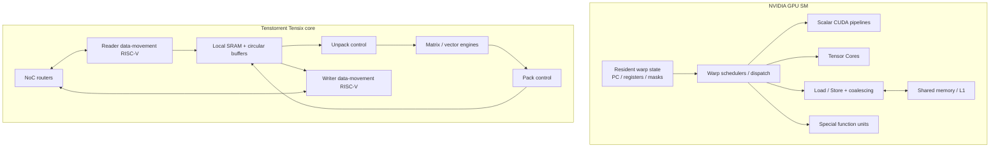

# Tenstorrent 做了什么减法？从 NVIDIA GPU SM 到 Tensix Dataflow Core

最后核对日期：2026-08-10。

本文讨论一个很有价值的观察：

> Tenstorrent 是否相当于把 CUDA Core / SM 中对 AI 冗余的部分砍掉，再保留矩阵计算所需的核心能力？

简短答案是：**方向上接近，但“精简 GPU SM”不是准确的架构描述。**

Tenstorrent 并不是拿一个 NVIDIA SM 逐项删减，而是从规则 tensor workload 出发，重新选择基本执行单位、延迟隐藏方法、存储模型和控制结构：

- GPU 以 thread、warp 和 SM 为核心，通过动态硬件调度维持通用吞吐；
- Tensix 以 tensor tile、core-local SRAM、NoC 和 reader/compute/writer pipeline 为核心，通过显式 dataflow 维持计算与搬运重叠；
- GPU 把更多复杂度放在硬件 scheduler、thread state、cache/coalescing 和成熟 runtime；
- Tenstorrent 把更多复杂度交给 compiler、kernel、layout、core placement、circular buffer 和 NoC mapping。

因此，更准确的标题不是“Tenstorrent 删除了哪些 GPU 单元”，而是：

> **Tenstorrent 如何用另一套机制，替代 GPU SM 为通用 SIMT 执行提供的能力。**

---

## 1. 先建立正确的比较边界

### 1.1 CUDA Core 不是一个完整的 core

`CUDA Core` 是 NVIDIA 对 GPU 中标量算术 execution lane 的产品用语之一。它不是 CPU core，也不是完整 SM。

一个现代 GPU SM 大致还包含：

- warp scheduler 与 instruction dispatch；
- 大型 register file；
- CUDA scalar arithmetic pipelines；
- Tensor Cores；
- load/store units；
- special-function units；
- shared memory / L1；
- thread、warp、barrier 和 dependency 状态。

因此，“Tensix 对比 CUDA Core”层级不对等。更合理的对照是：

```text
NVIDIA Streaming Multiprocessor
            vs
Tenstorrent Tensix core
```

### 1.2 图形硬件与 CUDA SM 不是同一层问题

AI accelerator 不需要完整的 graphics pipeline，例如 rasterization、display 和部分 graphics-specific fixed-function hardware。这确实能省去通用 GPU 芯片上的非 AI 资源。

但数据中心 GPU 的 AI 执行效率问题，主要不在 rasterizer，而在以下更深层的架构选择：

- 是否采用 SIMT thread/warp；
- 如何管理片上状态；
- 如何隐藏 memory latency；
- cache 与显式 scratchpad 如何取舍；
- tensor engine 是附加 execution pipeline，还是整个 core 的中心；
- 数据移动由硬件动态响应，还是由 software 显式编排。

本文重点比较这一层，而不是简单地说“Tenstorrent 没有图形单元”。

### 1.3 “冗余”必须限定 workload

某项硬件对规则的 MatMul、convolution 或 Transformer block 可能利用率很低，但对以下 workload 并不冗余：

- 动态控制流；
- 不规则 gather/scatter；
- 图计算；
- 通用 HPC；
- 复杂 custom kernel；
- 多租户与广泛软件兼容；
- 尚未被 compiler 稳定识别和 lowering 的新算子。

所以本文中的“减法”表示 **降低某种通用机制在 AI 主执行路径中的地位**，不等于证明它在所有计算中无用。

---

## 2. 两种 core 的基本结构

下面是用于建立心智模型的教学抽象，不是晶体管级 floorplan。



GPU SM 是一台能够让大量 thread/warp 驻留并动态前进的通用 throughput processor。

Tensix core 则更像一个可编程的 tile dataflow node：

```text
NoC / DRAM
    ↓
Reader kernel
    ↓
Input circular buffers in local SRAM
    ↓
Unpack → matrix/vector math → pack
    ↓
Output circular buffer
    ↓
Writer kernel → NoC / DRAM / next core
```

---

## 3. 第一项减法：不采用 CUDA-style thread/warp 作为基本抽象

### GPU 为什么需要 warp

CUDA programmer 写出大量逻辑 thread。硬件把 thread 组成 warp，再把 thread block 分配给 SM。

SM 必须负责：

- 保存 resident warp 的执行上下文；
- 判断哪个 warp 已经 ready；
- 从 ready warp 中选择下一条指令；
- 处理同 warp 内不同 thread 的 active state；
- 在 load、dependency 或 barrier stall 时切换到其他 warp。

这让同一套 GPU 能执行从 dense GEMM 到复杂 custom CUDA kernel 的广泛代码。

### Tensix 用什么替代

TT-Metalium 不要求开发者创建成千上万个逻辑 thread。它让开发者为 participating Tensix core 编写较小的 device kernel：

- reader kernel；
- compute kernel；
- writer kernel。

这些 kernel 操作的是 tile、buffer 和 NoC transfer，而不是大量独立 scalar thread。

所以 Tensix 不需要 GPU 式的：

- warp formation；
- resident warp pool；
- 每周期从大量 ready warp 中动态选择；
- warp-level branch mask/reconvergence programming model。

但这不表示 Tensix 没有 instruction control。控制仍存在，只是由较小的 RISC-V kernel 和专用 engine protocol 承担。

---

## 4. 第二项减法：减少大量 per-thread architectural state 的必要性

GPU 为了维持高 occupancy，需要在 SM 上同时驻留多个 warp。每个 thread/warp 会消耗：

- register；
- program state；
- barrier/synchronization state；
- active mask 与控制流状态；
- shared-memory allocation；
- scheduler/dependency tracking capacity。

这也是为什么 CUDA optimization 经常讨论：

```text
registers per thread
threads per block
shared memory per block
resident blocks per SM
active warps
occupancy
```

Tensix 的主要数据状态不是数百个逻辑 thread 的 private scalar state，而是：

- core-local SRAM 中的 tensor tile；
- circular buffer 的 producer-consumer 状态；
- Tensix Engine source/destination registers；
- 少量 RISC-V kernel 的执行状态；
- NoC transfer 与 semaphore 状态。

这并不意味着 Tensix “没有寄存器”或“没有调度状态”，而是状态粒度从大量独立 thread 转向 tile pipeline 和显式 buffer。

---

## 5. 第三项减法：弱化动态 warp scheduling

### GPU 的延迟隐藏

GPU 经常通过 thread-level parallelism 隐藏 latency：

```text
warp 0：等待 global-memory load
warp 1：执行 scalar arithmetic
warp 2：执行 Tensor Core instruction
warp 3：准备下一次 memory operation
```

只要存在足够多 ready warp，scheduler 就能让 execution pipeline 保持忙碌。

这种机制能够适应：

- cache hit/miss 变化；
- 数据依赖；
- memory latency 波动；
- 不同 warp 的分支路径；
- 不同 kernel resource usage。

### Tensix 的延迟隐藏

Tensix 主要用空间流水和 producer-consumer overlap：

```text
Reader：  正在搬 tile 2
Compute： 正在算 tile 1
Writer：  正在写 tile 0
```

reader、compute、writer 由不同控制 processor 驱动，通过 circular buffer 协调。

这降低了“动态寻找另一个 ready warp”的重要性，但引入另一组性能问题：

- input CB 是否为空；
- output CB 是否已满；
- reader、compute、writer service time 是否平衡；
- DRAM bank 或 NoC 是否造成 backpressure；
- buffer 是否足够覆盖 latency；
- core partition 是否均匀。

换句话说：

> GPU 主要从大量 ready warp 中寻找并行；Tensix 主要让数据移动和 tensor engine 在不同 tile 上形成流水。

---

## 6. 第四项减法：不把透明 cache hierarchy 当作主要数据供应机制

### GPU 路径

典型 GPU kernel 的数据路径可能经过：

```text
HBM / device memory
        ↓
       L2
        ↓
per-SM L1 / shared memory
        ↓
registers / Tensor Core operands
```

程序显式优化 coalescing、shared-memory staging 和 locality，但 cache hierarchy 仍会动态响应大量 thread 发出的 memory request。

### Tensix 路径

Tenstorrent 文档明确指出，core-local `L1 SRAM` 是 working memory/scratchpad，不是硬件自动管理的 cache：

```text
Device DRAM / remote core SRAM
        ↓ explicit NoC transfer
Local SRAM circular buffer
        ↓ unpack
Tensix Engine registers
        ↓ math + pack
Output circular buffer
        ↓ explicit NoC transfer
DRAM / remote core
```

这弱化了以下透明机制：

- 自动 cache line replacement；
- 依赖 cache 命中隐藏数据位置；
- 将所有访问主要表达成独立 thread load/store；
- 让通用 memory hierarchy 自行发现 tensor reuse。

相应地，software 必须明确负责：

- tensor layout；
- tile 与 shard；
- DRAM bank；
- core placement；
- CB capacity；
- 生命周期；
- multicast；
- reshard 与 intermediate forwarding。

因此不能把 Tensix 简化为“没有 cache 的 GPU”。存储模型、并行单位和同步协议都已经改变。

---

## 7. 第五项减法：降低通用 scalar lane 在主计算路径中的地位

现代 NVIDIA SM 同时提供多类 execution pipeline。对于 AI workload：

- Tensor Core 主要执行矩阵乘加；
- scalar CUDA pipeline 执行不能映射成矩阵块的算术和控制；
- load/store unit 处理 memory instruction；
- special-function pipeline 处理部分复杂函数。

Tensix 不是完全删除 scalar/vector 能力，而是重新确定主次：

```text
主要数值吞吐：Tensix matrix/vector engines
tile 搬进/搬出：unpack / pack
数据移动：reader/writer RISC-V + NoC
控制：RISC-V processors
```

官方公开模型中，RISC-V controller 不亲自完成大规模 tile math。它们主要驱动 router、unpack、math 和 pack，而矩阵/向量结果由 Tensix Engine 产生。

所以准确表述是：

> Tenstorrent 没有取消 scalar control，而是让 scalar control 为 tile engine 服务，不再让大量 scalar thread lane 构成整个编程模型的中心。

---

## 8. 第六项减法：不需要 warp divergence/reconvergence 机制

在 SIMT GPU 中，同一 warp 的 thread 可以在功能上拥有不同控制流。发生数据相关分支时，硬件需要跟踪哪些 lane active，并执行需要走过的分支路径。

Tensix 不使用 CUDA warp，因此没有相同形式的 warp divergence 与 reconvergence。

但是控制流成本没有消失，只是转移到了其他位置：

- RISC-V kernel branch；
- 不规则 NoC access；
- 不均匀 tile partition；
- padding 后的无效 element；
- dynamic shape specialization；
- host/runtime 的 conditional dispatch；
- 某些 core 提前完成后产生的 tail。

因此规则 dense tile workload 更容易保持利用率，而高度不规则、per-element branch-heavy 的 workload 不一定适合直接映射到 tile engine。

---

## 9. 第七项减法：不以统一地址和隐式迁移作为低层默认模型

CUDA 平台提供 device memory、managed/unified memory、system memory、streams 和多种异步传输机制。具体硬件和产品支持程度不同，但整体软件目标是让广泛程序能够在 CPU/GPU memory system 上执行。

TT-Metalium 的基础心智模型更直接：

```text
Host DRAM != Device DRAM != Core-local SRAM
```

host pointer 不会自动变成 Tensix kernel 可直接使用的 local address。host/runtime 需要：

1. 分配 device buffer；
2. 传输 tensor；
3. 指定 layout 和 device address；
4. dispatch kernel；
5. 在需要时读回结果。

device 内部还要继续安排 DRAM、NoC 和 local SRAM 间的数据移动。

这让 data ownership 和 transport boundary 更明确，但也增加 compiler/runtime/kernel 的工作量。

---

## 10. Tenstorrent 没有砍掉什么

把 Tensix 说成“只有矩阵乘法器”也是错误的。它仍然需要：

- device DRAM；
- core-local SRAM；
- matrix engine；
- vector/SFPU；
- scalar control processor；
- instruction memory；
- synchronization；
- NoC router；
- Ethernet/multi-chip fabric；
- runtime command queue；
- compiler/JIT；
- layout、padding 和 precision handling；
- debug、profiling 与 fault management。

它也没有完全消除动态行为：

- kernel 可以接收 runtime argument；
- reader/writer 可以根据 buffer 和 semaphore 状态等待；
- NoC 与 DRAM 会产生竞争；
- host runtime 仍然 dispatch work；
- 不同 core 可以有不同 workload；
- 高层框架仍需处理 dynamic model behavior。

区别在于这些动态行为没有被统一包装成 GPU 式的大规模 SIMT warp machine。

---

## 11. Tensix 增加和强化了什么

Tenstorrent 的设计不是单纯做减法，还强化了 GPU SM 编程中相对不显式的部分。

### 11.1 NoC 是编程模型的一等资源

kernel 可以直接表达：

- 从哪个 DRAM bank 读；
- 向哪个 core 坐标写；
- unicast 或 multicast；
- 使用哪个 NoC；
- 在何处等待 barrier/semaphore；
- 数据是否直接进入下一个 core 的 buffer。

### 11.2 Circular buffer 是硬件流水协议

CB 不只是一个普通数组，它表达：

- producer 等待空位；
- producer reserve/push；
- consumer wait/pop；
- tile ownership；
- bounded buffering；
- reader/compute/writer backpressure。

### 11.3 Tile layout 是执行格式

数据不只是“一个 tensor pointer”。software 必须考虑：

- logical shape；
- padded shape；
- tile shape；
- physical layout；
- per-core shard；
- per-device distribution。

### 11.4 Core mesh 是分布式执行空间

一个 operation 可以映射到 core grid。数据可以在：

```text
core local
→ chip NoC
→ chip-to-chip Ethernet
→ Galaxy / cluster fabric
```

不同层级移动。placement、reuse 和 collective 因而成为算法的一部分。

---

## 12. 同一个 MatMul 在两种架构上的责任分配

考虑：

```text
C = A × B
```

### GPU

```text
framework/library 选择 GEMM kernel
→ thread blocks 分配到 SM
→ threads 组成 warps
→ warp scheduler 选择 ready warp
→ global load/coalescing/cache
→ shared-memory/register staging
→ Tensor Core MMA
→ epilogue/store
```

主要调优变量：

- block/warp tile；
- occupancy；
- register pressure；
- shared-memory capacity/bank conflict；
- memory coalescing；
- Tensor Core instruction shape；
- async copy 与 pipeline stage；
- library/kernel selection。

### Tensix

```text
compiler/program 选择 core grid
→ 为 A/B/output 创建 DRAM/L1 layout 与 CB
→ reader 读取或 multicast tile
→ compute 等待 tile
→ unpack → matrix engine accumulate → pack
→ writer 写回或送往下一个 core
```

主要调优变量：

- tensor tile/layout；
- core grid；
- DRAM bank；
- CB depth；
- multicast 与 local reuse；
- unpack/math/pack balance；
- reader/compute/writer service time；
- NoC path；
- shard 与下一算子的 placement。

二者都在做 tiling、reuse 和 overlap，但责任边界不同。

---

## 13. 这种减法为什么可能适合 AI

规则 AI workload 通常具有：

- 大量重复 matrix/vector operation；
- tensor shape 和 layout 可在运行前得知；
- producer-consumer graph 明确；
- 数据复用可以通过 tiling 规划；
- 相同 operation 会作用于大量 element；
- 通信量可以通过 sharding/multicast 建模。

在这些条件下，GPU 为通用性准备的部分机制可能无法持续转化成有效 AI throughput：

- resident warp state；
- divergence flexibility；
- dynamic cache replacement；
- 通用 per-thread control；
- 运行时寻找 ready warp；
- 对未知 memory behavior 的适应能力。

Tensix 尝试把这些预算转向：

- matrix/vector compute；
- local SRAM；
- NoC bandwidth；
- tile unpack/pack；
- 多 core dataflow；
- Ethernet scale-out。

但公开资料没有给出足以将每项设计精确换算为 die area 或功耗节省的完整 floorplan/RTL 数据。因此这里只能做机制分析，不能声称“删除 warp scheduler 精确节省了 X% 面积”。

---

## 14. 代价：硬件减法通常变成软件加法

### 14.1 Compiler 和 kernel 更难

software 必须决定：

- tile 怎样形成；
- op 放在哪些 core；
- tensor 如何 sharding；
- buffer 多深；
- 数据怎样走 NoC；
- 哪些 tile multicast；
- 中间结果是否写回 DRAM；
- layout conversion 是否值得；
- pipeline 是否平衡。

### 14.2 对动态和不规则 workload 的适应性下降

GPU 可以在 warp stall 时执行另一个 ready warp。显式流水如果遇到未建模 latency，往往直接表现为 CB empty/full 或 core idle。

### 14.3 Padding 与 layout conversion 可能浪费资源

tile engine 喜欢规则 physical layout。不对齐 shape 可能需要 padding；相邻 op layout 不兼容时可能需要 tilize、untilize 或 reshard。

### 14.4 生态和工具成熟度不同

CUDA 已有成熟 library、compiler、debugger、profiler 和大量模型支持。开放低层硬件并不自动等于所有高层模型都能立即高效运行。

### 14.5 利用率更依赖整体平衡

如果 reader、compute、writer、NoC 或 DRAM 中任意一个成为瓶颈，其他引擎可能空闲。峰值矩阵吞吐不能代表端到端性能。

---

## 15. 哪些 workload 更能体现这种设计

更容易受益：

- dense MatMul；
- convolution；
- Transformer 中规则的 projection/FFN；
- 能稳定 tile/shard 的 attention operation；
- elementwise/vector pipeline；
- 能通过 multicast 复用输入的 multi-core operation；
- 固定或有限 shape family；
- 可形成长 producer-consumer pipeline 的图。

需要更谨慎：

- 细粒度分支密集 kernel；
- 高度不规则 sparse access；
- 小到无法铺满 tile/core 的 operation；
- 频繁 host-device round trip；
- layout 不断变化的 graph；
- 尚无稳定 TT-NN/TT-Forge lowering 的 custom op；
- 依赖 CUDA 专有 library 或 GPU ecosystem 的流水。

Tenstorrent 将产品定位为 training 与 inference 的通用 AI accelerator，因此不能把它归类为只支持固定推理图的 ASIC；但它的通用性仍然建立在 tensor/dataflow 范围内，不等同于 GPU 的 SIMT 通用性。

---

## 16. 最终结论

可以把最初的直觉修正成下面这段话：

> Tenstorrent 认为，对规则 AI workload，没有必要让每个计算 core 都成为一台维护大量 thread/warp、依赖动态 scheduler 和透明 cache 的通用 SIMT processor。Tensix 将基本单位改成 tensor tile，把计算交给 matrix/vector engine，把控制交给小型 RISC-V，把数据交给 local SRAM、circular buffer 和 NoC，并通过 reader/compute/writer pipeline 隐藏延迟。

它主要弱化的是：

1. CUDA-style thread/warp abstraction；
2. 大量 resident thread state；
3. 动态 warp scheduling；
4. warp divergence/reconvergence；
5. 以透明 cache 和 per-thread load/store 为中心的 memory model；
6. 通用 scalar lane 在主 AI 计算路径中的地位；
7. 低层统一地址与隐式数据迁移的依赖。

它用以下机制替代：

1. tile matrix/vector engine；
2. RISC-V control processors；
3. reader/compute/writer kernels；
4. core-local SRAM；
5. circular buffers；
6. explicit NoC transfers；
7. core/device mesh 与 software-controlled layout。

因此，Tenstorrent 不是“少了一些功能的 GPU”，而是另一种复杂度分配：

```text
GPU：更多通用性与动态适应能力放在 SM hardware/runtime

Tensix：更多结构信息与数据移动责任放在 compiler/kernel
```

---

## 17. 主要来源

### Tenstorrent 官方资料

- TT-Metalium single-core architecture/matmul lab：<https://docs.tenstorrent.com/tt-metal/latest/tt-metalium/tt_metal/labs/matmul/lab1/lab1.html>
- Memory for kernel developers：<https://docs.tenstorrent.com/tt-metal/latest/tt-metalium/tt_metal/advanced_topics/memory_for_kernel_developers.html>
- Compute Engines and Data Flow within Tensix：<https://docs.tenstorrent.com/tt-metal/latest/tt-metalium/tt_metal/advanced_topics/compute_engines_and_dataflow_within_tensix.html>
- TT-Metalium multi-core matmul/NoC lab：<https://docs.tenstorrent.com/tt-metal/latest/tt-metalium/tt_metal/labs/matmul/lab3/lab3.html>
- TT software stack：<https://docs.tenstorrent.com/getting-started/tt-software-stack.html>

### NVIDIA 官方资料

- CUDA Programming Guide：<https://docs.nvidia.com/cuda/cuda-programming-guide/index.html>
- CUDA SIMT kernel model：<https://docs.nvidia.com/cuda/cuda-programming-guide/02-basics/writing-cuda-kernels.html>
- CUDA advanced SIMT execution：<https://docs.nvidia.com/cuda/cuda-programming-guide/03-advanced/advanced-kernel-programming.html>
- GPU Performance Background：<https://docs.nvidia.com/deeplearning/performance/dl-performance-gpu-background/index.html>

---

## 术语表

| 术语 | 概念 |
| --- | --- |
| CUDA Core | NVIDIA GPU SM 中执行标量算术的 execution lane/product term；不是完整 SM，也不是 CPU core。 |
| SM | Streaming Multiprocessor，NVIDIA GPU 的主要可编程计算单元，包含 scheduler、register、shared/L1 和多类 execution pipeline。 |
| SIMT | Single Instruction, Multiple Threads；以逻辑 thread 编程、以 warp 成组执行的模型。 |
| Thread block | CUDA 中一组可在同一 SM 上协作、同步和共享 shared memory 的 thread。 |
| Warp | GPU 调度和执行 thread 的基本分组；现代 CUDA 编程模型中通常为 32 threads。 |
| Warp scheduler | 从 ready warp 中选择下一条可发射指令的 SM 硬件。 |
| Warp divergence | 同一 warp 中的 thread 走不同控制流路径，导致 active lane 利用率下降。 |
| Reconvergence | divergence 后重新合并 warp 控制流的机制。 |
| Occupancy | SM 上 active warp 数相对于硬件上限的比例；受 register、shared memory、block size 等限制。 |
| Tensor Core | NVIDIA SM 中面向小矩阵乘加等操作的专用 execution pipeline。 |
| Coalescing | GPU memory system 将相邻 thread 的访问合并成较少 memory transaction 的机制。 |
| Cache hierarchy | 通过 L1/L2 等自动保存近期数据、动态响应访问局部性的存储层次。 |
| Scratchpad | 由 software/compiler 显式管理的片上存储，而不是自动替换的 cache。 |
| Tensix core | Tenstorrent mesh 中的计算 node，包含 local SRAM、Tensix Engine、RISC-V controllers 与 NoC endpoints。 |
| Tensix Engine | 执行 tile matrix/vector operation 的计算引擎。 |
| RISC-V controller | Tensix core 内控制 data movement、unpack、math 和 pack 的处理器；不是主要 tile math datapath。 |
| Tile | Tensix matrix/vector engine 的数据与计算单位；常见示例为 32×32 elements，但具体约束依 operation 与代际而定。 |
| NoC | Network-on-Chip，连接 Tensix core、DRAM、Ethernet 和其他 device node 的片上网络。 |
| Circular Buffer / CB | local SRAM 中连接 producer/consumer kernel 的 bounded FIFO。 |
| Reader kernel | 通过 NoC 将 DRAM 或 remote SRAM 中的 tile 搬到 input CB 的 kernel。 |
| Compute kernel | 控制 unpack、matrix/vector math 和 pack 的 kernel。 |
| Writer kernel | 将 output CB 中的 tile 搬到 DRAM 或 remote core 的 kernel。 |
| Backpressure | 下游无法继续接收数据时，沿 bounded buffer 反向阻止上游继续生产。 |
| Multicast | 一次 NoC data movement 将相同数据发送到多个目标 core，用于减少重复 DRAM 读取。 |
| Sharding | 将 tensor 分割并放置到多个 core/device 的方法。 |
| Layout | tensor 的 physical arrangement，包括 row-major/tile、padding、memory space 和 core/device distribution。 |
| Dataflow | 按数据依赖组织计算与移动，让 producer 结果直接进入 consumer 的执行方式。 |
